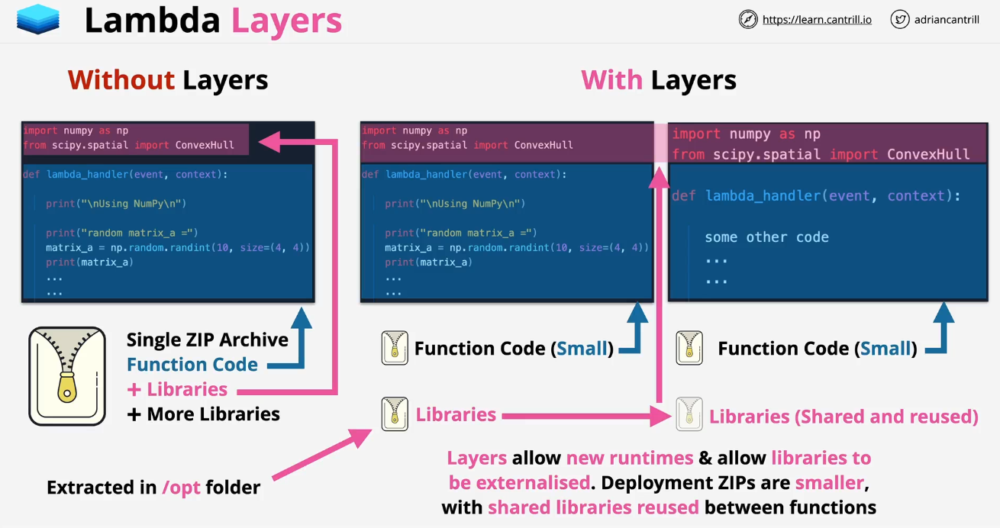
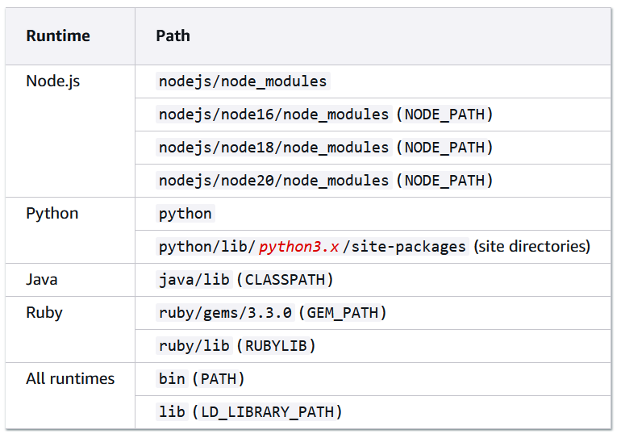

# 📦 **AWS Lambda Layers: How They Work & Creating Custom Layers**

AWS **Lambda Layers** provide a way to share **libraries, dependencies, and custom code** across multiple Lambda functions, making deployments **more efficient** and **reducing function size**.

---

<div style="text-align: center;">
  
</div>

---

## **🤔 How AWS Lambda Layers Work**

### **🔹 What is a Lambda Layer?**

- A **Lambda Layer** is an archive (.zip) that contains **libraries, dependencies, or custom code**.
- Layers **reduce function package size** and allow **reusability** across multiple Lambda functions.
- A function can have **up to 5 layers**, in addition to the function code.

### **🔹 Benefits of Using Lambda Layers**

✅ **Reduces deployment package size**  
✅ **Reuses shared code across multiple functions**  
✅ **Simplifies function updates** (update the layer instead of every function)  
✅ **Supports multiple runtimes (Python, Node.js, C#)**

### **🔹 How Layers Work in Lambda Execution?**

- **1️⃣** When a Lambda function executes, **AWS unpacks all attached layers** into the `/opt` directory.
- **2️⃣** The function **automatically loads dependencies** from `/opt`.
- **3️⃣** The function’s runtime accesses these dependencies as if they were in the function package.

<div style="text-align: center;">
  
</div>

📌 **Example:**

- A Python layer with `numpy` will be stored at `/opt/python`.
- A Node.js layer with `moment.js` will be stored at `/opt/nodejs`.
- A C# layer with `.NET dependencies` will be stored at `/opt/bin`.
- [Other](https://docs.aws.amazon.com/lambda/latest/dg/packaging-layers.html)

---

## **🪜 Creating a Custom Lambda Layer**

### **🛠 Steps to Create a Lambda Layer**

**1️⃣ Package your dependencies in a ZIP file**  
**2️⃣ Upload the ZIP file to AWS Lambda as a layer**  
**3️⃣ Attach the layer to your Lambda function**  
**4️⃣ Use the dependencies in your function**

### **🛠 AWS CLI to Create a Layer**

```sh
aws lambda publish-layer-version \
  --layer-name MyCustomLayer \
  --description "My custom Lambda Layer" \
  --compatible-runtimes python3.9 nodejs18.x dotnet6 \
  --zip-file fileb://my-layer.zip
```

> 📌 **This uploads a layer compatible with Python 3.9, Node.js 18.x, and .NET 6.**

---

## **🐍 Example 1: Creating a Python Lambda Layer (Latest Version)**

### **✅ Step 1: Install Python Dependencies Locally**

```sh
mkdir -p python
pip install requests -t python/
```

> 📌 **This installs the `requests` library inside a `python/` directory, which AWS Lambda expects.**

---

### **✅ Step 2: Zip the Directory**

```sh
zip -r python-layer.zip python/
```

or

```powershell
Compress-Archive -Path python -DestinationPath python-layer.zip
```

> 📌 **zip file should contain python directory as lambda will map it to `/opt/python/`.**

---

### **✅ Step 3: Upload the Layer to AWS**

```sh
aws lambda publish-layer-version \
  --layer-name PythonRequestsLayer \
  --description "Python requests library layer" \
  --compatible-runtimes python3.9 \
  --zip-file fileb://python-layer.zip
```

---

### **✅ Step 4: Use the Layer in a Python Lambda Function**

Attach the layer to your Lambda function, and modify your function like this:

```python
import requests

def lambda_handler(event, context):
    response = requests.get("https://api.github.com")
    return response.json()
```

> 📌 **The function automatically finds `requests` inside `/opt/python/`.**

---

## **🌐 Example 2: Creating a Node.js Lambda Layer (Latest Version)**

### **✅ Step 1: Install Dependencies Locally**

```sh
mkdir -p nodejs
npm install moment --prefix nodejs
```

📌 **This installs `moment.js` inside `nodejs/node_modules`.**

---

### **✅ Step 2: Zip the Directory**

```sh
zip -r nodejs-layer.zip nodejs/
```

or

```powershell
Compress-Archive -Path nodejs -DestinationPath nodejs-layer.zip
```

> 📌 **zip file should contain nodejs directory as lambda will map it to `/opt/nodejs/node_modules`.**

---

### **✅ Step 3: Upload the Layer to AWS**

```sh
aws lambda publish-layer-version \
  --layer-name NodeJsMomentLayer \
  --description "Moment.js library for Node.js" \
  --compatible-runtimes nodejs18.x \
  --zip-file fileb://nodejs-layer.zip
```

---

### **✅ Step 4: Use the Layer in a Node.js Lambda Function**

Modify `index.js`:

```javascript
import moment from "moment";

export const handler = async (event, context) => {
  console.log("EVENT: \n" + JSON.stringify(event, null, 2));
  return {
    statusCode: 200,
    body: `Current Time: ${moment().format("MMMM Do YYYY, h:mm:ss a")}`,
  };
};
```

> 📌 **Lambda will automatically load `moment.js` from `/opt/nodejs/node_modules`.**

## **🏗 Example 3: Creating a C# Lambda Layer (.NET 8)**

`THE ONLY RIGHT WAY TO CREATE LAMBDA FUNCTION USING .NET IS TO USE VISUAL STUDIO WITH BUILT-IN AWS LAMBDA TEMPLATES`

### **✅ Step 1: Create a .NET Core Project & Install Dependencies**

```sh
mkdir dotnet-layer && cd dotnet-layer
dotnet new classlib -n MyLambdaLayer
cd MyLambdaLayer
dotnet add package Newtonsoft.Json
dotnet build -c Release
```

> 📌 **This creates a .NET class library and installs `Newtonsoft.Json`.**
> 📌 **Please Specify the dotnet version as it current only support dotnet8**

---

### **✅ Step 2: Prepare the Layer Structure**

Create a directory and copy the compiled files:

```sh
mkdir -p dotnet/bin
cp -r bin/Release/net8.0/* dotnet/bin/
```

---

### **✅ Step 3: Zip and Upload the Layer**

```sh
zip -r dotnet-layer.zip dotnet/
aws lambda publish-layer-version \
  --layer-name DotNetLayer \
  --description "Layer for .NET 6 with Newtonsoft.Json" \
  --compatible-runtimes dotnet6 \
  --zip-file fileb://dotnet-layer.zip
```

or

```powershell
Compress-Archive -Path dotnet/bin -DestinationPath dotnet-layer.zip
```

> 📌 **zip file should contain bin directory as lambda will map it to `/opt/bin`.**

---

### **✅ Step 4: Use the Layer in a C# Lambda Function**

Modify `Function.cs` to use the library:

```csharp
using System;
using Newtonsoft.Json.Linq;

public class Function
{
    public string FunctionHandler(string input)
    {
        JObject json = JObject.Parse("{\"message\":\"Hello from Lambda\"}");
        return json["message"].ToString();
    }
}
```

📌 **Lambda will automatically load `Newtonsoft.Json` from `/opt/bin`.**

---

## **🔗 How to Attach a Layer to a Lambda Function**

You can **attach a layer using the AWS Console** or AWS CLI:

### **🛠 AWS CLI to Attach a Layer**

```sh
aws lambda update-function-configuration \
  --function-name MyLambdaFunction \
  --layers arn:aws:lambda:us-east-1:123456789012:layer:PythonRequestsLayer:1
```

📌 **Replace `PythonRequestsLayer` with your layer ARN.**

---

## **🏁 Final Thoughts**

✅ **Lambda Layers** help reduce deployment size and improve efficiency.  
✅ You can create custom layers for **Python, C#, Node.js, and other runtimes**.  
✅ Layers are automatically loaded into the **/opt/** directory.  
✅ **Up to 5 layers** can be attached to a single Lambda function.
