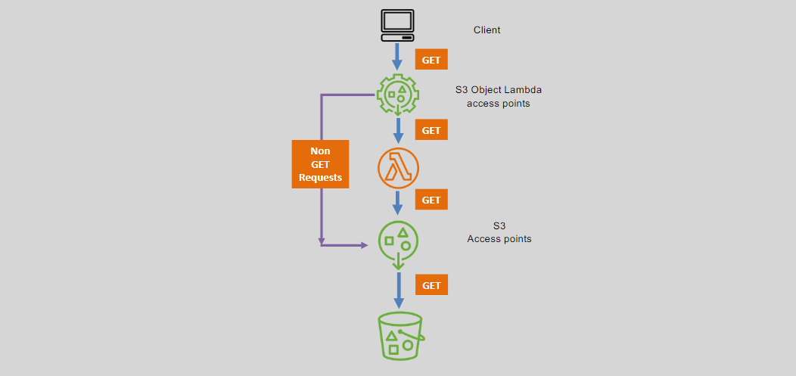

# 🛠️ **Amazon S3 Object Lambda: Transforming Data on the Fly**

Amazon S3 Object Lambda extends the capabilities of Amazon S3 by allowing you to add your own code to S3 GET requests. This enables on-the-fly data transformation without the need to store multiple versions of the same object. This guide provides a concise overview of S3 Object Lambda, comparing it with traditional S3 GET requests and highlighting its key use cases.

---

## 📦 **S3 GET Requests Without Object Lambda**

Traditionally, handling data manipulation with S3 GET requests involves multiple steps and additional storage. Understanding this baseline helps in appreciating the benefits of S3 Object Lambda.

### 🔍 **How It Works:**

- **Data Retrieval:** When you perform a GET request on an S3 object, the data is retrieved directly from the stored object.
- **Post-Processing:** Any required data manipulation, such as filtering or resizing, occurs **after** the data has been retrieved from S3.
- **Storage Overhead:** To accommodate different data formats or sizes, you might need to store multiple versions or derivatives of the same object.

### 🛠️ **Use Cases:**

- **Filter Rows in Responses:** Extract specific rows or data segments from large datasets.
- **Resize Images:** Adjust image dimensions to fit various display requirements.
- **Remove Sensitive Information:** Strip out confidential or sensitive data from objects before use.

---

## ⚡ **S3 GET Requests With Object Lambda**

S3 Object Lambda revolutionizes how data is accessed and manipulated by integrating Lambda functions directly into the S3 GET request workflow. This eliminates the need for storing multiple object versions and streamlines data processing.

### 🔍 **How It Works:**

- **Integrated Transformation:** When a GET request is made, S3 Object Lambda automatically invokes the associated Lambda function to process and modify the data before it's returned to the requester.
- **No Additional Storage:** Transformations are performed in real-time, reducing the need to store multiple object versions or derivatives.
- **Seamless Invocation:** S3 handles the invocation of Lambda functions, ensuring that only GET requests are transformed while other request types are processed normally.

### 🛠️ **Use Cases:**

- **Filter Rows in Responses:** Dynamically extract and return only the necessary data segments.
- **Dynamically Resize Images:** Adjust image sizes on-the-fly based on request parameters.
- **Remove Sensitive Information:** Automatically redact or omit confidential data from objects during retrieval.
- **Automated Data Processing:** Implement custom logic to process data as it is accessed, enhancing flexibility and efficiency.

---

## ⚖️ **Comparison: With vs. Without Object Lambda**

| **Aspect**                | **Without Object Lambda**                               | **With Object Lambda**                                            |
| ------------------------- | ------------------------------------------------------- | ----------------------------------------------------------------- |
| **Data Retrieval**        | Direct from S3 storage                                  | Retrieved and transformed via Lambda before delivery              |
| **Storage Requirements**  | Multiple object versions for different formats          | Single object version with real-time transformations              |
| **Processing Overhead**   | Post-retrieval processing is required                   | On-the-fly processing integrated into GET requests                |
| **Flexibility**           | Limited to pre-stored object formats                    | Highly flexible with custom Lambda transformations                |
| **Cost Efficiency**       | Increased storage costs due to multiple object versions | Reduced storage costs by eliminating redundant data               |
| **Performance**           | Potential delays due to post-processing                 | Optimized performance with integrated processing                  |
| **Use Case Adaptability** | Less adaptable to dynamic data manipulation needs       | Highly adaptable to a wide range of dynamic data processing needs |

---

## 🏁 **Conclusion**

Amazon S3 Object Lambda enhances the traditional S3 GET request mechanism by enabling real-time data transformation through Lambda functions. This not only streamlines data processing but also reduces storage overhead and increases flexibility. Whether you need to filter data, resize images, or remove sensitive information, S3 Object Lambda provides a powerful and efficient solution to meet your application's dynamic requirements.
