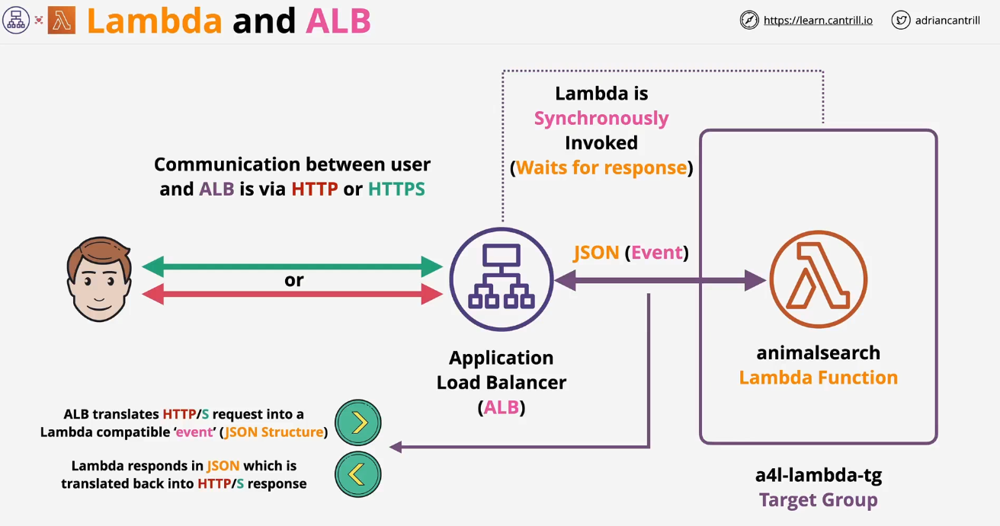
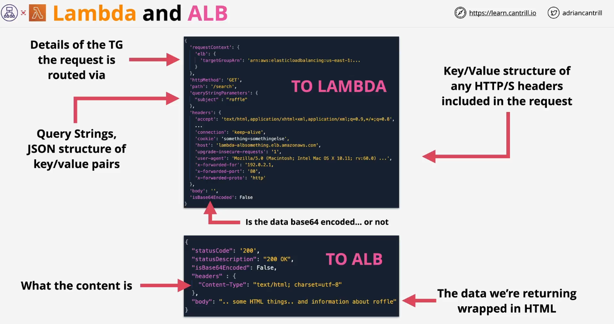
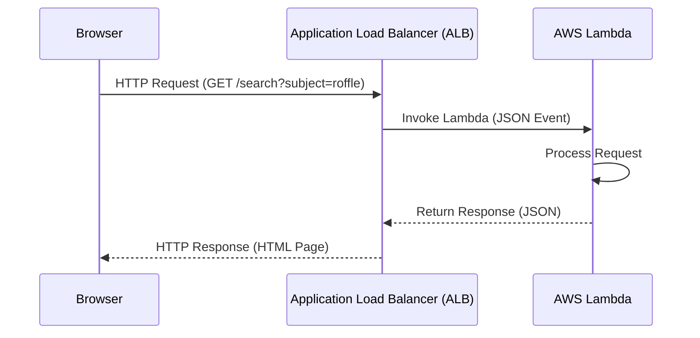
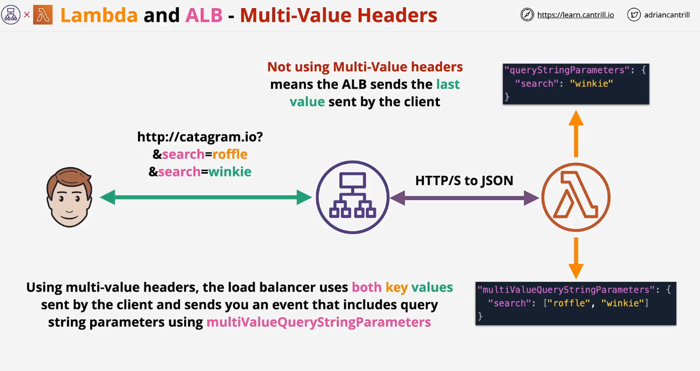

# AWS Lambda with ALB example

<div style="text-align: center;">
  
  
</div>

---

## 📝 **Explanation of the Sequence**

**1️⃣ Browser sends an HTTP request** → `http://my-alb.com/search?subject=roffle`  
**2️⃣ ALB receives the request** and transforms it into a **JSON event**  
**3️⃣ ALB invokes the Lambda function** with the request details  
**4️⃣ Lambda processes the request**, extracts the query parameters, and generates a response  
**5️⃣ Lambda sends the response** back to ALB in JSON format  
**6️⃣ ALB converts the JSON response** back to a proper HTTP response and sends it to the browser  
**7️⃣ The browser receives the final HTML page**

---



---

## 🔀 **Step-by-Step Request Flow:**

### **1️⃣ User Sends an HTTP Request**

- **A user makes a request to ALB**, e.g.:

  ```http
  GET http://my-alb.com/search?subject=roffle
  ```

- **Headers sent by the user:**

  ```json
  {
    "accept": "text/html,application/xhtml+xml",
    "user-agent": "Mozilla/5.0",
    "cookie": "session-id=xyz123"
  }
  ```

---

### **2️⃣ ALB Receives the Request & Forwards It to Lambda**

- ALB determines the target **(Lambda function or EC2 backend)**
- If **Lambda is the target**, ALB **transforms the HTTP request** into a JSON event and sends it to the Lambda function.

> 📌 **Example ALB JSON Request to Lambda:**

```json
{
  "requestContext": {
    "elb": {
      "targetGroupArn": "arn:aws:elasticloadbalancing:us-east-1:123456789012:targetgroup/my-target-group"
    }
  },
  "httpMethod": "GET",
  "path": "/search",
  "queryStringParameters": {
    "subject": "roffle"
  },
  "multiValueQueryStringParameters": {
    "subject": ["roffle"]
  },
  "headers": {
    "accept": "text/html,application/xhtml+xml",
    "user-agent": "Mozilla/5.0",
    "cookie": "session-id=xyz123"
  },
  "multiValueHeaders": {
    "accept": ["text/html,application/xhtml+xml"],
    "user-agent": ["Mozilla/5.0"],
    "cookie": ["session-id=xyz123"]
  },
  "body": "",
  "isBase64Encoded": false
}
```

> 📌 **Key Takeaways:**
>
> - **Headers & query parameters** are transformed into JSON
> - **Multi-value headers & query strings** are supported if enabled
> - **ALB ensures secure, scalable request routing**

---

### **3️⃣ AWS Lambda Processes the Request**

- The Lambda function **extracts data** from the event (headers, query parameters, etc.)
- **Processes the request and generates a response**

📜 **Example Lambda Function (`lambda_function.py`):**

```python
import json

def lambda_handler(event, context):
    subject = event.get("queryStringParameters", {}).get("subject", "default")

    response_body = f"<html><body><h1>Search Results for: {subject}</h1></body></html>"

    return {
        "statusCode": 200,
        "statusDescription": "200 OK",
        "isBase64Encoded": False,
        "headers": {
            "Content-Type": "text/html; charset=utf-8"
        },
        "body": response_body
    }
```

> 📌 **Lambda reads query parameters and returns an HTML response.**

---

### **4️⃣ Lambda Returns an HTTP Response to ALB**

- **Example JSON response from Lambda:**

```json
{
  "statusCode": 200,
  "statusDescription": "200 OK",
  "isBase64Encoded": false,
  "headers": {
    "Content-Type": "text/html; charset=utf-8"
  },
  "body": "<html><body><h1>Search Results for: roffle</h1></body></html>"
}
```

> 📌 **Lambda responses must match ALB's expected format** with:
>
> - `statusCode`
> - `headers`
> - `body`

---

### **5️⃣ ALB Forwards Response to User**

- ALB **transforms Lambda’s JSON response** back into an **HTTP response**.
- The user receives:

  ```html
  <html>
    <body>
      <h1>Search Results for: roffle</h1>
    </body>
  </html>
  ```

## 🔥 **Multi-Value Headers in ALB and AWS Lambda**

By default, when a client sends multiple values for the same query parameter (`search=roffle&search=winkie`), ALB **only forwards the last value** unless **Multi-Value Headers** are enabled.

---

<div style="text-align: center;">
  
</div>

---

### **✅ What Happens Without Multi-Value Headers?**

- ALB sends **only the last received value** to AWS Lambda.
- Example request:

  ```ini
  http://catagram.io?search=roffle&search=winkie
  ```

- **ALB converts the request to JSON:**

  ```json
  {
    "queryStringParameters": {
      "search": "winkie"
    }
  }
  ```

- ❌ **We lose `search=roffle` because only the last value is forwarded.**

---

### **✅ What Happens With Multi-Value Headers Enabled?**

- ALB sends **all values** in an array inside `multiValueQueryStringParameters`.
- Example JSON payload:

  ```json
  {
    "multiValueQueryStringParameters": {
      "search": ["roffle", "winkie"]
    }
  }
  ```

- ✅ **Now Lambda can access both values.**

### **✅ Enabling Multi-Value Headers in ALB**

By default, ALB **only forwards single values** for query parameters and headers.  
To enable **Multi-Value Headers**, run the following AWS CLI command:

```sh
aws elbv2 modify-target-group-attributes \
  --target-group-arn arn:aws:elasticloadbalancing:us-east-1:123456789012:targetgroup/my-target-group/123abc \
  --attributes Key=lambda.multi_value_headers.enabled,Value=true
```

> 📌 **Now Lambda will receive query parameters and headers correctly!**
