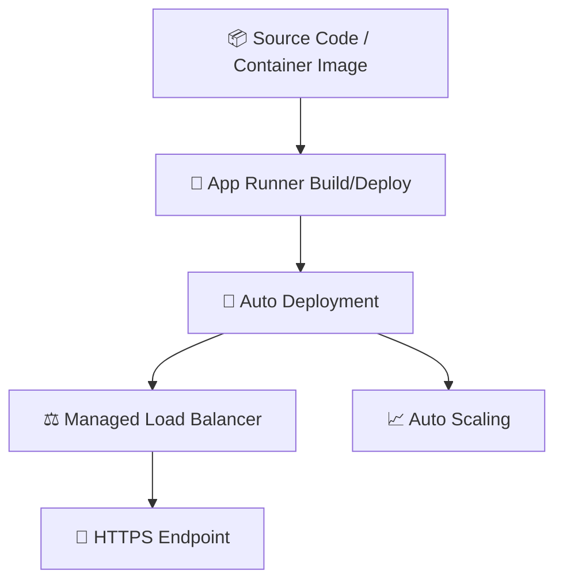

# 🚀 How to Use AWS App Runner (Console + CLI Guide, 2025)

> _“Deploy from GitHub or a container. No servers. No YAML. Just go.”_

---

## 📚 What Is AWS App Runner?

**AWS App Runner** is a fully managed service that allows you to **deploy and scale web apps and APIs from source code or container images** — without managing servers, scaling rules, or load balancers.

---

## 🧭 Overview: How App Runner Works

<div align="center">



</div>

---

## 🛠️ 1️⃣ Deploy from GitHub (Console)

### 🔧 Step-by-Step (Console UI)

1. Go to [App Runner Console](https://console.aws.amazon.com/apprunner).
2. Click **Create service**.
3. Under **Source**, choose:
   - **Source type**: Code repository
   - **Provider**: GitHub
   - **Connect** your GitHub account and pick the repo
4. Configure:
   - **Branch**: e.g. `main`
   - **Runtime**: Node.js, Python, etc.
   - **Build command**: e.g. `npm install`
   - **Start command**: e.g. `npm run start`
5. Set environment variables (optional)
6. Name your service (e.g., `my-app-runner-service`)
7. Enable automatic deployments (optional)
8. Click **Next** → Review → Create Service ✅

⏱️ In 60–90 seconds, App Runner gives you a live HTTPS endpoint!

---

## 📦 2️⃣ Deploy from Container (Console)

1. Choose **Container registry** as the source.
2. Select:
   - **Amazon ECR** (public or private)
   - Choose image + tag
3. Configure:
   - **Port** your app listens on (e.g., 80 or 8080)
   - Set any **environment variables**
4. Click **Next**, review and deploy

🔥 You can also enable auto-deploy from ECR (on new image push).

---

## 🧰 CLI Version: Deploy via Container (Amazon ECR)

You can’t use CLI to deploy directly from source code, **only from container images**.

### 🔧 Example: Create App Runner Service from ECR

```bash
aws apprunner create-service \
  --service-name my-ecr-app \
  --source-configuration file://source-config.json
```

#### 🔍 `source-config.json`

```json
{
  "ImageRepository": {
    "ImageIdentifier": "123456789012.dkr.ecr.us-east-1.amazonaws.com/my-app:latest",
    "ImageRepositoryType": "ECR",
    "ImageConfiguration": {
      "Port": "8080",
      "RuntimeEnvironmentVariables": [
        {
          "Name": "NODE_ENV",
          "Value": "production"
        }
      ]
    }
  },
  "AutoDeploymentsEnabled": true,
  "AuthenticationConfiguration": {
    "AccessRoleArn": "arn:aws:iam::123456789012:role/AppRunnerECRAccessRole"
  }
}
```

> 🧠 Don’t forget to attach `AmazonECRReadOnlyAccess` to that role.

---

## 🔁 Update the Service (CLI)

```bash
aws apprunner update-service \
  --service-arn arn:aws:apprunner:us-east-1:123456789012:service/my-ecr-app/123abc \
  --source-configuration file://source-config.json
```

---

## 🧹 Delete the Service (Console or CLI)

### 🔧 CLI

```bash
aws apprunner delete-service \
  --service-arn arn:aws:apprunner:us-east-1:123456789012:service/my-ecr-app/123abc
```

---

## 🔐 Domain, VPC, IAM

### ✅ Custom Domain Mapping

```bash
aws apprunner associate-custom-domain \
  --service-arn <SERVICE_ARN> \
  --domain-name "api.myapp.com"
```

> Requires DNS verification (CNAME or TXT).

---

### 🔐 Private Networking (VPC Connector)

If your app needs RDS, ElastiCache, etc.:

- Create VPC connector in the console
- Attach it to your App Runner service under **Network settings**

---

## 🔍 Monitoring and Logs

- 📊 View **metrics** in **CloudWatch**
- 📄 Access logs under the “Logs” tab in the console
- 🎯 Filter by service name, deployment, or time

---

## ✅ Best Practices

| Area            | Tip                                                             |
| --------------- | --------------------------------------------------------------- |
| 🔐 IAM Roles    | Use minimal privilege ECR + AppRunner roles                     |
| 🧪 Environments | Tag services for `dev`, `staging`, `prod`                       |
| 🧰 Debugging    | Use health checks + logs to identify bad containers or commands |
| 🔄 Deployment   | Enable auto-deploy + manual rollback in case of failure         |
| 🧠 Scale tuning | Default scaling is good — tune max concurrency if needed        |
| 🧼 Cleanup      | Delete unused services to avoid cost                            |

---

## 🧠 Summary

| Use Case                      | Use App Runner When You…                                    |
| ----------------------------- | ----------------------------------------------------------- |
| From GitHub (No Infra Skills) | Want fastest way to deploy source code                      |
| From ECR                      | Already use Docker and CI/CD pipelines                      |
| Need HTTPS Out of the Box     | Want TLS without managing certs or ALBs                     |
| Focus on Dev, Not Infra       | Want to avoid Fargate, ECS tasks, IAM roles, load balancers |
| Need Scaling w/o Worry        | Want auto-scaling with no manual rules or alarms            |

---

## 📚 Extra Resources

- [📘 App Runner Docs (AWS)](https://docs.aws.amazon.com/apprunner/)
- [🎥 Video: Deploy a Node.js App with App Runner](https://www.youtube.com/watch?v=xCGfQvYj6t8)
- [🧠 App Runner Pricing](https://aws.amazon.com/apprunner/pricing/)
