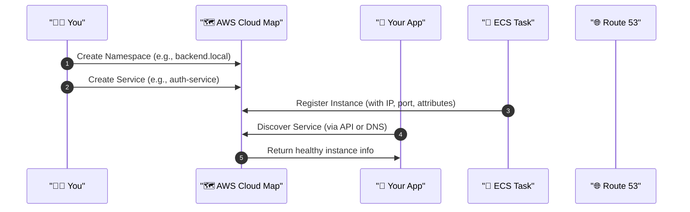

# 🗺️ AWS Cloud Map: The Missing Map for Modern Microservices

> “DNS that thinks in services, not just IPs.”

---

## 📚 Official Definition

**AWS Cloud Map** is a **fully managed service discovery tool** that allows applications to discover resources **by name**, with **custom attributes**, and keep track of their **health and locations** — automatically.

> 🧠 Think of it as Route 53 + dynamic service registry + filtering engine.

---

## 🧩 Core Components

### 1️⃣ **Namespace**

A **namespace** is the logical domain in which your services live. It defines **how your service is resolved** (via DNS or API):

| Type           | Description                                              |
| -------------- | -------------------------------------------------------- |
| 🛡️ **Private** | Internal use via DNS in your VPC (`.local`, `.internal`) |
| 🌍 **Public**  | Internet-facing DNS namespace (rare)                     |

✅ Example: `backend.local`, `orders.myapp.local`

---

### 2️⃣ **Service**

A **service** in AWS Cloud Map is like a label that groups together **dynamic instances**. You define:

- 💬 Friendly name (e.g., `auth-service`)
- 🔄 DNS record type (A/AAAA/SRV/CNAME)
- 🩺 Optional health check (for filtering)

Each service lives in a namespace.

---

### 3️⃣ **Service Instance**

An **instance** is the **actual resource** behind the service. For example:

| Field      | Example                              |
| ---------- | ------------------------------------ |
| IP Address | `10.0.0.125`                         |
| Port       | `8080`                               |
| Attributes | `env=prod`, `region=us-east-1`, etc. |

💡 You can register EC2s, ECS Tasks, EKS Pods, on-prem servers, etc.

---

## 🧭 How It All Works (Flowchart)



---

## 🌐 Service Discovery Options

| Method     | Description                                   | Use Case                        |
| ---------- | --------------------------------------------- | ------------------------------- |
| 📡 **DNS** | Resolve to IP address (like Route 53)         | ECS, EC2, legacy workloads      |
| 🧬 **API** | Query using AWS SDK/CLI (`DiscoverInstances`) | Filter by region/env/custom tag |

💡 API-based discovery is **super flexible** for modern apps (e.g., pick instance with `env=staging` + `zone=b`)

---

## 🚀 Real-World Use Cases

### 🧩 Microservices in ECS

Use Cloud Map for **service-to-service discovery**:

- `orders.local` → ECS tasks with `orders-service`
- Resilient to IP changes or scaling events

---

### 🔁 Blue/Green or Canary Deployments

Tag instances with:

```json
{
  "version": "v1",
  "stage": "green"
}
```

Then use `DiscoverInstances` API to query only `"stage=green"`.

---

### 🌍 Hybrid Apps

Have on-prem services? Register their IPs into Cloud Map too:

```bash
aws servicediscovery register-instance \
  --service-id svc-abc123 \
  --instance-id my-db \
  --attributes AWS_INSTANCE_IPV4=10.1.1.1,AWS_INSTANCE_PORT=5432
```

Your cloud apps can now discover them like any other instance!

---

## 🛠️ How to Set Up (Step-by-Step)

### ✅ Step 1: Create a Namespace

```bash
aws servicediscovery create-private-dns-namespace \
  --name backend.local \
  --vpc vpc-0abc123 \
  --region us-east-1
```

---

### ✅ Step 2: Create a Service

```bash
aws servicediscovery create-service \
  --name auth-service \
  --dns-config "NamespaceId=ns-abc123,DnsRecords=[{Type=A,TTL=60}]" \
  --health-check-custom-config FailureThreshold=1
```

---

### ✅ Step 3: Register an Instance

```bash
aws servicediscovery register-instance \
  --service-id svc-abc123 \
  --instance-id task-001 \
  --attributes AWS_INSTANCE_IPV4=10.0.0.12,AWS_INSTANCE_PORT=8080
```

---

### ✅ Step 4: Discover the Instance

```bash
aws servicediscovery discover-instances \
  --namespace-name backend.local \
  --service-name auth-service
```

✅ Returns:

```json
[
  {
    "InstanceId": "task-001",
    "Attributes": {
      "AWS_INSTANCE_IPV4": "10.0.0.12",
      "AWS_INSTANCE_PORT": "8080"
    }
  }
]
```

---

## 🔌 Integration with Amazon ECS

ECS services can **auto-register and auto-deregister** from Cloud Map:

```json
"serviceRegistries": [
  {
    "registryArn": "arn:aws:servicediscovery:...",
    "port": 8080,
    "containerName": "my-api"
  }
]
```

✔️ ECS handles instance registration for you on task launch or shutdown.

---

## 📏 Limits and Best Practices

| Rule              | Recommendation                                           |
| ----------------- | -------------------------------------------------------- |
| Max attributes    | Use short keys + small values (default: 10 per instance) |
| TTL value         | Keep low (30–60s) for dynamic systems                    |
| Naming convention | Use dots (`.`) only in namespace, not service names      |
| Health checks     | Use custom checks for ECS, Route 53 only for static IPs  |

---

## ✅ Summary Table

| Concept         | Description                                                              |
| --------------- | ------------------------------------------------------------------------ |
| Namespace       | Logical boundary (DNS-based or API-only)                                 |
| Service         | Defines the application resource type                                    |
| Instance        | Actual registered service endpoint (IP, port, attributes)                |
| Discovery Type  | DNS (for ECS, EC2) or API (filter-rich for modern apps)                  |
| ECS Integration | Automatic instance management with `serviceRegistries` config            |
| Best Fit        | Microservices, hybrid apps, scalable backends, feature-aware deployments |

---

## 💬 Final Thoughts

> AWS Cloud Map is not just DNS — it’s **DNS + smart service registry + custom metadata filtering + dynamic cloud state.**

- Use **DNS** for ECS task-to-task communication.
- Use **API discovery** for intelligent routing or deployment experiments.
- Mix it with **tags**, **health checks**, and **capacity providers** for cloud-native flexibility.

## 📚 Additional Resources

- [AWS Cloud Map Features](https://aws.amazon.com/cloud-map/)
- [AWS Cloud Map Documentation](https://docs.aws.amazon.com/cloud-map/)
