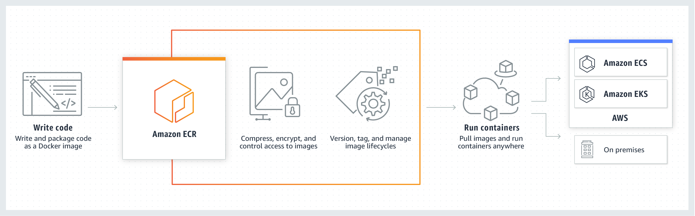
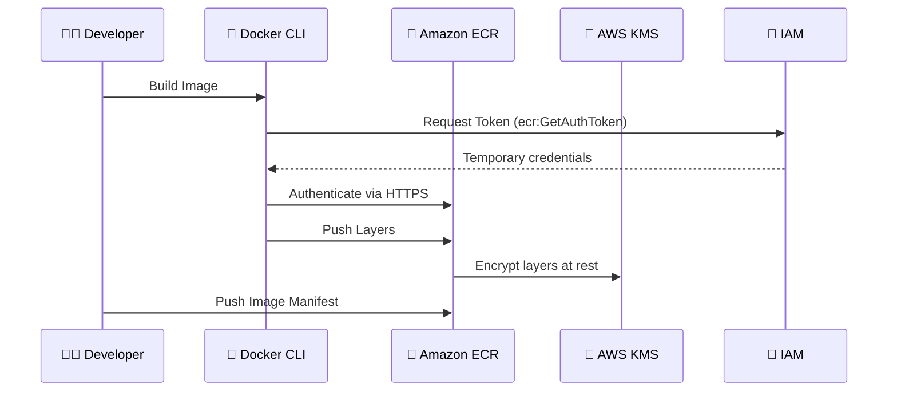

# 🐳 Amazon ECR – Your Secure Container Image Vault

> **Amazon Elastic Container Registry (ECR)** is a **fully managed Docker-compatible registry** service that makes it easy to store, manage, scan, and deploy container images.

It’s like your private DockerHub on AWS—fully integrated, highly secure, and built to scale for production workloads.

---

<div style="text-align: center">
  
</div>

---

## 📦 What Is Amazon ECR (Official Definition)

Amazon ECR is a **managed container image registry** service that supports storing, versioning, scanning, and retrieving container images and artifacts. It integrates with **Amazon ECS, EKS, Fargate**, and CI/CD services like **CodePipeline** and **CodeBuild**.

---

## 🌟 Why Use Amazon ECR?

| Feature                   | Description                                                    |
| ------------------------- | -------------------------------------------------------------- |
| 🛠️ Fully Managed          | No setup needed; AWS manages availability, durability, scaling |
| 🔐 Secure by Default      | AWS IAM + KMS encryption + HTTPS                               |
| 🔍 Vulnerability Scanning | Find CVEs in base images before deployment                     |
| 📉 Lifecycle Policies     | Auto-delete old images to reduce storage cost                  |
| 🔗 Integrated             | Deep hooks into ECS, EKS, CodePipeline, Fargate                |
| 💥 High Performance       | Fast push/pull for large image layers via S3 under the hood    |

---

## 🧠 How ECR Works (Behind the Scenes)

<div align="center">



</div>

- ECR stores layers as **immutable blobs** in **Amazon S3**.
- Uses **IAM-based token authentication** with short-lived auth tokens.
- Images are **scanned using Amazon Inspector**.
- Image metadata is **indexed for fast lookups**.

---

## 🧪 Real-World Flow: Push and Pull Images

### 🔧 Step 1: Authenticate Docker

```bash
aws ecr get-login-password --region us-east-1  \
| docker login --username AWS --password-stdin 123456789012.dkr.ecr.us-east-1.amazonaws.com
```

### 🏷️ Step 2: Tag the Image

```bash
docker tag my-app:latest 123456789012.dkr.ecr.us-east-1.amazonaws.com/my-app:latest
```

### 🚀 Step 3: Push to ECR

```bash
docker push 123456789012.dkr.ecr.us-east-1.amazonaws.com/my-app:latest
```

### 📥 Step 4: Pull from ECR

```bash
docker pull 123456789012.dkr.ecr.us-east-1.amazonaws.com/my-app:latest
```

---

## 🔐 IAM Permissions You Need

Here’s a minimal policy to allow push/pull:

```json
{
  "Version": "2012-10-17",
  "Statement": [
    {
      "Effect": "Allow",
      "Action": [
        "ecr:GetAuthorizationToken",
        "ecr:BatchCheckLayerAvailability",
        "ecr:PutImage",
        "ecr:InitiateLayerUpload",
        "ecr:UploadLayerPart",
        "ecr:CompleteLayerUpload"
      ],
      "Resource": "*"
    }
  ]
}
```

> 🔒 **Tip**: Use resource-specific ARNs for tighter control.

---

## 📚 Lifecycle Policy Example

Automatically delete untagged images older than 30 days:

```json
{
  "rules": [
    {
      "rulePriority": 1,
      "description": "Remove untagged images after 30 days",
      "selection": {
        "tagStatus": "untagged",
        "countType": "sinceImagePushed",
        "countUnit": "days",
        "countNumber": 30
      },
      "action": {
        "type": "expire"
      }
    }
  ]
}
```

Set it from the console or using the `put-lifecycle-policy` CLI.

---

## 🦾 DevOps Integrations

- **CodeBuild**: Pull from and push to ECR during CI builds
- **CodePipeline**: Automatically deploy new images from ECR
- **ECS / EKS**: Use ECR images as production workloads
- **IAM Roles for Service Accounts (IRSA)**: Grant pods access in EKS
- **PrivateLink / VPC Endpoints**: Secure image access inside your VPC

---

## 💡 Best Practices

| ✅ Do                                                   | ❌ Don’t                         |
| ------------------------------------------------------- | -------------------------------- |
| Use lifecycle policies to reduce cost                   | Keep old/untagged images forever |
| Enable image scanning                                   | Push unverified images to prod   |
| Use per-environment repos (`dev/`, `staging/`, `prod/`) | Mix all tags in one repo         |
| Rotate and scope IAM access                             | Give wildcard access to everyone |

---

## ⚙️ Common Troubleshooting Tips

| Error                       | Fix                                        |
| --------------------------- | ------------------------------------------ |
| `no basic auth credentials` | Forgot to run `aws ecr get-login-password` |
| `repository not found`      | You didn’t create the repo yet             |
| `access denied`             | Missing IAM permission                     |
| `layer already exists`      | Expected if you push same layers again     |

---

## 📊 Pricing Overview

- **Storage**: ~\$0.10/GB/month
- **Data Transfer**: Free within same region
- **Scanning**: Free with basic scanning; charges may apply for advanced

> 🧠 ECR uses **S3 behind the scenes**, so image layer storage is durable and efficient.

---

## 🧾 TL;DR Summary

- 🐳 Amazon ECR is a secure, scalable container image registry
- 🔐 Uses IAM + KMS + HTTPS for security
- 🔁 Supports push/pull via Docker CLI or automation
- 🧪 Can scan images for CVEs
- 💸 Save money with lifecycle policies
- 🤝 Perfect for ECS, EKS, and CI/CD pipelines

---

## 📎 Useful Links

- 📘 [Official Amazon ECR Docs](https://docs.aws.amazon.com/AmazonECR/latest/userguide/what-is-ecr.html)
- 🛠️ [ECR CLI Reference](https://docs.aws.amazon.com/cli/latest/reference/ecr/)
- 🔐 [IAM Permissions for ECR](https://docs.aws.amazon.com/AmazonECR/latest/userguide/security_iam_id-based-policy-examples.html)
