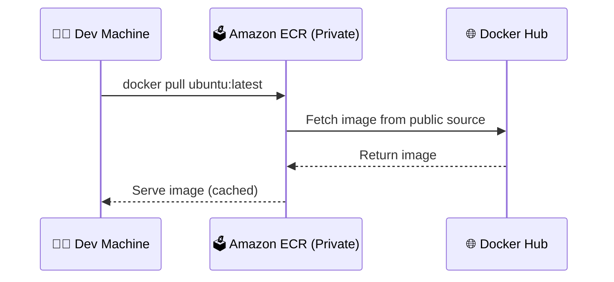

# 🏺 Private vs. Public Container Registries + ECR Public Gallery

When managing container images, **where you store them** matters — not just for access control, but also for performance, security, and global reach. In this topic, we’ll break down:

1. What’s a **container registry**?
2. 🥷 Private Registries – secure & customizable
3. 🧑‍🎤 Public Registries – share with the world
4. 🎨 Amazon ECR Public Gallery
5. 🛠️ Advanced ECR Private Registry Features

Let’s roll 👇

---

## 📦 What is a Container Registry?

A **container registry** is a storage and distribution system for container images. It allows developers to:

- **Push (upload)** images after building them
- **Pull (download)** images to deploy into container runtimes like Docker, Kubernetes, ECS, etc.

Registries often come with features like **access control**, **versioning**, **vulnerability scanning**, **replication**, and more.

---

## 🥷 Private Container Registries

### 🔐 What is a Private Registry?

A **private registry** is accessible only by **authorized users or systems**. It's ideal for internal, proprietary applications or infrastructure.

### ✅ Common Use Cases

- Enterprises securing proprietary containers
- DevOps pipelines requiring controlled access
- Edge or on-prem Kubernetes clusters

---

### ⚙️ Key Features in **Amazon ECR Private Registry**

| Feature                              | Description                                                                                            |
| ------------------------------------ | ------------------------------------------------------------------------------------------------------ |
| 🔄 **Pull Through Cache**            | Cache images from public registries (like Docker Hub) into ECR to reduce rate limits & speed up access |
| 🧩 **Repository Creation Templates** | Automatically apply config (like lifecycle rules & scanning) when new repos are created                |
| 🌍 **Replication**                   | Replicate images across Regions automatically to improve latency or meet compliance                    |
| 🔍 **Image Scanning**                | Detect vulnerabilities in base images & layers                                                         |
| 📜 **Immutable Tags**                | Prevent overwriting image tags for consistency & security                                              |
| 🧼 **Lifecycle Policies**            | Auto-delete old/unused images to save storage costs                                                    |

---

### 🧭 Real-World Example: Pull Through Cache



> 🔥 Benefit: ECR caches the public image and serves it locally from next time — faster and Docker Hub rate limit free!

---

## 🧑‍🎤 Public Container Registries

### 🌍 What is a Public Registry?

A **public registry** is visible to **anyone on the internet** and used to share **open-source images** like Nginx, Node.js, Python, etc.

### 🏆 Popular Public Registries

- Docker Hub (`hub.docker.com`)
- GitHub Container Registry (`ghcr.io`)
- Amazon ECR Public Gallery (`gallery.ecr.aws`)

---

## 🎨 Amazon ECR Public Gallery

Amazon ECR offers its own **public image hosting platform** with a sweet domain:

🔗 [https://gallery.ecr.aws](https://gallery.ecr.aws)

### 🧩 Key Features

| Feature                      | Description                                             |
| ---------------------------- | ------------------------------------------------------- |
| 🌐 Public Browsing           | Anyone can search, browse, and pull your images         |
| 📊 Pull Metrics              | View total image pulls (great for tracking popularity)  |
| 🔐 IAM-Controlled Publishing | Only authorized accounts can push images                |
| 🧾 Signed URLs               | (Optional) Use signed URLs for temporary private access |
| 🖼️ Vanity URLs               | Your own namespace: `gallery.ecr.aws/myproject`         |

> 🧠 Use ECR Public if you want your image available globally, with the scalability and security of AWS behind it.

---

### 🔄 Example: Using a Public Image

```bash
docker pull public.ecr.aws/bitnami/nginx:latest
```

Boom! You’ve pulled an open-source image from the AWS public gallery.

---

## ⚔️ Public vs. Private Comparison Table

| Feature               | Private Registry                  | Public Registry                  |
| --------------------- | --------------------------------- | -------------------------------- |
| 🔒 Access             | Restricted (IAM, policies)        | Open to the world                |
| 🌍 Use Case           | Internal apps, CI/CD pipelines    | OSS distribution                 |
| 🔄 Pull Through Cache | ✅                                | ❌                               |
| 📜 IAM Policies       | ✅                                | ✅ (for pushing)                 |
| 👥 Audience           | Teams / Orgs                      | Community / Global Devs          |
| 📈 Metrics            | Private only                      | Global visibility & pull stats   |
| 💰 Pricing            | Charged per GB stored/transferred | Mostly free, with egress charges |

---

## 🔑 Best Practices

### For Private Registries (ECR)

- Enable image scanning 🔍
- Apply lifecycle policies 🧼
- Use replication across regions 🌎
- Enforce tag immutability 🧪
- Enable pull-through cache for external dependencies 🚀

### For Public Registries

- Use consistent, semantic version tags (`v1.2.3`, `latest`)
- Don’t store sensitive configs or secrets 😱
- Add README and labels for clarity 🏷️
- Monitor pull metrics to track adoption 📈

---

## 🧠 Conclusion

Choosing between public and private registries depends on your **audience** and **security needs**. Amazon ECR gives you the best of both worlds:

- A powerful **private registry** with enterprise-grade features like pull-through caching, region replication, and scanning.
- A globally distributed **public gallery** with IAM-secured publishing and pull stats for your open-source love.

Whether you're building microservices for a fintech startup or publishing OSS tools for millions — **Amazon ECR has your back**. 💪
