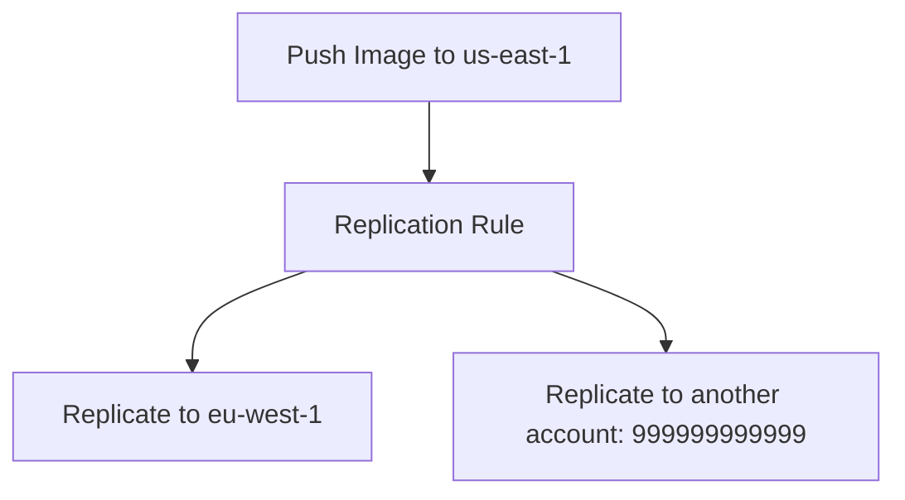

# 🛡️ Amazon ECR Private Registry: Feature Settings Explained

_Amazon ECR (Elastic Container Registry) Private Registries come packed with customizable features to secure, optimize, and automate container image workflows. In this topic, we’ll explore all the key feature settings like **registry permissions**, **pull-through cache**, **replication**, **repository creation templates**, and **scanning**._

> ✅ This guide is based on the **ECR Private Registry** page from the AWS Console and official AWS documentation — explained clearly, like a smart friend walking you through it.

---

## 📦 What Is an ECR Private Registry?

An ECR Private Registry is a **container image registry** dedicated to your AWS account where you control access, organization, and image lifecycles. Think of it as your own personal "DockerHub inside AWS" — but more secure, customizable, and integrated.

---

## 🧰 Feature Settings Overview

| Feature                           | Purpose                                        | Summary                                    |
| --------------------------------- | ---------------------------------------------- | ------------------------------------------ |
| **Registry Permissions**          | Control who can access/manage the registry     | IAM + optional registry policy             |
| **Pull Through Cache**            | Cache and mirror images from public registries | Speeds up pulls and isolates from internet |
| **Replication**                   | Sync images across regions/accounts            | Helps with HA and multi-region ops         |
| **Repository Creation Templates** | Predefine default settings for new repos       | Enforce org-wide tagging, scanning, etc.   |
| **Scanning**                      | Scan images for vulnerabilities                | Basic or Enhanced via Amazon Inspector     |

Now let’s break each one down. 👇

---

## 🔐 1. **Registry Permissions**

### 📘 Official Definition

> Controls access to **your entire private registry** (not just individual repos) using **registry-level policies** and IAM.

### ⚙️ How It Works

- You can attach a **Registry Policy** — similar to an S3 bucket policy — to define who can:
  - List repositories
  - Create/Delete repositories
  - Manage pull through cache or replication
- This is **optional**. If no policy is added, IAM is the default mechanism.

### 🧠 Example Use Case

> Allow your build automation role in a CI/CD pipeline to create new repositories dynamically.

```json
{
  "Effect": "Allow",
  "Principal": {
    "AWS": "arn:aws:iam::123456789012:role/codebuild-role"
  },
  "Action": "ecr:CreateRepository",
  "Resource": "*"
}
```

---

## 🌀 2. **Pull Through Cache**

### 📘 Official Definition

> Pull through cache lets you **mirror and cache images** from external registries like Docker Hub to your private registry.

### 🎯 Benefits

- Faster pulls for commonly used base images
- Saves bandwidth and time
- Isolates your workloads from **Docker Hub rate limits**

### 🔧 How It Works

You define a **cache rule** such as:

| Setting               | Example                               |
| --------------------- | ------------------------------------- |
| **Upstream registry** | `public.ecr.aws/docker/library/nginx` |
| **Namespace prefix**  | `nginx-cache`                         |

Then, instead of pulling from Docker Hub, you pull:

```bash
docker pull <account-id>.dkr.ecr.<region>.amazonaws.com/nginx-cache/nginx:latest
```

> 🧠 Under the hood, ECR fetches from DockerHub the **first time**, stores it internally, and **subsequent pulls** come from the cache.

---

## 🌍 3. **Replication**

### 📘 Official Definition

> Replication rules allow you to automatically **sync repositories or entire registries** to other AWS accounts or regions.

### 🔄 Types of Replication

- **Cross-region replication**: e.g., `us-east-1` → `eu-central-1`
- **Cross-account replication**: Share with other AWS accounts

### 🧰 Common Use Cases

- High Availability (HA) across multiple AWS regions
- Global latency optimization
- Secure multi-account DevOps workflows

### 🧠 Flowchart Example



> Replication is **asynchronous**, but fast. You can scope it to a specific repo or apply it to all.

---

## 🧪 4. **Repository Creation Templates**

### 📘 Official Definition

> These templates let you define **default settings** for any **new repository** created in your registry.

### 🧩 Configuration Options

- Enable/disable scanning on push
- Default encryption settings (KMS or AES-256)
- Configure tag immutability
- Specify repository tags (metadata)

### 💡 Why Use It?

- Prevent developers from forgetting best practices.
- Enforce security and tagging compliance across the board.

---

## 🔬 5. **Image Scanning**

### 📘 Official Definition

> Scan container images for known vulnerabilities using either **Basic scanning** or **Enhanced scanning** (powered by Amazon Inspector).

### 🛠️ Options

| Type         | Description                                                   | Tool               |
| ------------ | ------------------------------------------------------------- | ------------------ |
| **Basic**    | Scan on push, CVE-based                                       | Native ECR scanner |
| **Enhanced** | Continuous, detailed CVE reports + integration with Inspector | Amazon Inspector   |

### 🧠 Tips

- Enable scanning **by default** via repo settings or templates.
- Integrate with **EventBridge** to trigger alerts or actions based on scan results.

---

## 🔒 Example IAM for All Features

```json
{
  "Version": "2012-10-17",
  "Statement": [
    {
      "Effect": "Allow",
      "Action": [
        "ecr:GetAuthorizationToken",
        "ecr:CreateRepository",
        "ecr:PutImageScanningConfiguration",
        "ecr:BatchCheckLayerAvailability",
        "ecr:ReplicateImage",
        "ecr:PutReplicationConfiguration",
        "ecr:GetRepositoryPolicy"
      ],
      "Resource": "*"
    }
  ]
}
```

---

## 🧠 Final Thoughts

ECR Private Registry isn’t just a bucket for images — it’s a **configurable, secure platform** that scales with your architecture. Whether you want to pull public images faster, enforce strict creation rules, or replicate across regions, **feature settings give you the control** you need.

---

## 📚 Resources

- 🔗 [ECR Private Registry Settings – AWS Docs](https://docs.aws.amazon.com/AmazonECR/latest/userguide/registry-permissions.html)
- 🔗 [Replication – AWS Docs](https://docs.aws.amazon.com/AmazonECR/latest/userguide/registry-replication.html)
- 🔗 [Pull Through Cache – AWS Docs](https://docs.aws.amazon.com/AmazonECR/latest/userguide/pull-through-cache.html)
- 🔗 [Image Scanning – AWS Docs](https://docs.aws.amazon.com/AmazonECR/latest/userguide/image-scanning.html)
- 🔗 [Repository Templates – AWS Docs](https://docs.aws.amazon.com/AmazonECR/latest/userguide/repository-creation-template.html)
