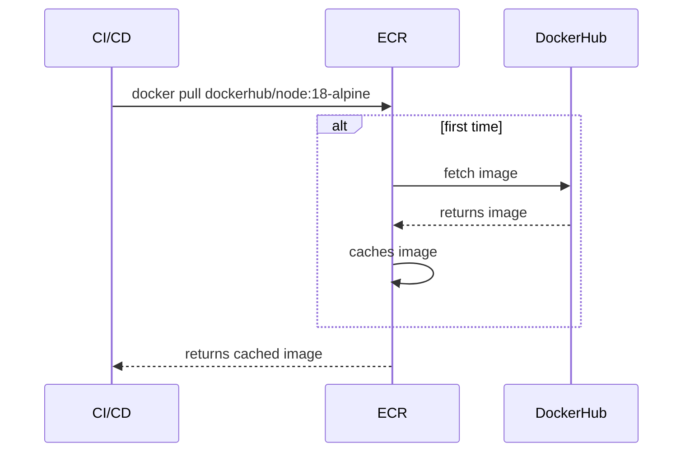
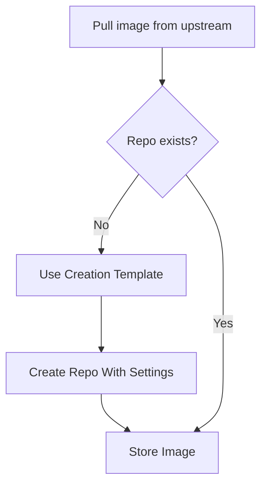

# 🧪 **Amazon ECR Private Registry – Feature Settings & Real-World Use Cases**

Let’s take a deep dive into **Amazon Elastic Container Registry (ECR) Private Registry** feature settings 🔐 — not just the _what_, but _why_ and _how they save your butt in production_ 🚀.

---

## 📜 Table of Contents

1. 🔐 [Registry Permissions](#-1-registry-permissions)
2. 🌀 [Pull Through Cache](#-2-pull-through-cache)
3. 🧩 [Repository Creation Templates](#-3-repository-creation-templates)
4. 🌍 [Replication](#-4-replication)
5. 🔬 [Scanning](#-5-scanning)
6. 🧠 [Summary Table](#-summary-table)

---

## 🔐 1. **Registry Permissions**

### _Limit Who Can Create Repos_

### 👨‍🔧 Problem

Your developers accidentally keep creating test repositories like `my-app-copy123`. You want to **lock down repo creation** so only the DevOps team can do it.

### ✅ Solution: Set a Registry Policy

```json
{
  "Version": "2012-10-17",
  "Statement": [
    {
      "Sid": "AllowDevOpsTeamToManageRegistry",
      "Effect": "Allow",
      "Principal": {
        "AWS": "arn:aws:iam::123456789012:role/devops-role"
      },
      "Action": ["ecr:CreateRepository", "ecr:DeleteRepository", "ecr:PutRegistryPolicy"],
      "Resource": "*"
    }
  ]
}
```

🔐 Only the `devops-role` can create/delete repos. Developers can still pull — but the registry stays clean and organized.

---

## 🌀 2. **Pull Through Cache**

### _Mirror Docker Hub (or other registries) to avoid rate limits_

### 🐳 Problem

Your CI/CD pipeline pulls `node:18-alpine` from Docker Hub 10 times a day and gets throttled 🚫.

### ✅ Solution: Use a Pull-Through Cache

1. **Go to ECR Console → Private Registry → Pull Through Cache**
2. Create a new rule:

   - **Upstream registry**: `public.ecr.aws/docker/library`
   - **Namespace prefix**: `dockerhub`

3. Pull from your private ECR instead:

```bash
docker pull <account-id>.dkr.ecr.<region>.amazonaws.com/dockerhub/node:18-alpine
```

### 🔄 What Happens Internally

<div align="center">



</div>

🎯 You just removed rate limits, increased speed, and have a private copy for security.

---

## 🧩 3. **Repository Creation Templates**

### _Auto-create repos with sane defaults when caching kicks in or manual creation occurs_

### ❓ What’s the Real Purpose?

This feature doesn’t _restrict_ repo creation. Instead, it **automates your repo settings** when:

- Pull-through cache creates a repo dynamically (e.g. `dockerhub/nginx`)
- A user/dev creates a new repo manually
- CI/CD scripts create repos on the fly

Instead of letting new repos start with no security policies, no lifecycle policies, and mutable tags 😱, this **enforces security best practices out-of-the-box**.

---

### 🛠 Example Scenario

Without this feature:

- CI/CD pulls `dockerhub/nginx`, ECR creates the repo silently.
- ❌ No encryption
- ❌ Tags are mutable
- ❌ No scanning enabled

**With templates:**

1. Go to **ECR → Private Registry → Repository Creation Templates**
2. Click **Edit** and configure:
   - ✅ Enable tag immutability
   - ✅ Enable scanning on push
   - 🔐 Set KMS encryption
   - 🏷 Add default tags (e.g., `team=devops`, `env=prod`)

💥 Now, any repo created — even by cache or automation — inherits these settings:



🧠 _Think of this as “infrastructure hygiene by automation.”_

---

## 🌍 4. **Replication**

### _Global disaster recovery or latency optimization_

### 🌐 Problem

Your workloads run in `us-east-1` and `eu-west-1`, but you manually sync container images across regions. It’s annoying and error-prone.

### ✅ Solution: Replication Rules

1. **Go to ECR → Private Registry → Replication**
2. Create a rule:

   - Source: `us-east-1`
   - Destination: `eu-west-1`
   - Scope: All repos or specific ones

3. Push image to `us-east-1`:

```bash
docker push <account-id>.dkr.ecr.us-east-1.amazonaws.com/my-app:latest
```

🎉 It gets replicated to `eu-west-1` automatically.

No S3 copy. No Lambda scripts. Pure AWS magic ✨

---

## 🔬 5. **Scanning**

### _Shift-left security scanning for containers_

### 🔍 Problem

You want to stop vulnerabilities before they hit production but don’t have time to manually scan every image.

### ✅ Solution: Enable Scanning

1. Go to `ECR → Repositories → my-app-repo`
2. Under **Scanning**, choose:

   - ✅ Basic (free)
   - 🔍 Enhanced (Amazon Inspector)

3. Push an image:

```bash
docker push <account-id>.dkr.ecr.<region>.amazonaws.com/my-app:latest
```

ECR auto-scans the image. See the results in console or CLI:

```bash
aws ecr describe-image-scan-findings \
  --repository-name my-app \
  --image-id imageTag=latest
```

🔔 Bonus: Use EventBridge to trigger alerts if critical CVEs found!

---

## 🧠 Summary Table

| Feature                     | Use Case                           | What It Solves                             |
| --------------------------- | ---------------------------------- | ------------------------------------------ |
| **Registry Permissions**    | Prevent unauthorized repo creation | Protects from repo sprawl                  |
| **Pull Through Cache**      | Avoid rate limits + speed up CI/CD | Cache images privately                     |
| **Repo Creation Templates** | Standardize new repos              | Ensure security, tags, scanning by default |
| **Replication**             | Global availability & DR           | Avoids manual syncing                      |
| **Scanning**                | Detect CVEs on image push          | Enables shift-left security                |

---

## 🏁 Final Thoughts

ECR Private Registry Features aren’t just fancy switches — they solve real security, performance, and automation pain points.

🔧 By using them together:

- You enforce company-wide defaults (Templates)
- Avoid external throttling (Cache)
- Secure your infra (Scan + Policies)
- Prepare for failure (Replication)
