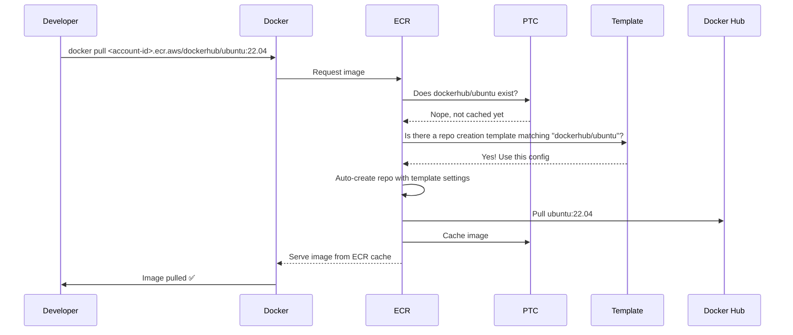

# 🧊 Amazon ECR Pull Through Cache & Repository Creation Templates

## 🧠 What This Topic Covers

| Feature                              | What You'll Learn                                                                            |
| ------------------------------------ | -------------------------------------------------------------------------------------------- |
| 🌀 **Pull Through Cache (PTC)**      | What it is, how it works behind the scenes, and how to use it smartly                        |
| 🧩 **Repository Creation Templates** | What they do, why they’re required for PTC, and how they enforce defaults                    |
| 🤔 **Common Confusions Solved**      | Do I need to create a repo manually? Where is the cache stored? What triggers repo creation? |

---

## 🌀 What is Pull Through Cache?

> **Official Definition:**  
> _Amazon ECR Pull Through Cache_ lets you cache container images from external public registries (like Docker Hub or Quay) inside your own private ECR registry. This avoids rate limits, improves speed, and makes builds more reliable.

### 🧪 Scenario: Slow CI Builds from Docker Hub

You’re pulling `node:18-alpine` from Docker Hub over and over in your CI/CD pipeline. It’s slow, sometimes fails due to DockerHub’s pull limits.

### ✅ PTC to the Rescue

With PTC enabled, ECR will **pull it once**, then **cache it locally** inside your AWS-managed storage (not S3), and serve it on every subsequent pull from ECR instead of Docker Hub.

---

## 🧩 What are Repository Creation Templates?

> **Official Definition:**  
> _Repository Creation Templates_ let you define default settings (like scanning, tag immutability, encryption, and IAM policies) that are automatically applied when ECR creates a repository for the first time.

### 😮 Wait... ECR Creates Repos Automatically?

Yes — **only** when:

- A **PTC rule** is configured
- You pull from a namespace prefix like `dockerhub/node`, and that repository **doesn’t exist yet**
- A **template matching the prefix** exists to allow repo auto-creation

---

## 🔁 How These Two Features Work Together

<div align="center">



</div>

---

## 🔥 Practical Example: Ubuntu Image from Docker Hub

Let’s say your Dockerfile looks like this:

```dockerfile
FROM ubuntu:22.04
RUN apt update && apt install -y curl
```

Instead of pulling directly from Docker Hub, you’ll:

1. Set up a PTC rule:

   - **Upstream registry**: `public.ecr.aws/docker/library`
   - **Prefix**: `dockerhub`

2. Configure a **repository creation template** with:

   - Image scanning
   - Immutable tags
   - Encryption
   - Optional access policy

3. Pull from ECR using this:

   ```bash
   docker pull <account-id>.dkr.ecr.<region>.amazonaws.com/dockerhub/ubuntu:22.04
   ```

4. What happens:
   - ECR checks if the repo `dockerhub/ubuntu` exists.
   - If not, and your template allows it, **ECR auto-creates the repo** using the template.
   - The image is fetched from Docker Hub, cached, and returned.
   - ✅ Every future pull hits **your** ECR registry, not Docker Hub.

---

## 🤯 Common Confusions Cleared

| Confusion                                                  | Clear Answer                                                                                           |
| ---------------------------------------------------------- | ------------------------------------------------------------------------------------------------------ |
| **Do I need to create the repo manually?**                 | ❌ No! If a matching template exists, ECR will create it for you automatically.                        |
| **Is the image stored in S3?**                             | ❌ No. ECR uses its own internal managed storage — not directly S3.                                    |
| **Do I need a repo creation template for every PTC rule?** | ✅ Yes — **if you want automatic repo creation** to happen when an image is pulled for the first time. |
| **What if there’s no template?**                           | ❌ The pull fails with `repository not found`.                                                         |
| **What if the repo exists already?**                       | ✅ Then PTC just caches and serves as expected.                                                        |
| **Is this related to pushing images?**                     | ❌ No. PTC is only for pulling external public images and caching them.                                |

---

## 🧠 Summary Table

| Feature                      | Purpose                                   | Used With                   |
| ---------------------------- | ----------------------------------------- | --------------------------- |
| **Pull Through Cache (PTC)** | Cache public images into private ECR      | Docker Hub, Quay            |
| **Repo Creation Templates**  | Automatically apply default repo settings | With PTC or manual creation |

---

## 🧰 Suggested Defaults in Repo Creation Templates

Here’s what a solid default setup might include:

- ✅ Image scanning on push
- ✅ Immutable tags
- 🔐 Encryption with KMS key
- 🔖 Tags like `department=devops`, `env=prod`
- 🔐 IAM policy that blocks anyone outside the CI pipeline

---

## 🧑‍🏫 Final Thoughts

Both **PTC and Repo Templates** are game changers:

- You get **Docker Hub speed without limits**
- You keep **full control over repository behavior**
- You enforce **security and compliance by default**
- All while reducing manual work for your team
