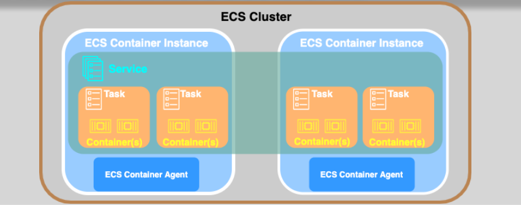
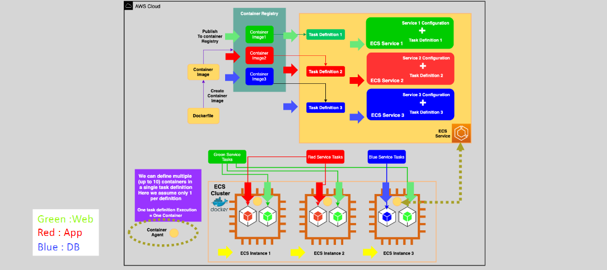

# 🎛️ Amazon ECS (Elastic Container Service)

_A Fully Managed Container Orchestration Solution on AWS!_

---

<div style="text-align: center; padding: 10px">
  
</div>

---

## 🧠 What Is Amazon ECS?

**Amazon ECS (Elastic Container Service)** is a **fully managed container orchestration service** that allows you to run and manage Docker containers at scale without the need to operate your own cluster management infrastructure.

ECS supports both **serverless** and **infrastructure-controlled** deployment models via **AWS Fargate**, **Amazon EC2**, and **ECS Anywhere**.

---

## 🌟 Key Features of ECS

| Feature                              | Description                                                                   |
| ------------------------------------ | ----------------------------------------------------------------------------- |
| 🚀 **Fully Managed**                 | No need to install or manage Kubernetes or other orchestrators                |
| 🔄 **Tight AWS Integration**         | Works out of the box with IAM, CloudWatch, Cloud Map, ALB/NLB, etc.           |
| 🧰 **Launch Flexibility**            | Use **Fargate**, **EC2**, or **ECS Anywhere** depending on your control needs |
| 📈 **Auto Scaling & Load Balancing** | Built-in support for auto-scaling containers and traffic balancing            |
| 🔐 **Secure by Default**             | Uses IAM roles for tasks and VPC networking with security groups              |

---

## 🧱 Core Components

<div style="text-align: center; padding: 10px">
  
</div>

---

### 🏗️ 1. **ECS Cluster**

A **logical grouping** of infrastructure (Fargate tasks, EC2 instances, or on-prem servers). It acts as the orchestration space for deploying applications.

> Think of it as your container "sandbox."

---

### 📘 2. **Task Definition**

A **blueprint** that defines:

- Docker image(s)
- vCPU and memory settings
- Environment variables
- Volumes
- IAM roles
- Network modes

🔁 One task definition can power many **ECS tasks**.

---

### 🚀 3. **ECS Task**

A **running container** (or group of containers) based on a task definition.

- Can run once (batch jobs) or long-lived (microservices).
- Each task is placed on either **Fargate** or **EC2**.

---

### 🛎️ 4. **ECS Service**

Maintains the desired number of **running tasks** at all times.

- Supports **rolling deployments**
- Can connect to an **Application Load Balancer (ALB)** or **Network Load Balancer (NLB)**
- Integrates with **Service Auto Scaling**

---

### 💻 5. **ECS Container Agent** (for EC2)

- Runs on each EC2 instance in the cluster.
- Communicates with ECS to start/stop tasks.
- Registers the EC2 instance with the ECS control plane.

---

## 🌍 Deployment Options

### 1️⃣ **Fargate (Serverless)**

> Run containers without managing servers.

| Benefits                         |
| -------------------------------- |
| 🚫 No EC2 provisioning           |
| 🧮 Auto-scales CPU & memory      |
| 🔒 Network isolation via ENI     |
| 💡 Ideal for microservices, APIs |

```bash
LaunchType: FARGATE
```

---

### 2️⃣ **EC2 (Server-based)**

> Bring your own EC2 instances.

| Benefits                           |
| ---------------------------------- |
| 🧠 Full control over instances     |
| 🛠️ Custom agents, AMIs, volumes    |
| 💡 Ideal for persistent storage    |
| 💸 Lower cost for stable workloads |

```bash
LaunchType: EC2
```

---

### 3️⃣ **ECS Anywhere**

> Run ECS tasks **on-premises** or **other clouds**.

- Connect non-AWS infrastructure to ECS.
- Hybrid cloud ready.
- Requires installing the **ECS Anywhere agent**.

---

## 📦 Use Cases for Amazon ECS

| Scenario              | Why ECS?                                          |
| --------------------- | ------------------------------------------------- |
| 🧩 Microservices      | Isolated services with auto-scaling per component |
| 🧪 Batch Jobs         | One-off jobs like ETL, media encoding, etc.       |
| 🔁 CI/CD Pipelines    | Easy automation of deployment pipelines           |
| 🏢 Hybrid Deployments | ECS Anywhere for non-AWS workloads                |
| ⚙️ Backend APIs       | Scale containerized APIs with ALB/NLB integration |

---

## ⚖️ ECS vs. Lambda

| Feature                | Amazon ECS                           | AWS Lambda                             |
| ---------------------- | ------------------------------------ | -------------------------------------- |
| 🧠 **Execution Type**  | Long-running services / batch jobs   | Event-driven, short duration functions |
| 🔄 **Scaling Model**   | Task-level auto-scaling              | Invocation-based auto-scaling          |
| ⏱️ **Max Duration**    | Unlimited                            | 15 minutes (900 seconds)               |
| 🔧 **Infrastructure**  | Optional (Fargate or EC2)            | Fully managed (no infra control)       |
| 💸 **Cost Efficiency** | Better for steady loads              | Better for unpredictable, bursty loads |
| 🛠️ **Use Case Fit**    | Microservices, APIs, custom runtimes | Simple event handlers, cron jobs       |

---

## 🧠 Best Practices

- ✅ Use **Fargate** when you want simplicity
- ✅ Use **EC2** when you need fine-tuned control or custom software
- ✅ Use **Service Auto Scaling** + **CloudWatch Alarms**
- ✅ Use **ALB + ECS Service Discovery** for service-to-service communication
- ✅ Use **IAM roles for tasks** for secure permissions
- ✅ Enable **container insights** for metrics and logs

---

## 🛠️ Developer Experience

- ECS integrates with **AWS Copilot CLI** for simplified deployment
- Supports **Blue/Green deployments** with CodeDeploy
- Works with **ECR**, **CloudWatch**, **AWS Secrets Manager**, and **IAM Roles for Tasks**

---

## 📚 Official References

- 🔗 [ECS Developer Guide](https://docs.aws.amazon.com/AmazonECS/latest/developerguide/Welcome.html)
- 🔗 [ECS Fargate Launch Type](https://docs.aws.amazon.com/AmazonECS/latest/userguide/what-is-fargate.html)
- 🔗 [ECS Anywhere Guide](https://docs.aws.amazon.com/AmazonECS/latest/userguide/ecs-anywhere.html)
