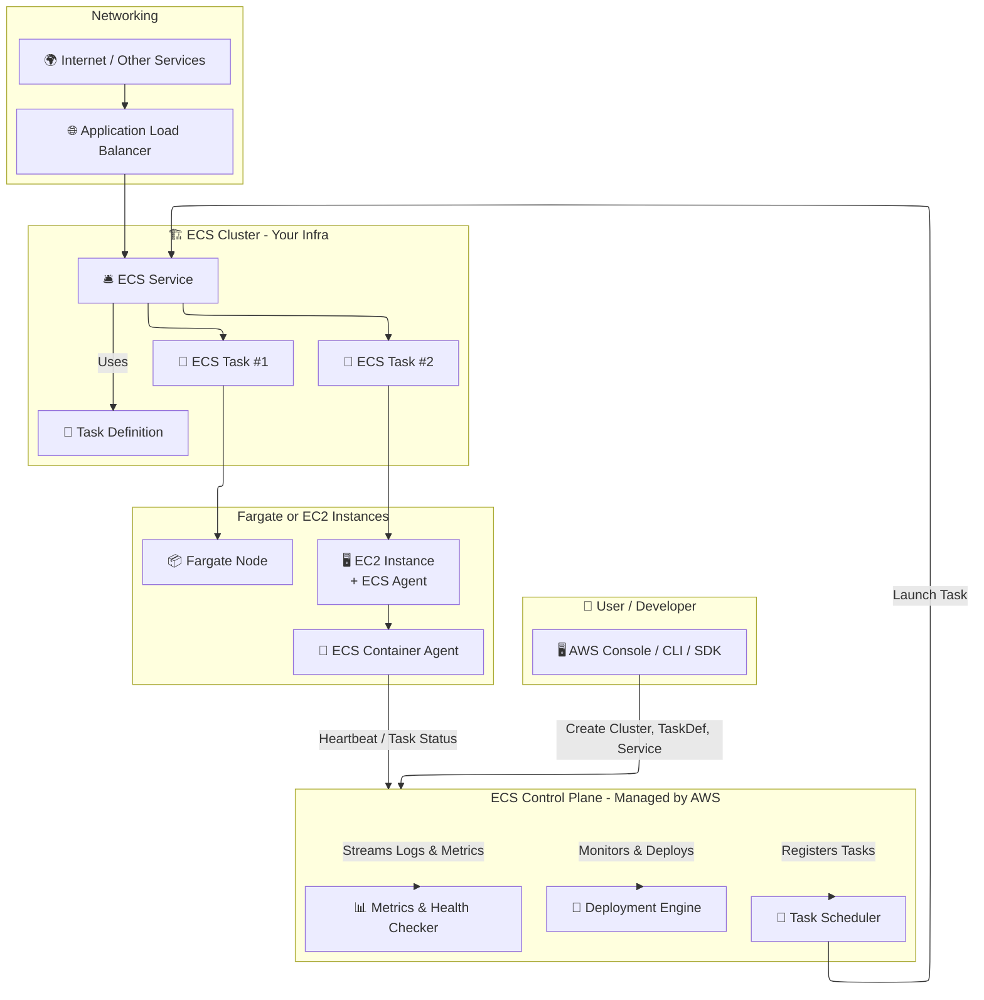
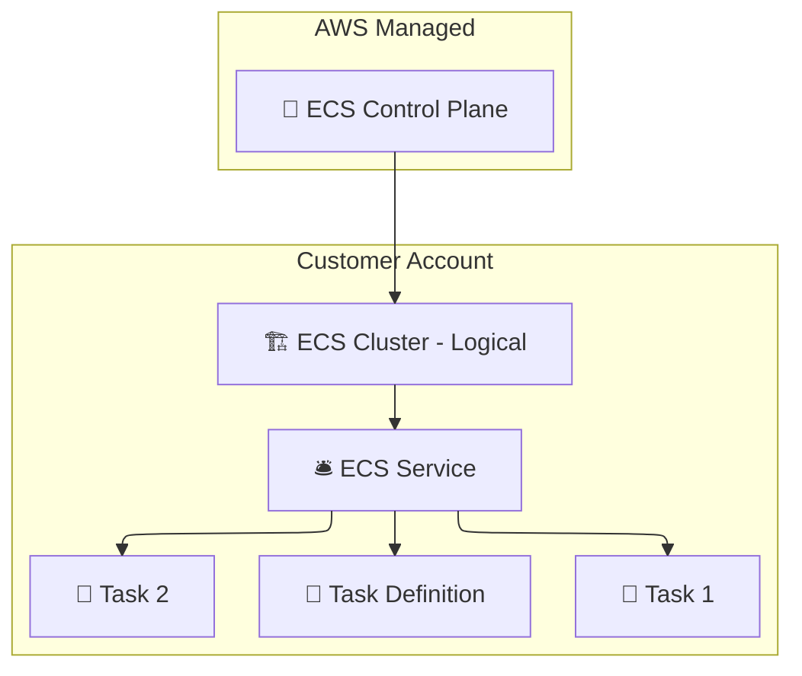
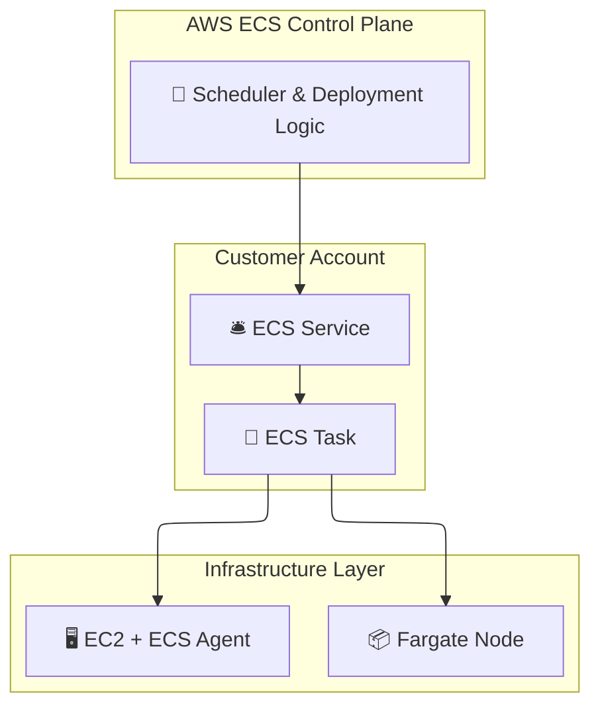
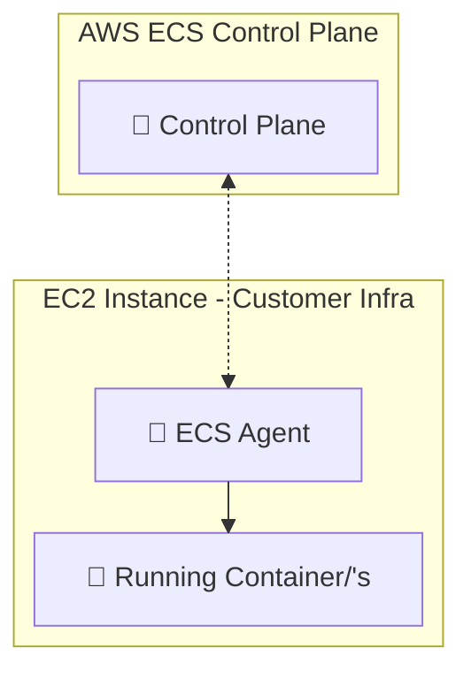
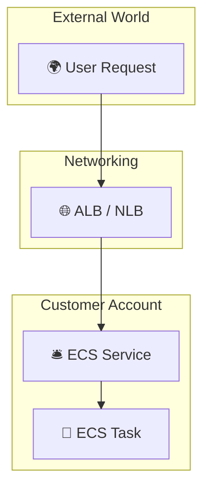

# 🧩 Amazon ECS Full Architecture – Broken Down Visually

---

## 🔍 Breakdown of the ECS Flow

Let’s break down what happens under the hood:

### 🧠 1. **Control Plane (AWS-managed)**

- Accepts configurations (clusters, task definitions, services)
- Decides **where and when** to run tasks
- Monitors health and enforces the desired task count
- Stores logs & metrics in **CloudWatch**
- Communicates with ECS Agents (for EC2 launch type)

---

### 🏗️ 2. **ECS Cluster**

- A logical group to manage ECS services and tasks.
- Can span **EC2**, **Fargate**, and **ECS Anywhere**.

---

### 📘 3. **Task Definition**

- A JSON blueprint describing the container image, resources, IAM roles, logging, and volumes.

---

### 🛎️ 4. **ECS Service**

- Ensures the right number of tasks are running.
- Supports rolling updates and integrates with **ALB/NLB** for traffic routing.

---

### 🚀 5. **ECS Task**

- A container (or group) created from a task definition.
- Can run on Fargate or EC2, depending on `launchType`.

---

### 🤖 6. **ECS Agent (for EC2)**

- Installed on EC2 to allow it to join the cluster.
- Reports task status, fetches instructions from control plane.

✅ **Not required for Fargate** (fully managed).

---

### 🌐 7. **Networking & Load Balancer**

- ECS integrates with **ALB/NLB** for incoming traffic.
- Services are registered into a **Target Group**, traffic routed via **path or port**.

---

## 🔷 Sub-Diagram 1: **Big Picture Overview**

### 📘 **Explanation:**

| Component                    | Location         | Description                                |
| ---------------------------- | ---------------- | ------------------------------------------ |
| `ECS Control Plane`          | AWS-managed      | Scheduler, orchestrator, deployment engine |
| `ECS Cluster`                | Customer-owned   | Logical space grouping tasks and services  |
| `TaskDef`, `Task`, `Service` | Customer-defined | You define these in your AWS account       |

---

## 🔶 Sub-Diagram 2: **Task Deployment (EC2 or Fargate)**

### 📘 **Explanation:**

| Component   | Location               | Notes                            |
| ----------- | ---------------------- | -------------------------------- |
| `Scheduler` | AWS                    | Decides where to launch the task |
| `Task`      | Customer Account       | You define task settings         |
| `EC2`       | Your EC2 instances     | Must run ECS Agent               |
| `Fargate`   | AWS-managed serverless | No management needed from you    |

---

## 🔷 Sub-Diagram 3: **EC2 Launch Type Internals**

### 📘 **Explanation:**

| Component       | Location     | Description                |
| --------------- | ------------ | -------------------------- |
| `ECS Agent`     | Runs on EC2  | Communicates with AWS      |
| `Control Plane` | AWS          | Sends launch instructions  |
| `Container`     | Customer EC2 | Actual Docker container(s) |

> 📝 Not needed in **Fargate** – AWS handles infra + agent.

---

## 🔶 Sub-Diagram 4: **Networking & Load Balancer Integration**

### 📘 **Explanation:**

| Component | Location       | Description                   |
| --------- | -------------- | ----------------------------- |
| `ALB`     | AWS Networking | Routes traffic to ECS Service |
| `Task`    | Customer-owned | Receives and handles request  |
| `Service` | Customer-owned | Registers with Load Balancer  |

---

## 🧠 Final Summary

| Component                | Location         | Notes                                      |
| ------------------------ | ---------------- | ------------------------------------------ |
| 🧠 **ECS Control Plane** | AWS              | Handles orchestration, scaling, scheduling |
| 🏗️ **ECS Cluster**       | Customer Account | Logical grouping for workloads             |
| 📘 **Task Definition**   | Customer Account | Blueprint for task containers              |
| 🧱 **Task**              | Customer Infra   | Runs on Fargate or EC2                     |
| 🤖 **ECS Agent** (EC2)   | EC2 only         | Facilitates control plane comm             |
| 📦 **Fargate Node**      | AWS              | Serverless compute platform                |
| 🌐 **ALB / NLB**         | AWS              | Routes external traffic to services        |

---

## 🧠 Communication Flow Summary

| Step | Component            | Action/Description                                                             |
| ---- | -------------------- | ------------------------------------------------------------------------------ |
| 1️⃣   | User/CLI             | Defines Task Definitions, Services, and Cluster using CLI, SDK, or AWS Console |
| 2️⃣   | ECS Control Plane    | Validates config, stores metadata, and assigns tasks via scheduler             |
| 3️⃣   | ECS Service          | Maintains desired number of tasks by launching them on Fargate or EC2          |
| 4️⃣   | ECS Agent (EC2 only) | Registers EC2 with ECS, receives and executes task instructions                |
| 5️⃣   | Task Launch          | ECS tasks are started with the configured containers                           |
| 6️⃣   | Load Balancer        | Routes user traffic to the tasks via target group                              |
| 7️⃣   | Monitoring           | ECS sends logs and metrics to **CloudWatch** for observability                 |

---

## 📦 Tips: Control Plane vs. Data Plane

| Control Plane (AWS-Managed)  | Data Plane (Your Infra)          |
| ---------------------------- | -------------------------------- |
| 🧠 Task Scheduling           | 🔁 Task Execution (Fargate/EC2)  |
| 🔄 Deployment Logic          | 🚀 Running Containers (Tasks)    |
| 📊 CloudWatch Monitoring     | 🧱 Actual container traffic/load |
| 🔐 IAM and Permissions Logic | 🔌 Network and Storage Access    |

---

## ✅ Want more?

I can visualize:

- ECS + **CodeDeploy Blue/Green flow**
- ECS + **CloudWatch Auto Scaling logic**
- ECS Anywhere (on-prem tasks)
- ECS with ECR + Secrets Manager + IAM Role for Tasks
