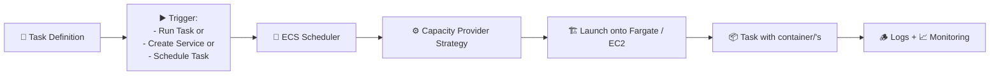
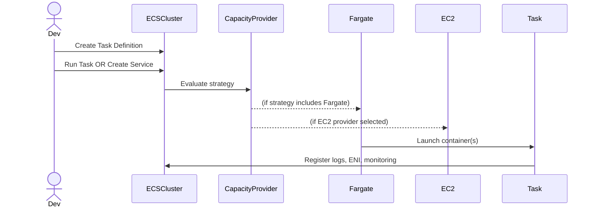

# 🧠 Amazon ECS Cluster

## 📌 ECS Core Model

At the highest level, ECS operates as an **orchestrator** for containers. It does three jobs:

1. **Defines** how your app should run → using a **Task Definition**
2. **Schedules** how & when your containers run → via **Tasks**, **Services**, or **Scheduled Tasks**
3. **Executes** containers using compute → **Fargate**, **EC2**, or **ECS Anywhere**

---

> Think of a **cluster** as your neighborhood or playground 🏡 where all your containers run.

It groups:

- 🧊 **Services** (long-running apps like a website or API)
- 🔁 **Tasks** (one-time jobs like scripts or cronjobs)
- 📅 **Scheduled Tasks** (jobs that run on a timer, like a daily report)

You can run **Fargate** or **EC2-backed** tasks in this playground.

---

## 🔧 What Happens When You Create a Cluster?

Let’s go step by step. ECS gives you these sections:

---

### 1️⃣ **Services**

> ⚙️ **What are ECS Services?**

👦 Think of this as a **forever-running app** that restarts if it breaks.

📦 It uses a **Task Definition** and keeps a fixed number of copies (**tasks**) running all the time.

🧠 Services are great for:

- Web APIs
- Backend servers
- Databases (not common but possible)

🧙 Pro Tip:

- ECS Services support **load balancing**, **blue/green deployments**, **auto scaling**, and **service discovery**.

---

### 2️⃣ **Tasks (Run Task)**

> 🚀 A task is just a one-time shot of your container.

👶 You can think of it like:  
"Hey ECS, go run this thing once and don't worry about it after."

📦 It also uses a **Task Definition**, but unlike a service, it **doesn't restart or scale** — it just runs and finishes.

🧠 Great for:

- Data processing jobs
- Scheduled backups
- Ad-hoc scripts

---

### 3️⃣ **Scheduled Tasks**

> ⏰ These are just “Run Task” commands that happen on a schedule.

👦 Like setting an alarm clock:  
"Run this task every day at 6 AM!"

Uses:

- Cron jobs
- Email reports
- Cleanup jobs

✅ It uses **CloudWatch Events (EventBridge)** behind the scenes to schedule the task.

---

## 🔁 ECS Execution Flow Overview



---

## 🧱 ECS Cluster: The Execution Boundary

> A **cluster** is a **logical boundary** that defines where your ECS workloads will run. It doesn’t run anything by itself — it's a container runtime workspace that uses **capacity providers** (Fargate or EC2) to launch actual work.

---

## 🎯 Task Definition (Blueprint for Execution)

Think of this as your deployment unit:

- Contains one or more **containers**
- Specifies:
  - Image to use (`nginx:latest`)
  - CPU/memory
  - Logging config
  - Networking mode
  - Environment variables
  - IAM role bindings

📘 Stored as a **versioned resource** and reused by services or tasks.

---

## 🔁 Task (One-off Unit of Work)

> A **Task** is the actual instantiation of a Task Definition inside a Cluster.

A task runs:

- Once if triggered directly (e.g., "Run Task" button or AWS CLI)
- Continuously if managed by a **Service**
- On a schedule if created as a **Scheduled Task**

Each task is a **containerized runtime** provisioned using **Fargate or EC2** based on your settings.

---

## 🕰️ Scheduled Tasks (Time-based One-shot Jobs)

These are EventBridge rules that **trigger “Run Task”** on a defined schedule (cron or rate expression).

Examples:

- Nightly batch jobs
- Weekly S3 report cleaners
- Daily ETL syncs

Unlike services, **they don’t persist**, scale, or track health — just run and exit.

---

## ⚙️ Services (Long-Running Containers)

> An ECS **Service** is a controller that keeps a desired count of tasks running, automatically replacing failed ones.

### What a Service Controls

| Feature               | Description                |
| --------------------- | -------------------------- |
| 🔁 Task Count         | Maintains N running copies |
| 📡 Load Balancer      | Integrates with ALB or NLB |
| 🔄 Rolling Deployment | Controlled updates         |
| 🔍 Health Check Logic | Replace unhealthy tasks    |
| ⚖️ Auto Scaling       | Horizontal scale out/in    |

Services are the **stateful orchestrators** for stateless containers.

---

## 🔥 Capacity Providers (Pro-Level)

> Capacity Providers let ECS decide **where** and **how** to launch tasks.

- Can be:
  - `FARGATE`
  - `FARGATE_SPOT`
  - `MyEC2AutoScalingGroup`

Each ECS **Service** can have a **Capacity Provider Strategy** like:

```json
[
  {
    "capacityProvider": "FARGATE",
    "weight": 1
  },
  {
    "capacityProvider": "FARGATE_SPOT",
    "weight": 2
  }
]
```

💡 **Weight** means preference — more weight = more tasks land there.

🧠 ECS chooses the best capacity provider based on this.

---

## 🤔 Which Should You Use?

| Use Case                 | Recommendation           |
| ------------------------ | ------------------------ |
| Web app backend          | ECS Service on Fargate   |
| Data processing pipeline | Run Task on Fargate      |
| Cron job (nightly task)  | Scheduled Task           |
| High performance compute | EC2 with Auto Scaling    |
| Spot instance savings    | Fargate Spot or EC2 SPOT |
| Load balancer & scaling  | ECS Service              |

---

## 📦 Container Execution Lifecycle

Here’s how a task is born and run in a cluster:



---

## 🔍 Monitoring, Insights & Logs

| Tool                      | Description                                 |
| ------------------------- | ------------------------------------------- |
| 📊 **CloudWatch Metrics** | Resource usage, task count, failures        |
| 🪵 **CloudWatch Logs**     | Container logs (via `awslogs` driver)       |
| 📈 **Container Insights** | Advanced CPU/memory/process metrics         |
| 🧪 **ADOT Sidecar**       | OpenTelemetry sidecar for tracing & metrics |

Monitoring is per cluster and optionally enhanced via Container Insights or sidecars.

---

## 🔐 Security Boundary

- **Task Role**: Used by the container to access AWS resources (e.g., S3)
- **Execution Role**: Used by ECS to pull the image, create logs, attach ENI
- **Security Group**: Used when in `awsvpc` mode for task-level networking
- **KMS Keys**: Can encrypt task logs, volumes, secrets

---

## 🔁 Update and Rollback

ECS Services support:

- **Rolling Deployments** (default)
- **Blue/Green deployments** via CodeDeploy (advanced)
- **Force new deployments** (redeploy current task)

You can rollback by selecting a previous task definition revision.

---

## ✅ Summary: ECS Orchestration Model

| Component            | Role in System              |
| -------------------- | --------------------------- |
| 📘 Task Definition   | The application blueprint   |
| 📦 Task              | Running instance of the app |
| 🧃 Service           | Long-running controller     |
| 🕰️ Scheduled Task    | Timed execution logic       |
| 🧱 Cluster           | Logical execution workspace |
| ⚙️ Capacity Provider | Execution logic (how/where) |
| ☁️ Fargate / EC2     | Compute provider            |
