# 🚀 Amazon ECS Clusters – The Complete Guide (2025 Edition)

> **“One cluster to rule them all — EC2, Fargate, or both.”**

---

## 📚 What Is an ECS Cluster?

An **Amazon ECS Cluster** is a logical grouping of resources where your containerized applications run. It can host:

- **Fargate tasks** (serverless)
- **EC2-backed tasks** (self-managed compute)
- Or **both**, using **capacity providers**

---

## 🧠 ECS Cluster Architecture Overview

```mermaid
flowchart TD
  A[🧱 ECS Cluster] --> B1[⚙️ EC2 Instances]
  A --> B2[☁️ Fargate Tasks]
  B1 --> C1[📦 EC2 Tasks]
  B2 --> C2[📦 Fargate Tasks]
  A --> D[🔗 Capacity Providers]
  A --> E[📡 Service Connect]
  A --> F[📊 Monitoring & Logs]
```



---

## 🛠️ ECS Cluster Types

### 1️⃣ Fargate-Only Cluster

> **Serverless compute** — no EC2 instances to manage.

- **Provisioning**: AWS handles compute provisioning.
- **Networking**: Requires `awsvpc` mode; each task gets its own ENI.
- **Use Cases**: Ideal for microservices, event-driven apps, and unpredictable workloads.

### 2️⃣ EC2-Only Cluster

> **Self-managed compute** — you control the EC2 instances.

- **Provisioning**: You manage EC2 instances and Auto Scaling groups.
- **Networking**: Supports `bridge`, `host`, and `awsvpc` modes.
- **Use Cases**: Suitable for workloads requiring specific hardware or configurations.

### 3️⃣ Mixed Cluster (Fargate + EC2)

> **Hybrid approach** — combine Fargate and EC2 tasks.

- **Provisioning**: Use capacity providers to manage task placement.
- **Use Cases**: Flexibility to run tasks on the most appropriate compute option.

---

## ⚙️ Capacity Providers

Capacity providers manage the infrastructure for your tasks.

- **FARGATE**: Standard Fargate tasks.
- **FARGATE_SPOT**: Cost-effective, interruption-tolerant Fargate tasks.
- **EC2**: EC2 instances managed via Auto Scaling groups.

**Example Capacity Provider Strategy**:

```json
[
  {
    "capacityProvider": "FARGATE",
    "weight": 1
  },
  {
    "capacityProvider": "FARGATE_SPOT",
    "weight": 1
  }
]
```

> **Note**: A capacity provider strategy can include either Fargate or EC2 providers, but not both simultaneously.

---

## 🧱 Creating an ECS Cluster

### 🔧 Fargate Cluster

1. Navigate to the [ECS Console](https://console.aws.amazon.com/ecs/v2).
2. Choose **Clusters** > **Create Cluster**.
3. Enter a **Cluster name**.
4. Under **Infrastructure**, select **AWS Fargate (serverless)**.
5. (Optional) Configure **Monitoring** and **Tags**.
6. Click **Create**.

---

<div style="text-align: center">
  
</div>

---

### 🖥️ EC2 Cluster

1. Navigate to the [ECS Console](https://console.aws.amazon.com/ecs/v2).
2. Choose **Clusters** > **Create Cluster**.
3. Enter a **Cluster name**.
4. Under **Infrastructure**, select **Amazon EC2 instances**.
5. Configure the **Auto Scaling group**:
   - **AMI**: Choose an ECS-optimized AMI.
   - **Instance Type**: e.g., `t3.medium`.
   - **Key Pair**: For SSH access.
   - **Capacity**: Set minimum and maximum instance counts.
6. Configure **Networking**:
   - **VPC** and **Subnets**.
   - **Security Groups**.
7. (Optional) Configure **Monitoring** and **Tags**.
8. Click **Create**.

---

<div style="text-align: center">
  
</div>

---

<div style="text-align: center">
  
</div>

---

## 🔄 Switching Between Fargate and EC2

To switch a service from EC2 to Fargate or vice versa:

1. **Update the Task Definition**:
   - Modify the `requiresCompatibilities` field to `FARGATE` or `EC2`.
2. **Update the Service**:
   - Use the updated task definition.
   - Adjust the **Capacity Provider Strategy** accordingly.
3. **Deploy**:
   - Apply the changes to redeploy the service on the desired compute option.

> **Note**: Ensure that the task definition and network configurations are compatible with the chosen launch type.

---

## 🔗 Service Connect

**Service Connect** simplifies service-to-service communication within and across ECS clusters.

- **Features**:
  - Uses **short names** and **standard ports** for service discovery.
  - Automatically manages DNS entries and traffic routing.
  - Supports communication across **clusters** and **VPCs**.

> **Use Case**: Ideal for microservices architectures requiring seamless inter-service communication.

---

## 📊 Monitoring and Observability

ECS offers robust monitoring features:

- **Container Insights**:
  - Provides metrics like CPU, memory, disk, and network usage.
  - Enables log collection and visualization.
- **Enhanced Observability**:
  - Offers deeper insights into container performance.
  - Helps in troubleshooting and optimizing applications.

> **Best Practice**: Enable Container Insights during cluster creation for comprehensive monitoring.

---

## 🔐 Security Considerations

- **IAM Roles**:
  - Assign appropriate roles to tasks and services for AWS resource access.
- **Security Groups**:
  - Define inbound and outbound rules to control traffic.
- **Encryption**:
  - Use AWS KMS to encrypt data at rest and in transit.
- **FIPS Compliance**:
  - Enable FIPS mode for workloads requiring compliance.

---

## 📌 Best Practices

- **Use Fargate for**:
  - Applications with variable workloads.
  - When you prefer serverless infrastructure management.
- **Use EC2 for**:
  - Applications requiring specific hardware or configurations.
  - When you need more control over the underlying infrastructure.
- **Use Mixed Clusters for**:
  - Flexibility to run tasks on the most suitable compute option.
  - Cost optimization by leveraging Fargate Spot and EC2 Spot instances.

---

## 🧾 References

- [Amazon ECS Clusters](https://docs.aws.amazon.com/AmazonECS/latest/developerguide/clusters.html)
- [Creating an ECS Cluster (Fargate)](https://docs.aws.amazon.com/AmazonECS/latest/developerguide/create-cluster-console-v2.html)
- [Creating an ECS Cluster (EC2)](https://docs.aws.amazon.com/AmazonECS/latest/developerguide/create-ec2-cluster-console-v2.html)
- [Amazon ECS Capacity Providers](https://docs.aws.amazon.com/AmazonECS/latest/developerguide/fargate-capacity-providers.html)
- [Service Connect](https://docs.aws.amazon.com/AmazonECS/latest/developerguide/interconnecting-services.html)
- [Monitoring Amazon ECS](https://docs.aws.amazon.com/AmazonECS/latest/developerguide/ecs-best-practices.html)
