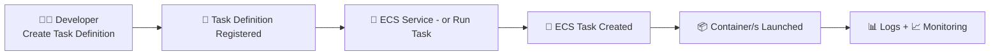
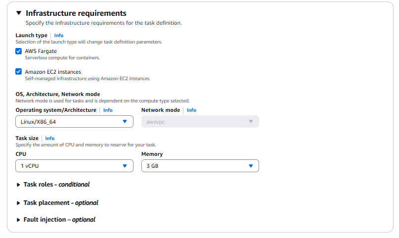
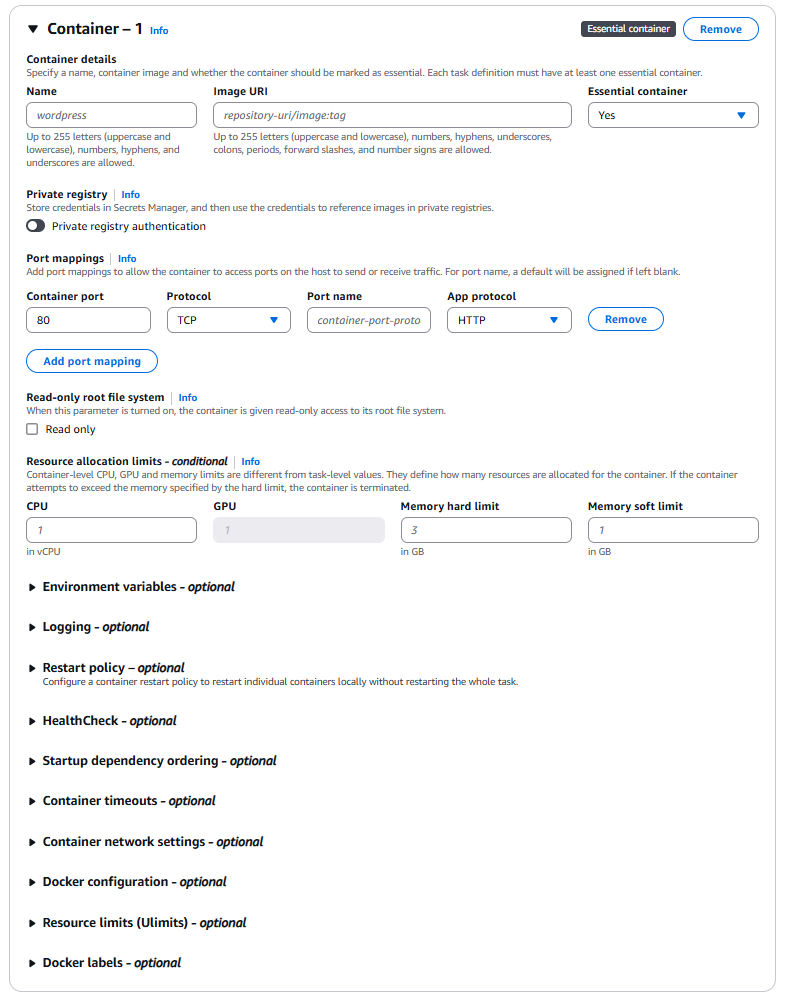
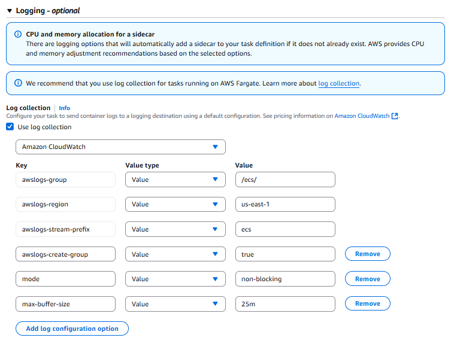
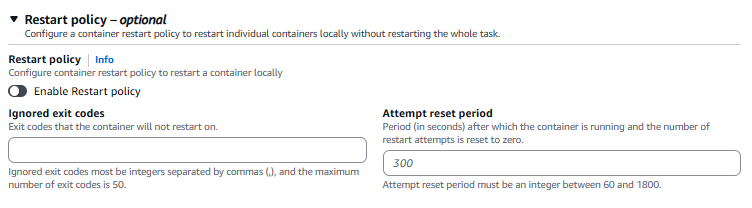
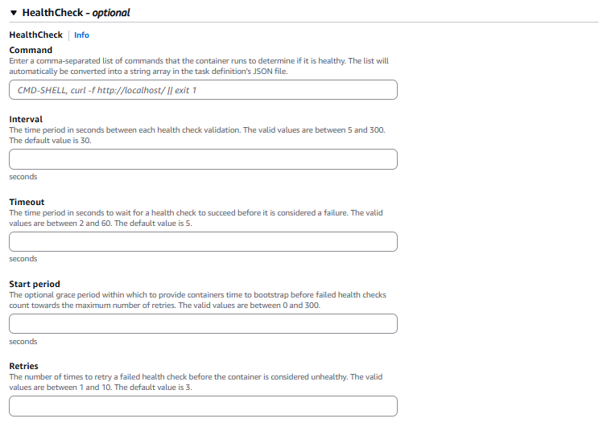
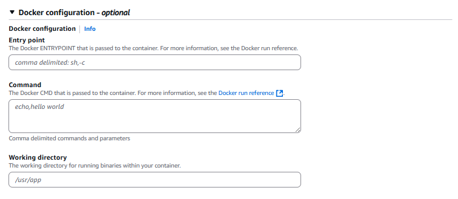

# 🐳 Amazon ECS Task Definition (2024 Console UI) – The Ultimate Guide

> “Define once. Run forever.” – ECS, probably.

---

## 📚 Official Definition

An **ECS Task Definition** is the **declaration of a containerized application**, describing **how many containers** to run, **what images** to use, **resource limits**, **environment configs**, **network settings**, and more.

Think of it like a **Docker Compose file + IAM + cloud-native features** — but wrapped into one ECS-native JSON definition.

---

## 🧭 Overview Flow (How ECS Uses a Task Definition)



---

## 🧱 1️⃣ Task Definition Configuration

> 🧾 What is it?
>
> > This is where you name your task blueprint — every time you create a new version, it's grouped under this "family" name.

### 🧩 Family Name

Just like how "Fast & Furious" has multiple movies — **your task family groups multiple revisions**.

🧠 **Rules:**

- Accepts letters, numbers, hyphens, underscores
- Max: 255 characters

✅ Example:

```plaintext
Task definition family: my-backend-api-task
```

---

## 🛠️ 2️⃣ Infrastructure Requirements

> 📌 This section defines where your containers will run and how much power (CPU + memory) they'll get.

<div style="text-align: center; padding: 10px">
  
</div>

---

| Setting                | Description                                                |
| ---------------------- | ---------------------------------------------------------- |
| 🛫 **Launch Type**     | `AWS Fargate` (serverless) or `EC2` (bring-your-own infra) |
| 💻 **OS/Architecture** | Linux or Windows, X86_64 or ARM64                          |
| 🌐 **Network Mode**    | Typically `awsvpc` (required by Fargate)                   |
| ⚙️ **Task Size**       | Match CPU + Memory per AWS-supported combos                |

🧪 **Example:**

```plaintext
Launch type: AWS Fargate
OS/Arch: Linux/X86_64
Network mode: awsvpc
CPU: 1 vCPU
Memory: 3 GB
```

---

## 🔐 3️⃣ Task Roles – Conditional

> 🔑 What is it?  
> ECS tasks need permission to pull images, write logs, and interact with AWS. These roles define who the task “acts” as.

| Role                       | Description                                                                              |
| -------------------------- | ---------------------------------------------------------------------------------------- |
| 🧾 **Task Role**           | IAM role that your **app inside** the container uses to access AWS resources (e.g., S3). |
| 🔄 **Task Execution Role** | IAM role ECS uses to **pull images / push logs / read secrets**                          |

💡 Task Execution Role Can be created on-the-fly by aws.

---

## 📍 4️⃣ Task Placement – Optional

> 📦 What is it?  
> Only for EC2 launch type: lets you control where your task is placed, based on instance type, AZ, custom attributes.

| Field              | Description                                           |
| ------------------ | ----------------------------------------------------- |
| 🔍 Placement Rules | Constraints like AZ, instance type, custom attributes |

⚠️ Fargate does not support these – it's AWS's problem 😎

---

## 🔁 5️⃣ Fault Injection – Optional

> 💥 What is it? (_Test like a champion. Inject chaos 🧨 (simulate crashes or stops)._)  
> This is where you enable chaos testing by letting ECS inject faults (e.g., restarting a task).

| Field     | Description                        |
| --------- | ---------------------------------- |
| ✅ Enable | ECS will inject faults for testing |

💡 Use in blue/green or resilience testing.

---

## 📦 6️⃣ Container Configuration

> 📦 What is it?  
> This is where you define each container:
> Which image to run, ports to open, CPU/memory, env vars, logging, restart logic, and more.

<div style="text-align: center; padding: 10px">
  
</div>

---

Let’s break it down like a containerized burger 🍔

---

### 🧮 1. Container Details

| Field               | Description                                |
| ------------------- | ------------------------------------------ |
| 🧾 Name             | Unique ID (e.g., `nginx`, `wordpress`)     |
| 🖼️ Image URI        | Docker image path (ECR or DockerHub)       |
| ❗ Essential        | If yes, task fails if this container fails |
| 🔐 Private Registry | Use Secrets Manager for auth               |

✅ Example:

```plaintext
Name: wordpress
Image URI: wordpress:latest
Essential: Yes
```

---

### 🔌 2. Port Mappings

| Field             | Description                            |
| ----------------- | -------------------------------------- |
| 🔢 Container Port | Port exposed by container (e.g., 80)   |
| 🔄 Protocol       | TCP or UDP                             |
| 🏷️ Port Name      | Optional identifier for load balancers |
| 🌐 App Protocol   | HTTP / HTTPS                           |

---

### 🔒 3. Read-only Root Filesystem

> ✅ Enable to **harden** your container by making its root FS **read-only**.
> prevents malware or code from modifying the container's file system — extra security!

---

### ⚙️ 4. Resource Limits

| Field          | Description                                  |
| -------------- | -------------------------------------------- |
| 🧠 CPU         | Per-container CPU share                      |
| 🎮 GPU         | For ML/AI containers (rare)                  |
| 💾 Memory Hard | Max allowed (task is **killed** if exceeded) |
| 💡 Memory Soft | Min reserved; more allowed if available      |

---

### 🌿 5. Environment Variables

| Method            | Description                     |
| ----------------- | ------------------------------- |
| ➕ Individually   | Enter one-by-one (key-value)    |
| 📄 From File (S3) | Load `.env` file from Amazon S3 |

🔐 Great for secrets (but better: use Secrets Manager).

---

### 📜 6. Logging (with CloudWatch)

<div style="text-align: center; padding: 10px">
  
</div>

---

| Setting        | Description                                   |
| -------------- | --------------------------------------------- |
| ✅ Enable Logs | ECS injects sidecar if needed                 |
| 🔧 Log Driver  | `awslogs` (default), or custom                |
| 🧩 Options     | Log group, region, stream prefix, buffer size |

💡 **Best Practice:** Always log to CloudWatch in Fargate!

---

### 🔁 7. Restart Policy

<div style="text-align: center; padding: 10px">
  
</div>

---

| Setting               | Description                                        |
| --------------------- | -------------------------------------------------- |
| ❌ Ignored Exit Codes | Prevent restart for certain exit codes (e.g. `50`) |
| 🔄 Attempt Reset      | Reset retry logic after this period (seconds)      |

---

### 🩺 8. Health Check

<div style="text-align: center; padding: 10px">
  
</div>

---

| Setting     | Description                                                   |
| ----------- | ------------------------------------------------------------- |
| 📜 Command  | Command to run (e.g., `curl -f http://localhost \|\| exit 1`) |
| 🔁 Interval | Frequency (5–300s)                                            |
| ⏲️ Timeout  | How long to wait (2–60s)                                      |
| 🕒 Start    | Grace period before checks start                              |
| 🔂 Retries  | How many failures = unhealthy (1–10)                          |

---

### ⛓️ 9. Startup Dependency Ordering

> Use this in **multi-container** tasks to define which container starts after or before another.

🧠 Example: Start Redis → Then App → Then Web

---

### ⏱️ 10. Container Timeouts

| Setting          | Description                               |
| ---------------- | ----------------------------------------- |
| 🕒 Start Timeout | Wait before assuming the container failed |
| ⛔ Stop Timeout  | Time allowed for graceful shutdown        |

---

### 🌐 11. Network Settings

> Not configurable with `awsvpc` mode (which is default in Fargate).

---

### ⚙️ 12. Docker Runtime Config

<div style="text-align: center; padding: 10px">
  
</div>

---

| Field         | Description                            |
| ------------- | -------------------------------------- |
| 🚪 Entrypoint | Overrides Docker ENTRYPOINT            |
| 💬 Command    | Command to execute (`CMD`)             |
| 📁 Work Dir   | Working directory inside the container |

✅ Example:

```plaintext
Entrypoint: sh,-c
Command: echo,hello world
Work Dir: /usr/app
```

---

### 🧱 13. Ulimits (Linux Resource Limits)

Add `ulimit` values for Linux like:

- `nofile` → Max open files
- `nproc` → Max processes

---

### 🏷️ 14. Docker Labels

Attach metadata to your containers (e.g. `com.myteam.owner: backend`).

---

## 📦 4️⃣ Storage – Optional

> What is it?
> This is where you configure **volumes** — extra data storage for your containers.

### 📂 Volumes

Define and mount data volumes.

```plaintext
Add volume: logs-volume
Mount path: /var/log/nginx
```

### 🔁 Volumes From

Use volume from another container in the same task.

---

## 📊 5️⃣ Monitoring – Optional

> 🧾 What is it?
> ECS now supports built-in **monitoring via AWS Distro for OpenTelemetry (ADOT)** using **sidecar containers**.

Use **ADOT** to send traces and metrics to AWS.

| Feature              | Description                                                     |
| -------------------- | --------------------------------------------------------------- |
| 🧬 Sidecar Injection | Automatically adds OpenTelemetry agent container                |
| ⚡ Trace Collection  | Sends traces to **AWS X-Ray**                                   |
| 📈 Metric Collection | Sends custom metrics to **CloudWatch** or **Amazon Prometheus** |

💡 AWS auto-assigns CPU/memory for the sidecar.

---

## 🏷️ 6️⃣ Tags – Optional

> 🧾 What is it?
> Tags help you organize, filter, and track costs in AWS.

---

Used for billing, organization, filtering in AWS Console.

| Field        | Description                             |
| ------------ | --------------------------------------- |
| 🏷️ Key/Value | Like `Environment=prod`, `Team=backend` |

🧠 Tagging may require `ecs:TagResource` IAM permission.

---

## ✅ What’s New (2024 UI)

| 🔥 Feature           | Upgrade                                            |
| -------------------- | -------------------------------------------------- |
| 🧠 OS/Arch           | Now explicitly selectable                          |
| 📡 Fault Injection   | Built-in toggle for chaos engineering              |
| 📦 Volumes From      | Better UI for multi-container shared storage       |
| ⚙️ Sidecar Injection | Integrated OpenTelemetry tracing + metrics         |
| 🏷️ Tagging IAM       | Tagging authorization warning now shown in console |

---

## 💬 Final Thoughts

> ECS Task Definitions are like pizza recipes:  
> You define the base (infra), choose your toppings (containers), bake it (ECS Service), and eat it (launch it!) 🍕
