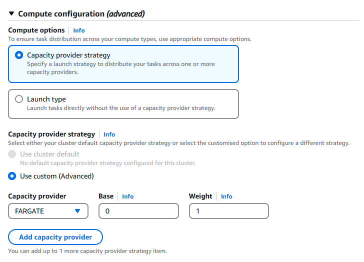

# 🧭 Capacity Provider Strategy vs. Launch Type — Updated Deep Dive

When you launch a **task** or create a **service** in ECS, you must choose **how ECS will decide where to run your container**. There are two methods:

---

## 🧠 1️⃣ Option 1: Launch Type (Legacy Mode)

```plaintext
[ ] Capacity provider strategy
[x] Launch type
```

This method is simple: you pick one and only one **infrastructure type** at runtime:

| Launch Type | Description                              |
| ----------- | ---------------------------------------- |
| `FARGATE`   | Run containers on AWS-managed serverless |
| `EC2`       | Use your self-managed EC2 instances      |

### ✅ When to Use

- Quick, one-time jobs or dev tests
- You don't care about fallback or capacity planning
- You’re scripting something very minimal

### ⚠️ Limitations

- ❌ No cost-aware fallback (e.g., from Spot → On-Demand)
- ❌ Cannot scale with ASG strategies
- ❌ Deprecated in modern production architectures

---

## ⚙️ 2️⃣ Option 2: Capacity Provider Strategy (Modern & Recommended)

```plaintext
[x] Capacity provider strategy
```

> Think of this as a **smarter compute plan**: you tell ECS _how to choose_ between different capacity providers like `FARGATE`, `FARGATE_SPOT`, or your own `EC2-ASG`.

---

### 🧩 UI Settings Breakdown

<div style="text-align: center;">
    
</div>

---

| Field                     | Description                                                                       |
| ------------------------- | --------------------------------------------------------------------------------- |
| **Use cluster default**   | Uses the capacity strategy you configured at the **cluster level**                |
| **Use custom (Advanced)** | Allows you to define a **per-service or per-task strategy** manually              |
| **Capacity provider**     | Choose from `FARGATE`, `FARGATE_SPOT`, `EC2`, or a custom ASG name                |
| **Base**                  | Minimum number of tasks to place on this provider (useful for mixing stable/spot) |
| **Weight**                | Determines how **remaining tasks are distributed** across providers               |

---

### 🧠 How `Base` and `Weight` Work Together

Let’s say you're launching **10 tasks** with this strategy:

```json
[
  { "capacityProvider": "FARGATE", "base": 2, "weight": 1 },
  { "capacityProvider": "FARGATE_SPOT", "base": 0, "weight": 2 }
]
```

**How ECS distributes:**

1. **2 tasks go to FARGATE** (due to base = 2)
2. The remaining 8 tasks:
   - FARGATE_SPOT gets twice the weight → gets 2/3 of them (5–6 tasks)
   - FARGATE gets 1/3 (2–3 tasks)

You get **fallback + cost optimization**, without managing infrastructure!

---

### 💡 Pro Tips for Production

| Scenario                                  | Strategy Example                          |
| ----------------------------------------- | ----------------------------------------- |
| ⚡ Burst workloads, tolerate interruption | `FARGATE_SPOT` only                       |
| 🛡️ Critical workloads                     | `FARGATE` only                            |
| 💸 Cost + stability hybrid                | Base = 1 FARGATE, weight = 2 FARGATE_SPOT |
| 🏗️ EC2 Auto Scaling with spot fallback    | Custom EC2 + `FARGATE` weights            |

---

## 📊 Launch Type vs Capacity Provider: Final Comparison

| Feature                  | Launch Type          | Capacity Provider Strategy |
| ------------------------ | -------------------- | -------------------------- |
| Ease of setup            | ✅ Very easy         | ⚠️ Requires config         |
| Spot + fallback support  | ❌ No                | ✅ Yes                     |
| Auto-scaling integration | ❌ Not supported     | ✅ Native support          |
| Mixed compute models     | ❌ Single type only  | ✅ EC2 + Spot + Fargate    |
| Modern ECS best practice | ❌ Deprecated slowly | ✅ Fully recommended       |

---

## ✅ Final Verdict

> **Always use Capacity Provider Strategy** in any serious workload.

You can build your own logic like:

```json
[
  { "capacityProvider": "FARGATE_SPOT", "weight": 2 },
  { "capacityProvider": "FARGATE", "weight": 1 }
]
```

Or use **custom EC2 auto scaling group** capacity providers like this:

```json
[
  { "capacityProvider": "MyEC2-ASG", "base": 1, "weight": 1 },
  { "capacityProvider": "FARGATE_SPOT", "weight": 2 }
]
```
