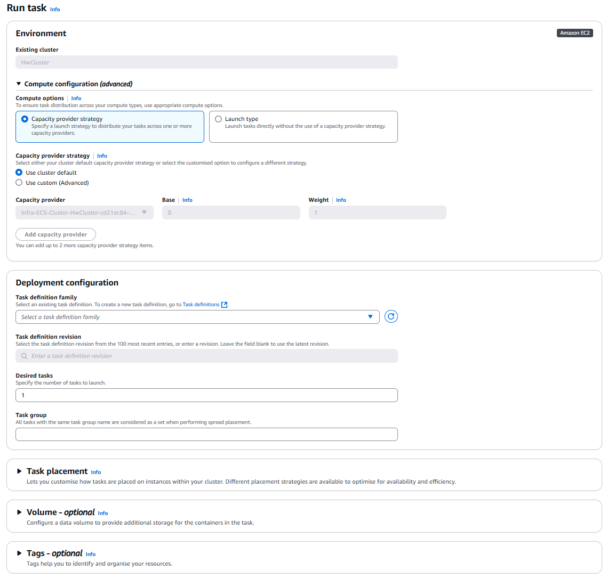

# 🐳 Running a Simple Task in Amazon ECS (Console + CLI, 2025 Edition)

> ECS Tasks are the _one-time, manual invocations_ of your container apps — like "run container now and stop when done".  
> No autoscaling, no service discovery, no retries. Just launch and forget 🚀

---

<div style="text-align: center">
  
</div>

---

## 📚 What’s a Simple Task?

A **simple ECS task** is a standalone execution of a **Task Definition** (your app container blueprint) that:

- **Does not run inside a service**
- **Does not repeat on a schedule**
- **Runs once**, then stops unless you manually start again
- Great for: **migrations, batch jobs, testing new images, backups, cron-like jobs**, etc.

---

## 🧱 Prerequisites (Before You Run)

| Requirement        | Description                                                          |
| ------------------ | -------------------------------------------------------------------- |
| ✅ Task Definition | Already registered with the container image, CPU/memory, etc.        |
| ✅ ECS Cluster     | Either Fargate (serverless) or EC2-based                             |
| ✅ VPC & Subnets   | Networking setup for the task to run (especially Fargate)            |
| ✅ IAM Roles       | Execution Role with permission to pull images, push logs, etc.       |
| ✅ Security Group  | For network access (e.g., allow port 80 or outbound internet access) |

---

## 🖥️ Method 1: Run a Simple Task via **Console**

### 📍 Step-by-Step (Latest 2025 UI)

1. **Open ECS Console**  
   Go to [ECS Console](https://console.aws.amazon.com/ecs/home) → choose your **Cluster**

2. **Click “Tasks” → “Run new task”**

3. **Compute Configuration**  
   You have two choices here:

   - **Launch Type**: Pick `FARGATE` or `EC2` manually (good for testing)
   - **Capacity Provider Strategy**: Use auto-balancing (recommended)

   Example Strategy:

   ```json
   FARGATE_SPOT → weight: 2
   FARGATE → weight: 1
   ```

4. **Task Definition**  
   Select:

   - Task family (e.g., `my-batch-job`)
   - Revision (latest preferred)

5. **Platform Version** (Fargate only)  
   Select `LATEST` unless you need a specific version

6. **Network Settings**

   - **Cluster VPC**
   - **Subnets** (at least 1 public subnet if public IP needed)
   - **Security Group** (allow HTTP/HTTPS if needed)
   - Auto-assign Public IP: `ENABLED` for internet access

7. **Overrides (Optional)**

   - Override CMD/Entrypoint or env vars from task definition

8. **Click "Run Task"**

---

## 🔧 Method 2: Run a Simple Task via **AWS CLI**

```bash
aws ecs run-task \
  --cluster MyCluster \
  --launch-type FARGATE \
  --network-configuration "awsvpcConfiguration={subnets=[subnet-12345],securityGroups=[sg-12345],assignPublicIp=ENABLED}" \
  --task-definition my-batch-job:5 \
  --count 1
```

---

### 📘 Explanation

| Option                                            | Description                                        |
| ------------------------------------------------- | -------------------------------------------------- |
| `--cluster`                                       | Name of the ECS cluster                            |
| `--launch-type` or `--capacity-provider-strategy` | Choose execution method                            |
| `--network-configuration`                         | Needed for `awsvpc` network mode (Fargate default) |
| `--task-definition`                               | Task family + revision number                      |
| `--count`                                         | Number of tasks to run                             |

---

## 🧠 Optional: Use Capacity Provider Strategy (CLI)

```bash
aws ecs run-task \
  --cluster MyCluster \
  --capacity-provider-strategy "capacityProvider=FARGATE_SPOT,weight=2" "capacityProvider=FARGATE,weight=1" \
  --network-configuration "awsvpcConfiguration={subnets=[subnet-abc123],securityGroups=[sg-abc123],assignPublicIp=ENABLED}" \
  --task-definition my-batch-job \
  --count 3
```

ECS will use Spot capacity first if available and fallback to regular Fargate.

---

## 📡 Monitoring Your Task

After launching:

| View                       | Description                                      |
| -------------------------- | ------------------------------------------------ |
| **Tasks tab** (in cluster) | Check `PENDING`, `RUNNING`, or `STOPPED` status  |
| **CloudWatch Logs**        | If enabled in log config, view task output logs  |
| **Events tab**             | ECS system-level events like failures or retries |

You can stop the task manually if needed:

```bash
aws ecs stop-task --cluster MyCluster --task <task-id>
```

---

## 🧪 Common Use Cases for Simple Tasks

| Use Case                     | Description                               |
| ---------------------------- | ----------------------------------------- |
| Batch Processing             | Data crunching, ETL, backups, PDF reports |
| Health Checks or Smoke Tests | Run test containers post-deploy           |
| Migrations or Patching       | One-time maintenance jobs                 |
| Low-frequency Cron Jobs      | Daily/hourly runs via EventBridge         |
| Infrastructure testing       | Validate image or task setup in isolation |

---

## ✅ Summary

| Feature                   | Console              | CLI                                         |
| ------------------------- | -------------------- | ------------------------------------------- |
| Simplicity                | ✅ Beginner-friendly | ⚙️ Scriptable & repeatable                  |
| Automation-ready          | ❌ Manual            | ✅ Great for CI/CD or Lambda-based triggers |
| Logs & Monitoring         | ✅ CloudWatch UI     | ✅ CloudWatch or `aws logs`                 |
| Capacity Strategy Support | ✅ Yes               | ✅ Yes                                      |

---

## 🔚 Final Thoughts

Running a simple task in ECS is like running `docker run` — but in the cloud.

When you want full control, logs, and environment flexibility without committing to long-running services, this is your go-to feature 💪
