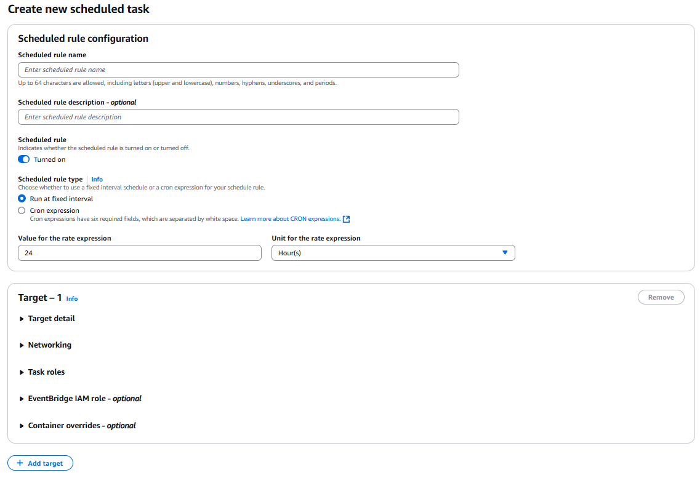

# ⏰ Amazon ECS Scheduled Tasks (2025 Guide)

> _"Because cron deserves containers too."_ – ECS, probably

---

<div style="text-align: center;">
    
</div>

---

## 📚 What Are ECS Scheduled Tasks?

A **scheduled task** in Amazon ECS lets you **automatically run a task** at fixed intervals — just like a cron job — using **EventBridge Scheduler** as the trigger.

Use cases:

- 💾 Database backups
- 🧪 Test automation
- 📊 ETL jobs / reports
- 🔧 Maintenance scripts

This is **not a long-running ECS Service** — it’s a one-time ECS Task launched based on a schedule you define.

---

## 🧱 Prerequisites

Before setting up a scheduled task:

| Resource           | Required For                                        |
| ------------------ | --------------------------------------------------- |
| ✅ ECS Cluster     | Fargate or EC2-based                                |
| ✅ Task Definition | Your container blueprint                            |
| ✅ VPC/Subnets     | For network connectivity                            |
| ✅ Security Groups | Firewall rules (allow HTTP, HTTPS, DB, etc.)        |
| ✅ IAM Roles       | - Task Execution Role (for ECS)                     |
|                    | - Scheduler Role (for EventBridge to run ECS tasks) |

---

## 🖥️ Create Scheduled Task via Console (2025 UI)

### 📍 Step-by-Step

1. Go to **Amazon EventBridge Scheduler** → click **Create schedule**

2. **Schedule Details**

   - Schedule Name: `nightly-backup-task`
   - Schedule Group: Default or custom
   - **Schedule Type**: Choose:
     - `Recurring` → use `rate(1 day)` or `cron(0 2 * * ? *)`
     - `One-time` → pick a date/time
   - Timezone: Your choice

3. **Target Settings**

   - Target Type: `AWS service`
   - Service: `ECS`
   - API: `RunTask`
   - Cluster: Choose from dropdown
   - Task Definition: Choose your task family & revision
   - Platform Version: Usually `LATEST`
   - Launch Type: FARGATE or EC2, OR use capacity provider strategy
   - Network Configuration:
     - VPC + Subnets
     - Security Group
     - Public IP (Enable for Fargate to pull from the internet)

4. **Permissions**

   - Let AWS create the required EventBridge IAM Role
   - Or use a pre-created IAM Role that allows `ecs:RunTask`

5. **(Optional) Retry & Dead Letter Queue**

   - Add retries or SQS DLQ in case tasks fail

6. Click **Create schedule** 🎉

---

## 🔧 Create Scheduled Task via AWS CLI

### 1. Create EventBridge Scheduler Role (if not already done)

**trust-policy.json**:

```json
{
  "Version": "2012-10-17",
  "Statement": [
    {
      "Effect": "Allow",
      "Principal": {
        "Service": "scheduler.amazonaws.com"
      },
      "Action": "sts:AssumeRole"
    }
  ]
}
```

```bash
aws iam create-role \
  --role-name EventBridgeSchedulerRole \
  --assume-role-policy-document file://trust-policy.json

aws iam attach-role-policy \
  --role-name EventBridgeSchedulerRole \
  --policy-arn arn:aws:iam::aws:policy/service-role/AmazonEC2ContainerServiceEventsRole
```

### 2. Create Target File

**target.json**:

```json
{
  "Arn": "arn:aws:ecs:<region>:<account>:cluster/<cluster-name>",
  "RoleArn": "arn:aws:iam::<account>:role/EventBridgeSchedulerRole",
  "EcsParameters": {
    "TaskDefinitionArn": "arn:aws:ecs:<region>:<account>:task-definition/<task-name>:<revision>",
    "LaunchType": "FARGATE",
    "PlatformVersion": "LATEST",
    "NetworkConfiguration": {
      "awsvpcConfiguration": {
        "Subnets": ["subnet-xxxxxx"],
        "SecurityGroups": ["sg-xxxxxx"],
        "AssignPublicIp": "ENABLED"
      }
    }
  }
}
```

### 3. Create Schedule

```bash
aws scheduler create-schedule \
  --name "daily-task" \
  --schedule-expression "rate(1 day)" \
  --flexible-time-window Mode=OFF \
  --target file://target.json \
  --role-arn arn:aws:iam::<account>:role/EventBridgeSchedulerRole
```

---

## 📡 Monitoring Scheduled Tasks

| Tool                  | What It Shows                       |
| --------------------- | ----------------------------------- |
| ECS Console → Tasks   | Shows if task started and completed |
| CloudWatch Logs       | Task logs (if logging enabled)      |
| EventBridge Scheduler | Execution logs, errors, and retries |

---

## 🧠 Best Practices

- ✅ Always lock the Task Definition to a **specific revision**
- ✅ Use **Dead-letter queues** to capture failures
- ✅ Tag scheduled tasks for billing and visibility
- ✅ Enable **CloudWatch Logs** in Task Definition
- ✅ Test the task manually before scheduling it

---

## 🎯 Summary Table

| Feature           | Value                                       |
| ----------------- | ------------------------------------------- |
| Schedule Engine   | EventBridge Scheduler                       |
| Trigger Action    | `RunTask` API                               |
| Launch Type       | FARGATE, EC2, or Capacity Provider Strategy |
| Frequency         | `rate()` or `cron()` expressions            |
| IAM Role Required | ✅ Scheduler Execution Role                 |
| Monitoring        | ECS, CloudWatch, EventBridge                |

---

## 💬 Final Thoughts

Scheduled Tasks in ECS = Cron jobs + Cloud superpowers ☁️💪

You get full control over **when**, **where**, and **how** your containerized tasks run — without managing cron daemons or EC2 servers.

Need to connect this with Lambda, RDS snapshots, or Step Functions next? Just say the word! 🚀
