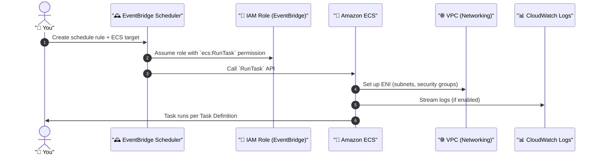
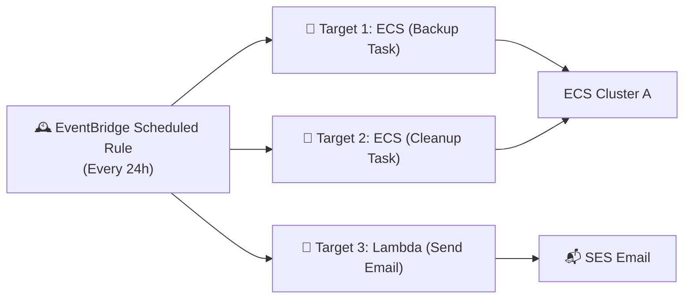

# 🎯 ECS Scheduled Task Targets: Internals, Power, and Clarity

> _“You don’t schedule an ECS task — you schedule an event that triggers a target to run a task.”_

---

## 🧠 What’s Really Going On?

When you create an **ECS Scheduled Task**, you’re **not directly running the task on ECS**.

You’re building a **serverless automation system** powered by:

| Layer                        | Role                                                               |
| ---------------------------- | ------------------------------------------------------------------ |
| 🕰️ **EventBridge Scheduler** | Creates and manages the **time-based trigger** (cron or rate)      |
| 🎯 **Target**                | Defines **what happens** when the schedule is triggered            |
| 🚢 **Amazon ECS**            | Executes the **actual container task** using `RunTask` API         |
| 🔐 **IAM Role**              | Grants permission to EventBridge to run ECS actions on your behalf |

---

## 🧩 What’s a “Target” in ECS Scheduled Task?

The **Target** is **everything ECS needs** to launch your container when the timer goes off:

| Component                          | Description                                                              |
| ---------------------------------- | ------------------------------------------------------------------------ |
| `cluster`                          | The ECS cluster where the task will be launched                          |
| `taskDefinitionArn`                | The ECS task definition to run (with container config)                   |
| `launchType` or `capacityProvider` | Whether to use EC2, Fargate, Spot, or a combination                      |
| `networkConfiguration`             | Defines subnets, security groups, and public IP assignment (awsvpc mode) |
| `overrides`                        | Optional: override command, environment vars, container names, etc.      |
| `roleArn`                          | IAM Role that allows EventBridge to call ECS `RunTask` on your behalf    |

---

## 🔄 Full Internal Lifecycle (Mermaid Diagram)

Here’s how it works when the clock ticks:



✅ **EventBridge doesn't run your containers** — it calls ECS **just like you would with the CLI**, but **on schedule**.

---

## ⚙️ Sample Target JSON (Behind the Scenes)

Here's a simplified real-world JSON representation of an ECS target inside an EventBridge scheduled rule:

```json
{
  "Arn": "arn:aws:ecs:us-east-1:123456789012:cluster/MyCluster",
  "RoleArn": "arn:aws:iam::123456789012:role/EventBridgeToEcsRole",
  "EcsParameters": {
    "TaskDefinitionArn": "arn:aws:ecs:us-east-1:123456789012:task-definition/MyTask:5",
    "LaunchType": "FARGATE",
    "NetworkConfiguration": {
      "awsvpcConfiguration": {
        "Subnets": ["subnet-abc123"],
        "SecurityGroups": ["sg-abc123"],
        "AssignPublicIp": "ENABLED"
      }
    },
    "PlatformVersion": "LATEST"
  }
}
```

🧠 Think of this as the **payload** that EventBridge sends to ECS every time the schedule hits.

---

## 🔁 Can I Have Multiple Targets?

Yes! One **Scheduled Rule** in EventBridge can have up to **5 targets**.

### 🚀 You Can Trigger

| Target Type    | Example                                |
| -------------- | -------------------------------------- |
| 🎯 ECS Task    | Run different task definitions         |
| 🧠 Lambda      | Run a serverless function              |
| 📨 SNS Topic   | Send a notification                    |
| 🗂️ SQS Queue   | Trigger a queued microservice pipeline |
| 🌎 API Gateway | Call external or internal API          |

### 🔥 Powerful Combo Example



💡 **One rule → many actions → single schedule**. Pure AWS orchestration power.

---

## ❓Can I Run ECS Tasks in Different Clusters?

🔸 **Console UI Limitation:** When using the AWS Console, you can only configure targets for **one cluster per rule at a time**.

🔸 **CLI / SDK / Terraform:** You **can configure multiple targets**, each pointing to **a different cluster**. This is super useful for **cross-account, cross-environment orchestration** (e.g., run in `dev` and `prod` clusters from the same rule).

---

## 🧠 Common Use Cases for Multi-Target Scheduling

| Scenario                | What You Schedule                               |
| ----------------------- | ----------------------------------------------- |
| 🔁 Daily backups        | Target 1: ECS Task → `run-backup`               |
| 🧼 Cleanup logs         | Target 2: ECS Task → `cleanup-s3-logs`          |
| 📧 Daily report email   | Target 3: Lambda → `generate-and-send-report`   |
| 📊 ETL pipeline start   | Target 4: ECS Task → `start-data-pipeline`      |
| 🌎 Call external system | Target 5: API Gateway → `/trigger/externalSync` |

---

## ✅ Summary: What a Target Really Is

| Concept                 | What It Means                                                            |
| ----------------------- | ------------------------------------------------------------------------ |
| 🎯 **Target**           | The **action to run** (like ECS task) when the schedule triggers         |
| 🧾 **Schedule Rule**    | The **time definition** (rate, cron)                                     |
| 🔐 **IAM Role**         | Grants permission to EventBridge to run tasks on ECS                     |
| 🔧 **Overrides**        | Lets you override container config (command, env vars, etc.)             |
| 🔁 **Multiple Targets** | Run multiple ECS tasks, Lambdas, APIs, SNS, or SQS from **one schedule** |

---

## 📌 Final Takeaways

- Targets in scheduled ECS tasks are **what actually runs**, not just pointers.
- Each **target** encapsulates everything ECS needs to run your container at the right time.
- You can **stack up multiple targets** in one rule to build powerful, serverless orchestrations.
- Use the **CLI or Terraform** to unlock flexibility the console doesn’t fully expose.
