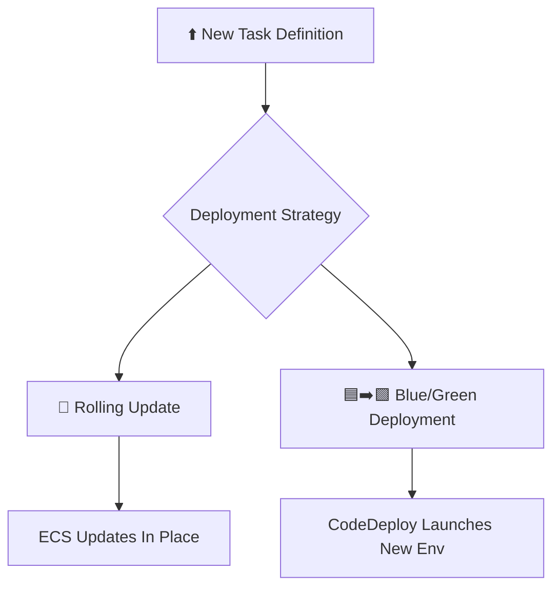
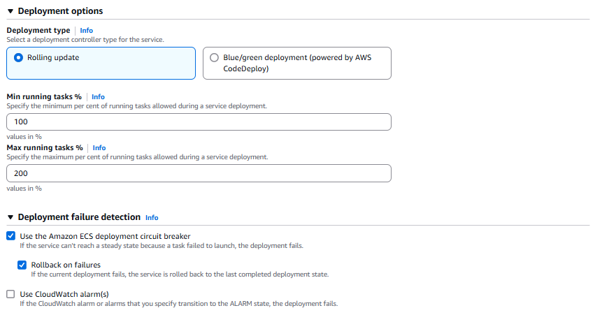
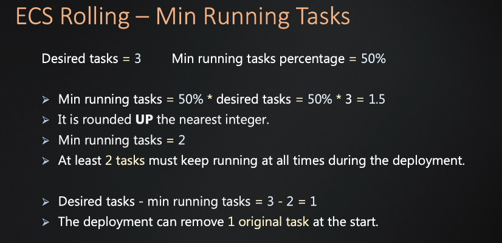
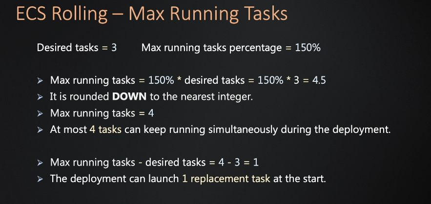
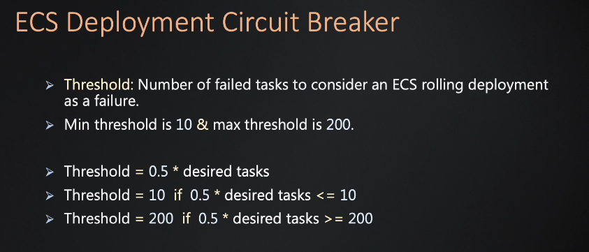
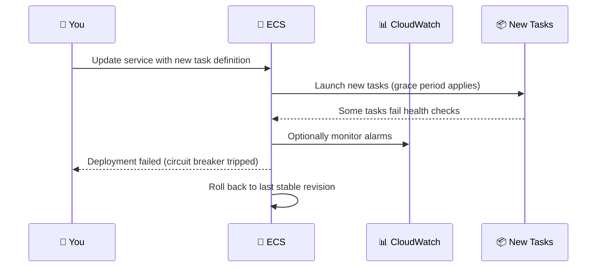
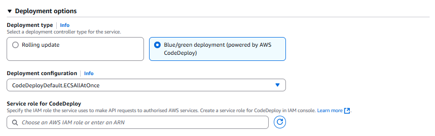

# 🚦 ECS Deployment Options & Failure Detection – Full Guide (2024)

> “Deploy with confidence — whether it’s one task or one thousand.”

---

## 🧭 Overview: How Deployments Work in ECS

When you update a service in ECS (e.g., change task definition), ECS performs a **deployment** — replacing old tasks with new ones while maintaining availability.

You get to choose how this deployment behaves:

<div style="text-align: center;">



</div>

---

## 🚀 Deployment Type: Rolling Update (Default)

> ECS gradually replaces old tasks with new ones within the same service.

<div style="text-align: center;">
    
</div>

---

When ECS **updates your service** (after you change the task definition), it **replaces old tasks with new ones** using a deployment scheduler.  
The two main knobs you use to control **how aggressively or safely** ECS deploys are:

| Setting           | What it controls                                          |
| ----------------- | --------------------------------------------------------- |
| **Min running %** | Minimum # of healthy tasks that must remain during update |
| **Max running %** | Maximum # of tasks allowed (old + new) at the same time   |

Both values are based on the **`desired count`** of your service and use **percentages**.

---

<div style="text-align: center;">
    
</div>

---

<div style="text-align: center;">
    
</div>

---

### 💡 Example

#### 📘 Example 1 – Simple Deployment with Defaults

```plaintext
Desired Count = 4
MinRunningPercent = 100
MaxRunningPercent = 200
```

**🔁 What Happens?**

- ECS can launch up to `4 x 200% = 8` total tasks (old + new)
- But **at least** `4 x 100% = 4` healthy tasks must be running during update

✅ This is **safe but needs enough resources** to hold 8 tasks temporarily.

---

#### 📘 Example 2 – Save Cluster Resources

```plaintext
Desired Count = 4
MinRunningPercent = 50
MaxRunningPercent = 100
```

- ECS keeps only **2 tasks** running (50% of 4)
- ECS ensures total running tasks don’t exceed 4

```plaintext
Phase 1: Stop 2 old tasks → Run 2 new
Phase 2: Stop 2 old → Run 2 new
```

🔄 This is **sequential and slower**, but **saves capacity**.

---

#### 📘 Example 3 – Burst Deploy (Needs Headroom)

```plaintext
Desired Count = 6
MinRunningPercent = 100
MaxRunningPercent = 300
```

- Min: 6 tasks must stay healthy
- Max: ECS can run up to `6 x 3 = 18` tasks during deploy

Great for **very fast updates** — if you have **a big cluster**.

---

#### 📊 Summary: Common Patterns

| Name           | Min % | Max % | Behavior                                 | Requires Extra Capacity? |
| -------------- | ----- | ----- | ---------------------------------------- | ------------------------ |
| Default (safe) | 100%  | 200%  | Safe, gradual deployment                 | ✅ Yes                   |
| Safe Minimal   | 100%  | 100%  | Never exceed current task count          | ❌ No                    |
| Save Resources | 50%   | 100%  | Kill old → Start new (more sequential)   | ❌ No                    |
| Burst Deploy   | 100%  | 300%  | Start many tasks quickly, faster rollout | ✅ Yes                   |

---

---

### 🧠 Deployment Failure Detection (Only for Rolling Update)

```plaintext
[✔] Use ECS deployment circuit breaker
    ┗ [✔] Rollback on failure
```

**What it does:**

| Feature                     | Meaning                                                               |
| --------------------------- | --------------------------------------------------------------------- |
| Circuit Breaker             | Stops deployment if new tasks fail to reach `RUNNING + healthy` state |
| Rollback on Failure         | Reverts to the last successful task definition                        |
| CloudWatch Alarm (optional) | You can define alarms that will fail the deployment if triggered      |

**How Circuit Breaker Works:**

<div style="text-align: center;">
    
</div>

```plaintext
- Desired Count = 2
- 0.5 * desired count = 1
- 1 < 10
- 10 task failure are needed for an ECS rolling deployment to be considered as a failure.
```

---

### 🧩 Failure Flow (with Circuit Breaker Enabled)



---

## 🟦 Blue/Green Deployment (CodeDeploy-Powered)

> ECS launches **two environments**: current (blue) and new (green), then switches over traffic.

<div style="text-align: center;">
    
</div>

---

### 🧠 Requirements

- ✅ Choose **"Blue/Green" deployment**
- 🧾 Select a **deployment configuration**
- 🔐 Provide a **CodeDeploy IAM role**

```plaintext
Deployment configuration: CodeDeployDefault.ECSAllAtOnce
Service role: arn:aws:iam::...:role/CodeDeployServiceRole
```

---

### 🧩 Deployment Flow

```mermaid
flowchart TD
    A[Old ECS Tasks (Blue)] -->|Running| LB1[⚖️ Load Balancer]
    B[New ECS Tasks (Green)] -.->|Not active yet| LB1
    A --> C{Switch Traffic}
    C --> B
    C --> A
```

- CodeDeploy controls traffic shift
- You can use **hooks** (pre-traffic, post-traffic)
- Great for **canary, linear, or all-at-once** strategies

---

### ⚠️ **No Deployment Failure Detection Here!**

Unlike Rolling Update, Blue/Green deployments **do not use ECS circuit breaker**.  
Failures are handled via:

- ✅ CodeDeploy hooks (e.g., lifecycle events)
- ✅ Rollbacks based on **CloudWatch alarms**
- ❌ But no ECS-native rollback on unhealthy tasks!

---

## 🤖 CLI Examples

### 📌 Rolling Update with Circuit Breaker

```bash
aws ecs create-service \
  --deployment-controller type=ECS \
  --deployment-circuit-breaker "enable=true,rollback=true"
```

### 📌 Blue/Green with CodeDeploy

```bash
aws ecs create-service \
  --deployment-controller type=CODE_DEPLOY \
  --service-name webapp \
  --task-definition webapp:3 \
  --load-balancers targetGroupArn=arn:...,containerName=app,containerPort=80 \
  --role arn:aws:iam::123456789012:role/CodeDeployServiceRole \
  --deployment-configuration deploymentCircuitBreaker={enable=false,rollback=false}
```

---

## 📊 Summary Table

| Feature                  | Rolling Update            | Blue/Green (CodeDeploy)      |
| ------------------------ | ------------------------- | ---------------------------- |
| Traffic switch           | In-place                  | Shift via LB                 |
| Circuit Breaker support  | ✅ Yes                    | ❌ No                        |
| CloudWatch Alarm support | ✅ Optional               | ✅ Required for rollback     |
| Rollback on task failure | ✅ Yes                    | ⚠️ Via CodeDeploy only       |
| Canary or % rollout      | ❌ Not native             | ✅ Yes (CodeDeploy config)   |
| Recommended for          | Simplicity, rapid deploys | Safer production deployments |

---

## ✅ Final Advice

> Choose wisely based on your team's risk tolerance and observability maturity:

| Scenario                       | Recommended Strategy             |
| ------------------------------ | -------------------------------- |
| Simpler, fast deployments      | Rolling Update                   |
| Safer, progressive delivery    | Blue/Green                       |
| You need rollback on bad tasks | Rolling Update + Circuit Breaker |
| You need approval or hooks     | Blue/Green + CodeDeploy          |
