# 🚢 Amazon ECS Service Creation

> “If tasks are the engines, ECS services are the pilots keeping them running 24/7.”

---

<div style="text-align: center;">
    
</div>

---

<div style="text-align: center;">
    
</div>

---

## 📚 What Is an ECS Service?

An **Amazon ECS Service** is like a smart supervisor for your containers. It:

- Launches tasks from a **task definition**
- Keeps them running as long as you want
- Replaces any unhealthy tasks automatically
- Supports **deployment strategies**, **auto scaling**, **load balancing**, and more

🧠 Think of it as:

> Kubernetes Deployment + ECS capacity control + optional load balancing + built-in healing = ECS Service.

---

## 🧩 How ECS Services Work – Internal Flow

```mermaid
flowchart TD
    TD["📘 Task Definition"] --> SVC["🔁 ECS Service"]
    SVC -->|"Maintains desired replicas"| TASKS["🚢 ECS Tasks"]
    TASKS -->|"Logs (stdout/stderr)"| CW["📊 CloudWatch Logs"]
    SVC -->|"Optional"| LB["⚖️ Load Balancer"]
    SVC -->|"Optional"| DNS["📛 Service Discovery (DNS)"]
    SVC -->|"Optional"| AS["📈 Auto Scaling"]
```



---

## 🧱 1️⃣ Basic Configuration

### 🏗️ Environment

| Field   | Description                              |
| ------- | ---------------------------------------- |
| Cluster | The ECS cluster where this service lives |

---

### 📘 Task Definition

| Field              | Description                                                                    |
| ------------------ | ------------------------------------------------------------------------------ |
| Task Definition    | Choose the app/task you want to run (previously registered)                    |
| Revision           | Choose the specific version of the task definition (or leave for latest)       |
| Service Name       | Name of the ECS service (unique per cluster)                                   |
| Service Type       | `Replica` (multiple tasks) or `Daemon` (1 task per EC2 instance, only for EC2) |
| Desired Count      | How many copies of the task should always be running                           |
| AZ Rebalancing     | ECS will rebalance tasks across availability zones automatically               |
| Health Check Grace | Time buffer before ECS considers a task unhealthy (useful during boot)         |

---

## ⚙️ 2️⃣ Compute Configuration

This determines **how ECS launches your tasks** — and you have two options:

### 🧠 Option A: Capacity Provider Strategy (✅ Recommended)

This is the modern, flexible way to manage compute. You assign weights to **FARGATE**, **FARGATE_SPOT**, or even EC2 Auto Scaling Groups.

```json
[
  { "capacityProvider": "FARGATE_SPOT", "weight": 2 },
  { "capacityProvider": "FARGATE", "weight": 1 }
]
```

💡 ECS will try to run more on `FARGATE_SPOT` (cheaper) but use `FARGATE` as fallback.

---

### 🧾 Option B: Launch Type (Legacy, simpler)

```bash
--launch-type FARGATE
```

Use this if you don’t want to define a capacity provider strategy. Less flexible, but easier for one-off setups.

| When to use    | Use case                        |
| -------------- | ------------------------------- |
| `FARGATE`      | Serverless infra                |
| `FARGATE_SPOT` | Cost-optimized (but not stable) |
| `EC2`          | Run on your own EC2 instances   |

---

## 🔌 3️⃣ Optional Service Features

### 🔗 Service Connect (Optional)

> Provides service-to-service communication via names like `orders.local`.

- Auto-assigns **service discovery names + ports**
- Great for microservices running within the same namespace

---

### 🔍 Service Discovery (Optional)

> Uses Route 53 DNS to give your service a hostname like `orders.myapp.local`.

Useful for:

- Internal traffic routing
- DNS-based discovery between services

You define a namespace like `myapp.local`, and ECS registers your task IPs in it.

---

### ⚖️ Load Balancing (Optional)

> Spread incoming HTTP/HTTPS/TCP traffic across healthy containers.

- Use **ALB or NLB**
- Attach a listener + target group
- Define which container + port to register

💡 Load balancers can even use **container-specific health checks** for smarter traffic control.

---

### 🌐 VPC Lattice (Optional)

> Think of this as "Cross-AWS Service Mesh."

- Securely route traffic across **accounts**, **regions**, and **VPCs**
- View insights and metrics
- Requires a little setup, but powerful for enterprises

---

### 📈 Service Auto Scaling (Optional)

> Automatically increases/decreases task count based on metrics.

You can scale based on:

- **CPU utilization**
- **Memory**
- **Custom CloudWatch metrics**
- Or manually through CLI/console

Auto scaling is defined as:

```json
{
  "minCapacity": 1,
  "maxCapacity": 10,
  "targetValue": 60,
  "metricType": "CPUUtilization"
}
```

---

### 📦 Task Placement (Optional)

> You can choose how tasks are distributed inside the cluster:

| Strategy  | What it does                                     |
| --------- | ------------------------------------------------ |
| `spread`  | Spread tasks across AZs, instances, or attribute |
| `binpack` | Pack tasks tightly to reduce cost                |
| `random`  | Choose a random instance                         |

💡 You can combine `spread + binpack` for best efficiency.

---

### 💾 Volume Configuration (Optional)

> Attach **EBS volumes** to your ECS tasks

Good for:

- Storing uploaded files temporarily
- Caching builds or processing large files

---

### 🏷️ Tags (Optional)

Use tags like:

```plaintext
Team = DevOps
Environment = Production
Project = Analytics
```

✅ Tags help with:

- Cost tracking
- IAM condition-based access
- Resource grouping

---

## 🧰 CLI Equivalent for Creating a Service

```bash
aws ecs create-service \
  --cluster my-cluster \
  --service-name my-backend-svc \
  --task-definition my-task:5 \
  --desired-count 2 \
  --launch-type FARGATE \
  --network-configuration 'awsvpcConfiguration={subnets=["subnet-xyz"],securityGroups=["sg-abc"],assignPublicIp="ENABLED"}' \
  --enable-execute-command \
  --health-check-grace-period-seconds 30
```

---

## 🧠 Bonus: Fargate vs EC2 for Services

| Feature         | FARGATE          | EC2                     |
| --------------- | ---------------- | ----------------------- |
| Serverless      | ✅ Yes           | ❌ You manage instances |
| Scaling         | Fast, managed    | Slower (based on ASG)   |
| Cost            | Slightly higher  | Cheaper at large scale  |
| Custom AMIs     | ❌ No            | ✅ Yes                  |
| Daemon Services | ❌ Not supported | ✅ Supported            |

---

## ✅ Final Thoughts

- Use **ECS services** when you want a **self-healing, always-on** container deployment
- Combine with **auto scaling**, **load balancing**, and **discovery** to build production-grade apps
- Always prefer **capacity providers** for modern setups
- EC2 gives more control, Fargate gives simplicity
