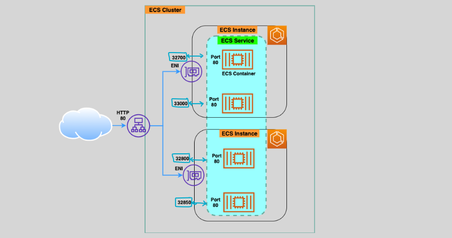

# 🌐 Amazon ECS Service with Elastic Load Balancing (ELB)

Amazon ECS integrates seamlessly with **Elastic Load Balancing (ELB)** to efficiently distribute incoming user requests or application traffic across tasks running on ECS instances. This ensures high availability, reliability, and scalability for containerized applications.

---

  

---

## 🌟 Key Concepts of ECS Service ELB

### 🔄 Load Balancing Across Tasks

- ECS allows you to use **Elastic Load Balancers (ALB/NLB)** to distribute traffic to tasks in an ECS service.
- The ELB dynamically registers and deregisters tasks as they start or stop, ensuring requests are always routed to healthy tasks.

### 🧑‍🤝‍🧑 Handling Multiple ECS Services

- When multiple ECS services launch tasks on the same ECS cluster:
  - ECS can register an ECS instance to an ALB/NLB multiple times using **different ports**.
  - This enables a single ALB/NLB to handle requests for multiple ECS services.

---

## 🚀 Dynamic Host Port Mapping

When multiple tasks from the same ECS service (listening on the same port) run on the same ECS instance, **Dynamic Host Port Mapping** ensures efficient traffic routing.

### 🔧 How It Works

1. **Dynamic Ports:**

   - Do not configure static port mapping between the container port and the host port.
   - ECS dynamically allocates an ephemeral port from the host's port range.

2. **ALB Registration:**

   - Tasks are automatically registered with the ALB using the instance ID and allocated port.

3. **Traffic Routing:**
   - The ALB listens on a single port and forwards traffic to the appropriate task based on its dynamically assigned port.

---

## 🛠️ Configuring ECS Service ELB

### 1️⃣ Create an ALB or NLB

- Use the AWS Management Console or CLI to set up an **Application Load Balancer (ALB)** or **Network Load Balancer (NLB)**.
- Define listeners to accept traffic on specific ports (e.g., HTTP or HTTPS).

### 2️⃣ Configure Target Groups

- Create target groups for your ECS tasks.
- Ensure the target type is set to **IP** for Fargate tasks or **Instance** for EC2 tasks.

### 3️⃣ Attach the ELB to Your ECS Service

- In the ECS service configuration:
  - Select the load balancer type (ALB or NLB).
  - Associate the appropriate target groups.

### 4️⃣ Enable Health Checks

- Define health check parameters to ensure the ELB routes traffic only to healthy tasks.
- Health checks monitor task availability and replace failed tasks automatically.

---

## 🎯 Use Cases for ECS Service ELB

1. **Microservices:**

   - Load balance requests across multiple microservices hosted on the same ECS cluster.

2. **Blue/Green Deployments:**

   - Seamlessly transition between application versions by routing traffic to new tasks gradually.

3. **High Availability:**

   - Ensure traffic is distributed across tasks and ECS instances for fault tolerance.

4. **Dynamic Scaling:**
   - Automatically scale tasks in response to traffic spikes, with the ELB managing traffic distribution.

---

## ✅ Benefits of ECS Service ELB

- **Scalability:** Automatically adjusts to handle varying traffic loads.
- **High Availability:** Ensures uninterrupted service by routing traffic only to healthy tasks.
- **Simplified Management:** Dynamically manages task registration and deregistration.
- **Cost Efficiency:** Share a single ALB/NLB across multiple ECS services for optimal resource usage.

---

Amazon ECS Service with Elastic Load Balancing provides a robust solution for managing application traffic in containerized environments. By leveraging features like dynamic host port mapping and health checks, you can build scalable, highly available, and efficient applications.
