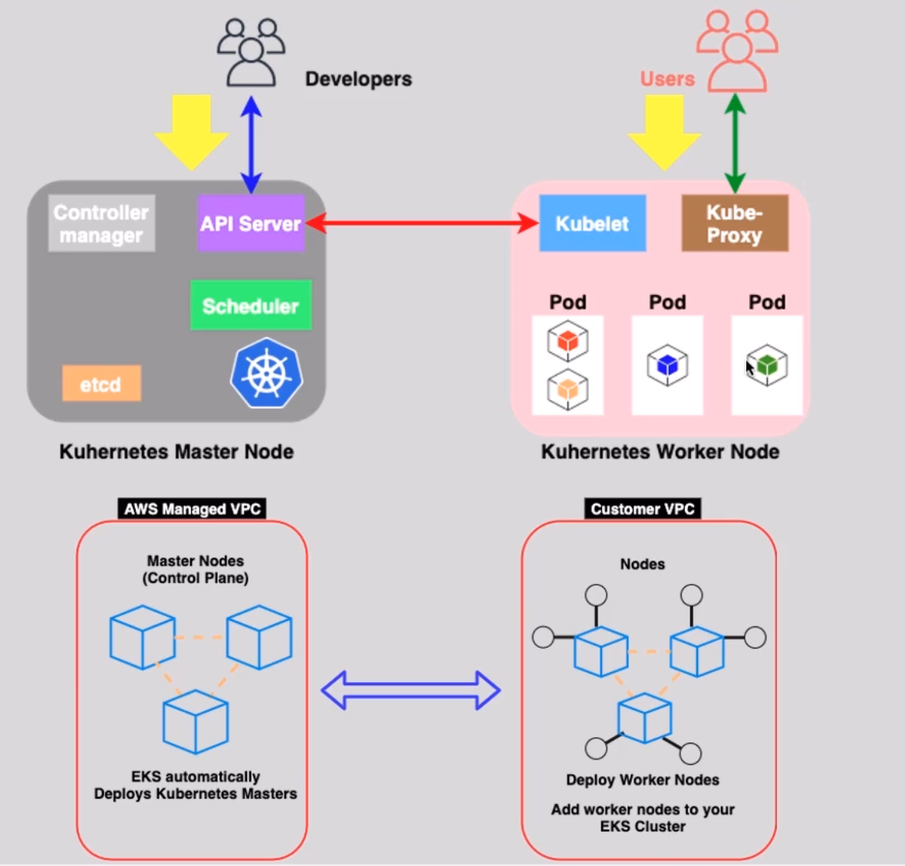
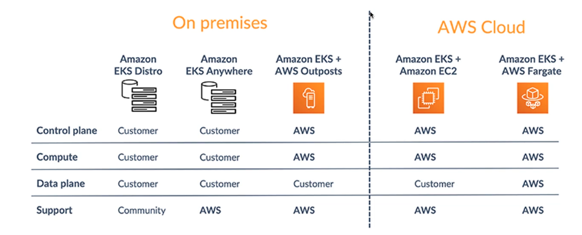

# 🚀 Amazon EKS: Simplifying Kubernetes on AWS

Amazon Elastic Kubernetes Service (EKS) is a fully managed Kubernetes service that simplifies the process of running Kubernetes clusters on AWS. With EKS, developers can deploy, manage, and scale containerized applications using Kubernetes without worrying about the complexities of managing the control plane or infrastructure.

---

   

---

## 🌟 Key Features

### 🛠️ Fully Managed Kubernetes

- Amazon EKS manages the Kubernetes control plane, ensuring high availability and scalability.
- Automatically patches, upgrades, and scales the control plane as needed.

### 🌐 Integration with AWS Services

- Seamlessly integrates with services like **IAM**, **VPC**, **CloudWatch**, and **Elastic Load Balancing**.
- Supports AWS-native security and networking features.

### 📊 Observability and Monitoring

- Compatible with monitoring tools like **Amazon CloudWatch**, **Prometheus**, and **Grafana**.
- Provides detailed insights into cluster performance and resource usage.

### 🔄 Multi-Environment Support

- Run Kubernetes clusters on AWS, on-premises, or hybrid environments using **EKS Anywhere**.

### 🛡️ Security

- Native integration with AWS **IAM** for access control.
- Supports encrypted secrets using **AWS Secrets Manager** and **KMS**.

---

## 🛠️ Key Components of EKS

### 1️⃣ **Control Plane**

- Fully managed by AWS.
- Ensures scalability, high availability, and security for the Kubernetes API server and etcd.

### 2️⃣ **Worker Nodes**

- Can run on **EC2 instances**, **Fargate**, or **EKS Anywhere**.
- Automatically connect to the managed control plane.

### 3️⃣ **Node Groups**

- Managed groups of EC2 instances.
- Simplifies provisioning and lifecycle management of worker nodes.

### 4️⃣ **Add-ons**

- Pre-configured Kubernetes components, such as **CoreDNS** and **Kube-proxy**, managed directly by AWS.

---

## 🌐 Deployment Options

   

---

### 🖥️ **EC2 Worker Nodes**

- Full control over the infrastructure.
- Ideal for applications requiring consistent performance and custom configurations.

### ☁️ **AWS Fargate**

- Serverless option for running pods without managing worker nodes.
- Best suited for lightweight or bursty workloads.

### 🏢 **EKS Anywhere**

- Extend Kubernetes clusters to on-premises environments.
- Suitable for hybrid cloud strategies.

### 🛠️ **EKS-D (EKS Distro)**

- Amazon's Kubernetes distribution that provides the same versions of Kubernetes and its dependencies as used in Amazon EKS.
- Suitable for running Kubernetes clusters in any environment, including on-premises or other cloud platforms.
- Ensures consistency between on-premises and cloud-based Kubernetes clusters.

---

## 🎯 Use Cases

1. **Microservices:** Orchestrate and scale distributed containerized applications.
2. **Hybrid Cloud:** Use EKS Anywhere to run workloads across on-premises and cloud environments.
3. **Machine Learning:** Manage and scale ML workloads using Kubernetes-native tools.
4. **Batch Processing:** Automate and scale ETL or batch processing tasks.

---

## 📂 Persistent Storage - Using EBS, EFS & FSx With Kubernetes Pods

Amazon EKS supports multiple persistent storage options for Kubernetes pods:

1. **Amazon EBS (Elastic Block Store):**

   - Provides high-performance block storage.
   - Ideal for single-node storage requirements.

2. **Amazon EFS (Elastic File System):**

   - Offers scalable, shared file storage accessible by multiple pods.
   - Ideal for workloads requiring shared storage like content management systems.

3. **Amazon FSx:**
   - Delivers specialized file systems such as FSx for Lustre or FSx for Windows File Server.
   - Suitable for applications with specific file system requirements.

---

## 🔄 Amazon EKS – Auto Scaling

### **Pod Auto Scaling**

- Uses the **Horizontal Pod Autoscaler (HPA)** to scale the number of pods in response to application demand.
- Based on resource utilization metrics like CPU or memory.
- Configured using Kubernetes manifest files.

### **Worker Node Auto Scaling**

- Automatically scales the EC2 instances in your cluster using **Auto Scaling Groups (ASG)**.
- Integrated with **Cluster Autoscaler**, which adjusts the number of nodes based on pending pods that cannot be scheduled due to insufficient resources.

---

## 🔗 Amazon EKS – Load Balancing

1. **Application Load Balancer (ALB):**

   - Use ALB when creating a Kubernetes **Ingress** resource.
   - Supports routing rules and HTTP/HTTPS traffic management.

2. **Network Load Balancer (NLB):**
   - Use NLB when creating a Kubernetes **LoadBalancer** service.
   - Best suited for high-performance, low-latency traffic routing.

---

## ✅ Benefits of Amazon EKS

1. **Simplified Kubernetes Management:** Focus on deploying applications, not managing the control plane.
2. **Scalability:** Automatically scales the control plane and worker nodes.
3. **Flexibility:** Supports both EC2 and Fargate for running workloads.
4. **Security:** Native integration with AWS security tools ensures robust cluster security.
5. **Community Support:** Compatible with Kubernetes-native tools and third-party integrations.

---

Amazon EKS makes Kubernetes accessible and manageable for developers and organizations of all sizes. Whether you're running microservices, machine learning workloads, or hybrid cloud applications, EKS provides the tools and scalability you need to succeed.
