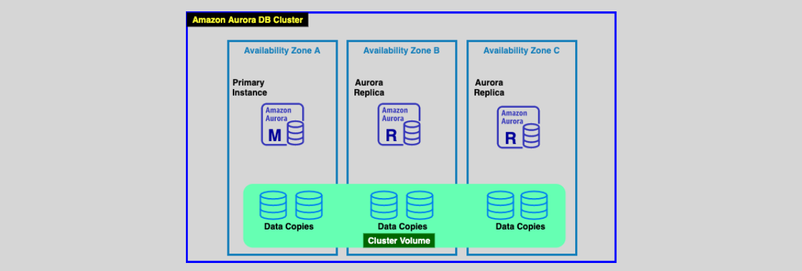
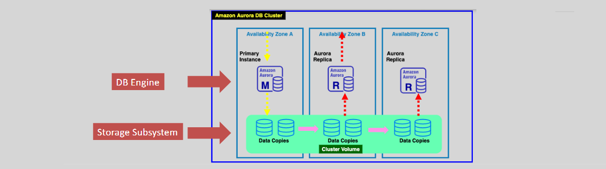
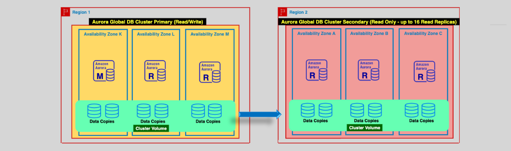

# **Amazon Aurora 🌟**

Amazon Aurora is a fully managed relational database service that is compatible with MySQL and PostgreSQL engines, offering outstanding performance and scalability.

- **Performance**: Amazon Aurora delivers **3x performance** for PostgreSQL and **5x performance** for MySQL compared to traditional MySQL and PostgreSQL databases.
- **High Availability & Fault Tolerance**: With automatic clustering, replication, and storage allocation, Aurora ensures high availability and scalability.

---

---

## **🎁 Key Features of Aurora**

### **🏪 1. Virtual DB Storage & Read Replicas**

- **Distributed Storage**: Aurora features a high-performance, distributed storage subsystem with a virtual database storage volume that spans multiple Availability Zones (AZs).
- **Redundancy**: It maintains two copies of the data per AZ in **three AZs** to ensure fault tolerance.
- **Independent Data Storage**: The shared storage architecture makes data independent from the DB instances, allowing you to add or remove DB instances more quickly.
- **Aurora Replicas**: It supports one primary (read/write) DB instance and up to **15 read-only replicas** in the same region.

---

### **🚀 2. Scaling Options**

Aurora offers a range of scaling features to accommodate growing workloads.

- **Storage Scaling**: Automatically scales the storage in **10 GiB increments** up to **128 TiB**. It can also shrink when data is removed.
- **Read Scaling**: You can create up to **15 Aurora replicas** for read scaling, which can be distributed across multiple AZs for high availability.
- **Auto Scaling**: Aurora replicas can scale up and down automatically based on demand (minimum one replica required to start).
- **Instance Scaling**: Aurora instances can be resized by modifying the instance type/size.

---

### **🌐 3. Connection Management & Endpoints**

Aurora provides several types of endpoints for efficient connection management:

1. **Cluster Endpoint**: Connects to the primary Aurora instance for read/write operations.

   - Example: `mydbcluster.cluster-123456789012.us-east-1.rds.amazonaws.com:3306`

2. **Reader Endpoint**: Connects to one of the Aurora replicas for read operations and load balances between replicas.

   - Example: `mydbcluster.cluster-ro-123456789012.us-east-1.rds.amazonaws.com:3306`

3. **Instance Endpoint**: Connects to a specific Aurora instance.
   - Example: `mydbinstance.123456789012.us-east-1.rds.amazonaws.com:3306`

---

### **🔄 4. Backup & Failover**

- **Automated Backups**: Aurora supports automated backups and manual snapshots. Snapshots are retained for up to 35 days, configurable.
- **Replication & Failover**: In case of a failure, an Aurora replica can be promoted to the primary instance, with failover occurring in under 60 seconds.
  - If no replica is available, Aurora will create a new primary DB instance in under **10 minutes**.

---

### **🌍 5. Global Database**

Aurora Global Database enables **cross-region replication** for disaster recovery and low-latency global applications:

- **Primary Region**: One read/write cluster in the primary AWS region.
- **Secondary Regions**: Up to **5 secondary read-only clusters** in other regions.
- **Low Latency Replication**: Aurora uses a **dedicated replication infrastructure** with latency of less than **1 second**.
- **Failover**: Global failover can happen in less than **1 minute**.

---

### **⏪⏭️ 6. Cluster Backtracking**

Backtracking allows you to rewind your Aurora DB cluster to a previous point in time without restoring from a backup.

- **Undo Mistakes**: Useful for undoing unintentional changes or exploring the effect of changes made to the DB cluster.
- **Chargeable Feature**: Aurora maintains log information to support this feature, which incurs charges.

---

### **⚡ 7. Aurora Parallel Query**

Aurora provides a **Parallel Query** feature to optimize performance for analytics and transactional queries:

- **Parallel Query**: Data-intensive analytics queries are processed in the Aurora storage layer, reducing the load on DB instances and allowing for high performance on both analytics and transactional queries simultaneously.

---

## **🎯 Conclusion**

Amazon Aurora is a powerful, fully managed relational database service offering high performance, scalability, and availability. It is designed to handle demanding workloads with features like **automatic storage scaling**, **multi-region replication**, **read replicas**, and **advanced performance optimization**. With Aurora, you can improve database performance, reduce downtime, and manage growing workloads more efficiently.
