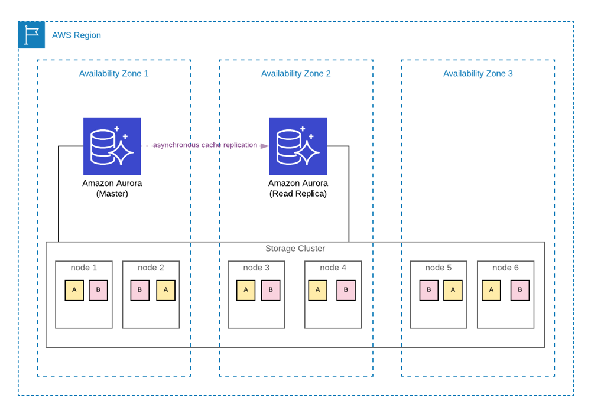
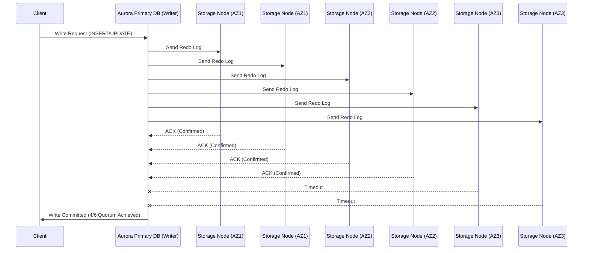
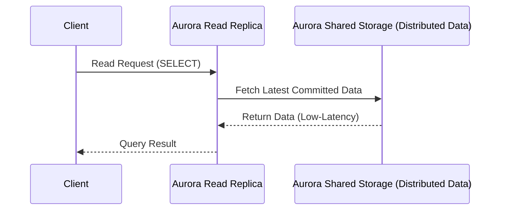

# ☀️ **Amazon Aurora Architecture**

Amazon Aurora is a **cloud-native relational database** designed to provide **high availability, scalability, and performance**. Unlike traditional relational database systems, **Aurora separates compute from storage**, making it **more resilient, scalable, and cost-efficient**.

---

    

---

## 📌 **1️⃣ Core Architectural Components of Aurora**

Amazon Aurora consists of **two main layers** that work together to provide its advanced capabilities:

### **🔹 1. Compute Layer (Database Instances)**

- The **compute layer** runs the database engine (**Aurora MySQL or Aurora PostgreSQL**).
- It processes **SQL queries, transactions, and indexing** but **does not store data locally**.
- The **compute instances connect to a shared distributed storage layer** for data retrieval.
- Supports:
  - **Primary instance (Writer)** – Handles **both read and write operations**.
  - **Up to 15 Read Replicas per Region** – For **scaling read workloads** and **automatic failover**.
- **Failover Process**:
  - If the **writer fails**, **Aurora promotes a read replica** to a new primary **within ~30 seconds**.

### **🔹 2. Storage Layer (Aurora’s Distributed Storage)**

- **Fully managed, auto-scaling distributed storage** spanning **3 AWS Availability Zones (AZs)**.
- **Automatically scales from 10GB to 128TiB** without downtime or manual provisioning.
- **Data is stored in 10GB "Protection Groups"**, each replicated **six times (two per AZ)** for fault tolerance.
- **Quorum-based replication**: A write is **confirmed when at least 4 out of 6 storage nodes acknowledge it**.
- **Read replicas share the same storage**, reducing replication lag to **<100ms**.

📌 **How This Differs from Traditional RDS**

- In **regular RDS**, each database instance has its own **dedicated storage volume**.
- In **Aurora**, all instances **share the same distributed storage layer**, eliminating replication delays.

---

## 🔄 **2️⃣ How Aurora Handles Reads & Writes**

### **✍️ Aurora Write Process**

✔ **Writes only happen in the primary instance (Writer).**  
✔ **Aurora does NOT write entire data pages** to storage – it **stores only redo log records**.  
✔ **No WAL (Write-Ahead Log) shipping** – Instead, writes are sent **directly to Aurora storage nodes**.  
✔ A write is **considered committed when 4 out of 6 storage nodes acknowledge it**.

📌 **Key Takeaways**

- Aurora **does not modify database pages immediately**—it first **stores redo logs in storage nodes**.
- **Less I/O overhead**, increasing performance significantly.
- Even if **1 or 2 storage nodes fail**, writes continue **without data loss**.

---

### **📖 Aurora Read Process**

✔ Read replicas **do not maintain separate database copies**.  
✔ Instead, all read replicas **query the shared storage layer directly**.  
✔ This **eliminates replication lag** and **allows instant failover**.

📌 **Key Takeaways**

- **No need for WAL log replay**—replicas instantly access the same data.
- **Near-zero replication lag** (**<100ms**).
- Up to **15 read replicas** for **high-performance scaling**.

---

## 🛠 **3️⃣ Aurora Storage System (Distributed & Self-Healing)**

✔ Data is **stored in 10GB protection groups**.  
✔ Each **protection group is replicated 6 times across 3 AZs**.  
✔ Aurora **can rebuild failed storage nodes automatically** without impact.

### **🔹 Quorum-Based Replication**

✔ Each write **must be confirmed by at least 4 out of 6 storage nodes**.  
✔ Ensures **strong consistency and fault tolerance**.

📌 **Why is This Better?**

- In **traditional databases**, storage is tied to a single instance (EBS).
- In **Aurora**, storage is **shared and distributed**, making it **faster and more reliable**.

---

## ⚡ **4️⃣ Aurora vs. Traditional RDS – Key Differences**

| Feature               | **Aurora**                                      | **Amazon RDS**                                 |
| --------------------- | ----------------------------------------------- | ---------------------------------------------- |
| **Storage Model**     | **Shared, distributed storage (multi-AZ)**      | **EBS-based storage (single AZ per instance)** |
| **Replication**       | **Storage-level replication (no WAL shipping)** | **Streaming WAL logs to replicas**             |
| **Replication Lag**   | **Milliseconds (<100ms)**                       | **Seconds to minutes**                         |
| **Failover Time**     | **~30 seconds**                                 | **60-120 seconds**                             |
| **Read Replicas**     | **Up to 15, zero-lag**                          | **Up to 5, replication lag exists**            |
| **Storage Scaling**   | **Auto-scales to 128TiB**                       | **Manual resizing required**                   |
| **Backup & Recovery** | **Continuous, no performance impact**           | **Daily snapshots (affects performance)**      |

📌 **Key Takeaways**  
✔ **Aurora eliminates replication lag by sharing a single storage layer.**  
✔ **Aurora failover is ~30s, RDS failover takes ~1-2 minutes.**  
✔ **Aurora scales automatically, RDS requires manual resizing.**

---

## 🏆 **5️⃣ Unique Aurora Features**

### **🔹 1. Aurora Global Database**

✔ Allows **cross-region replication** with **latency <1 second**.  
✔ Supports **disaster recovery & multi-region workloads**.

### **🔹 2. Aurora Serverless**

✔ **Auto-scales compute capacity** based on demand.  
✔ Ideal for **variable workloads**.

### **🔹 3. Aurora Cloning**

✔ **Instantly clones databases** without copying full data.  
✔ Great for **testing and analytics**.

### **🔹 4. Cluster Cache Management**

✔ Aurora **keeps cache warm** across failovers.  
✔ **RDS loses cache after failover** (causing slow query performance).

---

## 🎯 **Final Summary: Why Aurora’s Architecture is Superior**

| **Feature**               | **Why Aurora is Better**                                         |
| ------------------------- | ---------------------------------------------------------------- |
| **Auto-Scaling Storage**  | **Grows from 10GB to 128TiB automatically**                      |
| **Shared Storage Layer**  | **Ensures zero-lag replication & fast failover**                 |
| **No WAL Shipping**       | **Writes are stored in shared storage, reducing network delays** |
| **Instant Read Replicas** | **Replicas do not require full data copies**                     |
| **Crash Recovery**        | **No need to replay logs, instant recovery**                     |

💡 **Final Thought**: **Aurora’s architecture is designed for modern cloud scalability, offering better performance, durability, and cost efficiency than traditional RDS.** 🚀🔥

📌 **Next Steps:** Would you like a hands-on guide on **deploying Aurora in AWS and testing failover?** 🚀
