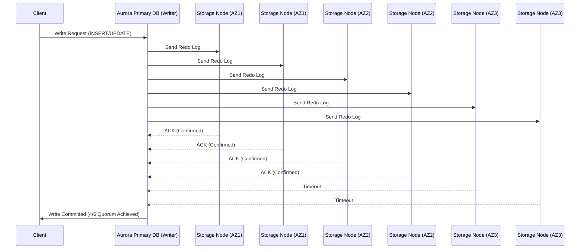
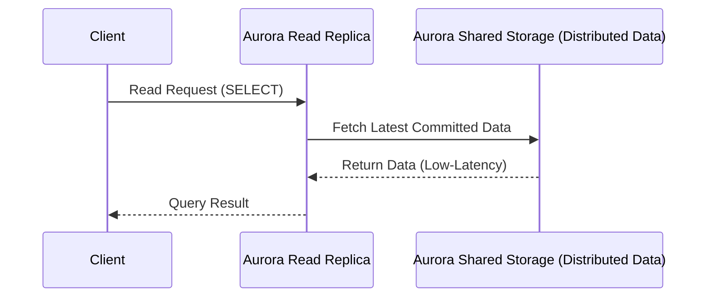

# 📂 **Amazon Aurora Storage Layer**

Amazon Aurora’s **storage architecture is fundamentally different** from traditional RDBMS storage. Instead of relying on **local EBS volumes**, Aurora employs a **distributed, multi-tenant storage layer** that separates **compute (database instances) from storage**, enabling **high availability, automatic scaling, and near-instant replication**.

---

## 📌 **1️⃣ What Makes Aurora’s Storage Unique?**

Aurora’s **storage layer is shared across all instances in a cluster** and is designed to be **highly available, fault-tolerant, and self-healing**.

### 🔹 **Key Features of Aurora’s Storage Layer**

- ✔ **Shared Storage** – The database **instances do not store data locally**; they access a **distributed storage volume** spanning **multiple AWS Availability Zones (AZs)**.
- ✔ **10GB Protection Groups** – Data is **partitioned into 10GB storage segments (protection groups)** for **efficient scaling** and **replication**.
- ✔ **6-Way Replication** – Each **10GB segment is automatically replicated 6 times across 3 AZs** for durability.
- ✔ **Auto-Scaling Storage** – Grows **from 10GB to 128TiB** dynamically, eliminating manual resizing.
- ✔ **No WAL Shipping** – Instead of traditional **Write-Ahead Logging (WAL)**, **Aurora applies redo logs at the storage layer**, significantly reducing replication lag.
- ✔ **Quorum-Based Writes** – A write is **considered committed only when at least 4 out of 6 storage nodes acknowledge it**, ensuring strong consistency.

📌 **How This Differs from Traditional RDS**

- In **traditional RDS**, every DB instance has its own **dedicated EBS volume**, requiring **manual replication and WAL shipping**.
- In **Aurora**, storage is **fully decoupled from compute**, providing **instant replication across read replicas with near-zero lag (<100ms)**.

---

## 🔄 **2️⃣ How Aurora’s Storage Layer Works**

Aurora’s **storage nodes operate independently from database instances** and handle **data persistence, replication, and recovery** seamlessly.

### **🔹 Aurora Write Process**

✔ **Writes happen only on the primary (writer) instance**.  
✔ Aurora **does not write full database pages immediately**—instead, it **writes only redo log records** to the storage layer.  
✔ The **redo logs are sent to 6 storage nodes across 3 AZs** for durability.  
✔ A transaction **commits only when at least 4 out of 6 storage nodes acknowledge the write**.

📌 **Key Takeaways**

- Aurora **only writes redo logs** to storage, reducing **disk I/O overhead** and improving performance.
- **No full-page writes**—data pages are reconstructed **asynchronously** by storage nodes when needed.
- **If a node fails**, Aurora **rebuilds missing data from other nodes** without downtime.

---

### **🔹 Aurora Read Process**

✔ **Aurora read replicas do not maintain separate copies of the database**.  
✔ Instead, they **directly access the same shared storage layer**.  
✔ Since there is **no need for WAL log shipping**, replication **happens in real-time (<100ms lag)**.

📌 **Key Takeaways**

- **No separate database copies**—all replicas access the **same storage layer**.
- **Near-zero replication lag** (**<100ms**), unlike traditional read replicas that rely on WAL-based replication.
- **Failover is nearly instant (~30s)** since **read replicas already have access to the latest data**.

---

## 🔀 **3️⃣ How Aurora Syncs Writes & Reads Across Storage Nodes**

### 🔹 **Quorum-Based Write System**

✔ **Each write must be confirmed by at least 4 out of 6 storage nodes**.  
✔ If a node **fails or lags**, the remaining nodes continue processing.  
✔ This ensures **strong consistency** without sacrificing performance.

### 🔹 **Instant Read Scaling**

✔ Since **read replicas query the same storage layer**, they do **not require data replication**.  
✔ This allows **up to 15 replicas** with **real-time updates**.  
✔ Aurora **automatically balances read requests across replicas**, improving performance.

📌 **Comparison with Traditional Replication**

| **Feature**         | **Aurora (Shared Storage)**               | **Traditional RDS (EBS-based)**         |
| ------------------- | ----------------------------------------- | --------------------------------------- |
| **Replication Lag** | **Milliseconds (<100ms)**                 | **Seconds to minutes**                  |
| **Failover Time**   | **~30 seconds**                           | **60-120 seconds**                      |
| **Read Scaling**    | **Up to 15 replicas, zero lag**           | **Up to 5 replicas, replication delay** |
| **Write Process**   | **Redo log writes, not full-page writes** | **Writes entire data pages**            |

---

## 🔄 **4️⃣ What Happens If a Storage Node Fails?**

Aurora’s **storage layer is self-healing** and **fault-tolerant**, capable of handling multiple failures.

### **✔ Storage Node Failure Recovery**

- If **one storage node fails**, **Aurora reconstructs the missing data from the other 5 copies**.
- **Replication happens automatically**—a new node is assigned and rebuilt **within minutes**.

### **✔ Availability Zone (AZ) Failure Recovery**

- Aurora **can survive the complete failure of an AZ** without losing data.
- Since **data is already replicated across 3 AZs**, it continues processing **without intervention**.

📌 **This means:** Aurora’s **architecture provides better durability** than **RAID, EBS, or traditional replication**.

---

## 🎯 **Final Summary: Why Aurora’s Storage Architecture is Superior** 🚀

| **Feature**           | **Aurora (Shared Storage)**                        |
| --------------------- | -------------------------------------------------- |
| **Storage Model**     | **Distributed, shared storage (not EBS-based)**    |
| **Storage Scaling**   | **Auto-scales from 10GB to 128TiB**                |
| **Replication**       | **6 copies per segment across 3 AZs**              |
| **Write Consistency** | **Quorum-based (4/6 nodes must confirm a write)**  |
| **Read Scaling**      | **Up to 15 replicas, zero-lag replication**        |
| **Failover Speed**    | **~30 seconds (instant access to shared storage)** |

💡 **Final Thought:**  
✔ **Aurora’s shared storage model eliminates replication lag and improves reliability.**  
✔ **Writes are applied at the storage layer, reducing the overhead of WAL shipping.**  
✔ **Storage is automatically self-healing, ensuring high durability and fault tolerance.**

📌 **Would you like a deep dive into how Aurora handles crash recovery and self-healing? Let me know! 🚀🔥**
