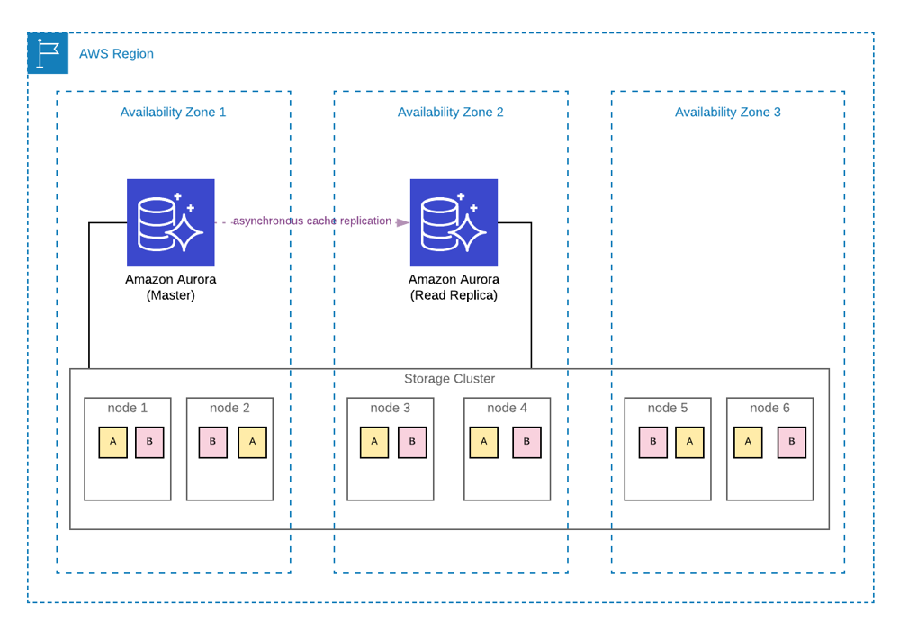

# 🏗 **Amazon Aurora Storage Nodes – Behind the Scenes**

Amazon Aurora’s storage architecture is **unique compared to traditional RDBMS systems** because it **decouples compute from storage** and uses a **distributed, fault-tolerant storage layer**. But how exactly does this work behind the scenes?

---

## 🏢 **What are Aurora Storage Nodes?**

### 🔍 **Aurora Storage Layer: High-Level Overview**

✔ Aurora’s **storage layer is separate from the database instances**.  
✔ Data is stored in **10GB “protection groups” (shards)**.  
✔ Each 10GB segment is **replicated 6 times across 3 AWS Availability Zones (AZs)**.  
✔ Aurora **does not use traditional block storage (EBS)**—it is a **distributed storage engine** built specifically for the cloud.

### ⚙️ **How Aurora Storage Nodes Are Structured**

Aurora’s storage nodes consist of:

- **✔️ Protection Groups** – Smallest unit of storage (10GB), replicated **6 times across 3 AZs**.
- **✔️ Page Cache** – Manages in-memory copies of data pages.
- **✔️ Redo Log Storage** – Aurora does **physical storage-based replication** instead of WAL (Write-Ahead Log) shipping.
- **✔️ Storage Volume** – A collection of **storage segments that auto-scale up to 128TiB**.
- **✔️ Consistency Model** – Uses a **quorum-based write system** to ensure durability.

📌 **Key Takeaways:**

- **✔ Aurora does not store the full database separately in each AZ**—it **distributes chunks** of data across multiple AZs.
- **✔ Each storage node keeps track of only a part of the dataset**.
- **✔ This architecture reduces replication lag and increases fault tolerance**.

---

## 🔄 **2️⃣ How Do Aurora Instances Stay in Sync Across AZs?**

### 🏗 **How Writes Are Handled in Aurora**

✔ **A database write happens only in the writer node (primary instance)**.  
✔ **Storage nodes apply changes to all replicas (reader nodes) at the storage layer, not at the database layer**.  
✔ **Writes are committed only when at least 4 out of 6 storage nodes confirm the change (Quorum-Based Writes)**.

📌 **Step-by-step write process:**

- **1️⃣** A write transaction is sent to the **primary instance**.
- **2️⃣** Aurora **creates a redo log record** (instead of modifying physical data immediately).
- **3️⃣** The **redo log is sent to 6 storage nodes** in **3 different AZs**.
- **4️⃣** **At least 4 out of 6 storage nodes must acknowledge the write** for it to be considered durable.
- **5️⃣** Once **confirmed**, the write is **committed** and available for read replicas.

✅ **This means:**

- Aurora **does not use traditional WAL (Write-Ahead Logging)** like PostgreSQL.
- **Storage nodes apply redo logs directly to their segments**, reducing network overhead.
- **Commit latency is much lower than RDS** because **Aurora’s shared storage layer ensures all nodes have the same data at the same time**.

---

### 🔎 **How Reads Are Handled in Aurora**

✔ **Aurora read replicas do not need to receive WAL logs** or **copy full datasets**.  
✔ Since **all instances share the same distributed storage**, read replicas just **query the existing storage nodes**.  
✔ This **eliminates replication lag**, which is common in traditional RDS read replicas.

📌 **Step-by-step read process:**

- **1️⃣** A read request is sent to a **read replica**.
- **2️⃣** The read replica **fetches data directly from the shared storage layer**.
- **3️⃣** The read request **returns immediately without waiting for WAL log replication**.

✅ **This means:**

- Aurora replicas **don't need to sync a full dataset**—they just query the same storage nodes.
- **Failover is much faster (~30 seconds)** because the **standby replica already has all the data loaded**.
- **No replication lag** since **all replicas share the same storage volume**.

---

## 🔀 **3️⃣ How Does Aurora Sync Writes & Reads Between Instances?**

### 🔹 **Quorum-Based Write System**

✔ **Aurora storage nodes operate in a distributed quorum model**.  
✔ **Writes are committed when at least 4 out of 6 storage nodes acknowledge them**.  
✔ If a node fails, Aurora **reconstructs the missing data from other nodes** without downtime.

### 🔹 **Low-Latency Read Scaling**

✔ Since **read replicas directly access shared storage**, there is **no need for physical data replication**.  
✔ Replicas **query the same distributed volume as the writer instance**, ensuring near-instant updates.  
✔ **Aurora supports up to 15 read replicas** with **<100ms replication lag**.

---

## 🎯 **Final Summary: How Aurora Storage Works Behind the Scenes**

| **Feature**           | **Aurora**                                                |
| --------------------- | --------------------------------------------------------- |
| **Storage Model**     | **Distributed, shared storage (not EBS)**                 |
| **Storage Unit**      | **10GB protection groups (shards)**                       |
| **Data Replication**  | **6 copies across 3 AZs**                                 |
| **Write Consistency** | **Quorum-based (4/6 storage nodes must confirm a write)** |
| **Read Scaling**      | **Up to 15 replicas, no replication lag**                 |
| **Failover Speed**    | **~30 seconds (instant access to shared storage)**        |

💡 **Final Thought**:  
✔ **Aurora’s shared storage removes replication lag**.  
✔ **Writes are applied at the storage layer instead of using WAL logs**.  
✔ **Failover is faster because all nodes share the same underlying storage**.

📌 **Would you like a deep dive into how Aurora handles crash recovery and self-healing? Let me know! 🚀🔥**
