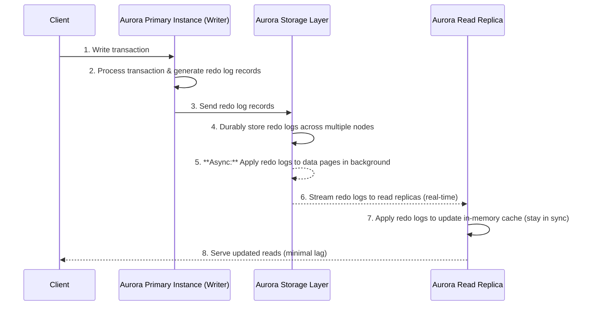

# **🧠 Aurora's Log-Based Storage**

Amazon Aurora is a high-performance, cloud-native relational database service that **reimagines traditional database architectures** by leveraging a **log-based storage system**. This architecture ensures **high availability, low replication lag (<100ms), and seamless failover** for read replicas.

In this guide, we will explore **how Aurora writes and reads data, how its read replicas stay in sync, and what happens when replicas fail before the storage layer fully flushes data pages**.

---

## **1️⃣ Aurora Transaction Commit & Read Replica Synchronization: Workflow 🔄**

The following sequence diagram illustrates **how a write transaction is processed in Aurora**, how redo logs are used instead of traditional page flushing, and how read replicas apply changes.

---

## **2️⃣ How Amazon Aurora's Log-Based Storage Works 🔍**

### **1. How does Aurora handle writes?**

✅ **Aurora does NOT write full data pages to disk immediately** like traditional databases. Instead, it:

- Writes only **redo log records** (which describe changes, not entire data pages).
- Sends these redo logs to the **Aurora storage layer**, which distributes them across multiple storage nodes.
- The storage layer later **assembles full data pages** from the redo logs **when needed**.

### **2. When do data pages get updated in storage nodes?**

✅ **Redo logs are written first**, and **data pages are updated asynchronously** in the background.

- This **avoids write amplification** and improves **commit performance** significantly.
- If a query requests data, the storage layer **reconstructs the page from redo logs** dynamically.

---

## **3️⃣ How Read Replicas Stay in Sync 📖**

Unlike traditional replication, Aurora read replicas **don’t rely on full-page flushes**. Instead, they:

1️⃣ Receive **redo logs in real-time from the storage layer**.  
2️⃣ Apply the logs **in memory** to keep up with the primary database.  
3️⃣ Serve updated reads **with minimal replication lag (<100ms)**.

### **Q: Do read replicas wait for the storage layer to flush data pages?**

❌ **No! Read replicas don’t need to wait for flushed pages.**  
✔ Instead, they **immediately apply redo logs in memory**, staying **almost in sync with the primary**.

### **Q: Does Aurora use eventual consistency for read replicas?**

❌ **No! Aurora avoids eventual consistency.**  
✔ Since redo logs are streamed **continuously** to read replicas, they reflect **committed transactions in real time**.

---

## **4️⃣ What Happens If a Read Replica Fails Before Storage Nodes Flush Data Pages? ⚠️**

If a read replica **fails and a new one is created**, but storage nodes **haven’t flushed data pages yet**, will the new replica have outdated data? **No. Aurora ensures consistency.**

1️⃣ The **new read replica does NOT rely on existing data pages**.  
2️⃣ Instead, it **fetches all redo logs from the storage layer**.  
3️⃣ The **redo logs are applied in memory**, keeping the replica **up to date** even if data pages weren’t flushed.

✔ **Storage nodes store redo logs across multiple AZs**, ensuring zero data loss.  
✔ The new replica reconstructs data pages dynamically **from logs, not from stale pages**.

### **Q: What if the primary instance fails before storage nodes flush pages?**

1️⃣ Aurora **selects the best read replica as the new primary**.  
2️⃣ It applies **all unprocessed redo logs** before accepting writes.  
3️⃣ Since redo logs are always **persisted before commit acknowledgment**, **no transactions are lost**.

---

## **5️⃣ Aurora's Log-Based Architecture vs Traditional Replication 📊**

| Feature              | **Traditional RDS (PostgreSQL/MySQL)** | **Aurora (PostgreSQL/MySQL-Compatible)** |
| -------------------- | -------------------------------------- | ---------------------------------------- |
| **Storage Model**    | Full-page writes on commit             | Log-based redo record storage            |
| **Read Replica Lag** | Seconds to minutes                     | **< 100ms (real-time log streaming)**    |
| **Replica Updates**  | Applies full page updates              | **Applies redo logs dynamically**        |
| **Failover Time**    | **60-120s**                            | **~30s** (fastest in AWS)                |
| **Cross-Region DR**  | Read replicas only                     | **Aurora Global Database**               |
| **Performance**      | Standard                               | **3-5x Faster**                          |
| **Write Latency**    | High (full pages written on commit)    | **Low (log-based commits only)**         |

---

## **6️⃣ Key Takeaways 🎯**

✔ **Writes:** Aurora **only writes redo logs** to storage first, avoiding full-page writes.  
✔ **Storage Layer:** Pages are **updated asynchronously**, reducing write amplification.  
✔ **Read Replicas:** Apply redo logs **in real-time**—they don't wait for flushed pages.  
✔ **Failover Handling:** If a replica fails before pages are flushed, **redo logs restore the latest state**.  
✔ **Consistency:** Replicas are **near real-time**, avoiding traditional replication lag.

🚀 **Amazon Aurora’s log-based storage model ensures fast writes, minimal replication lag, and seamless failovers—making it one of the most advanced cloud databases available today!** 🎯
