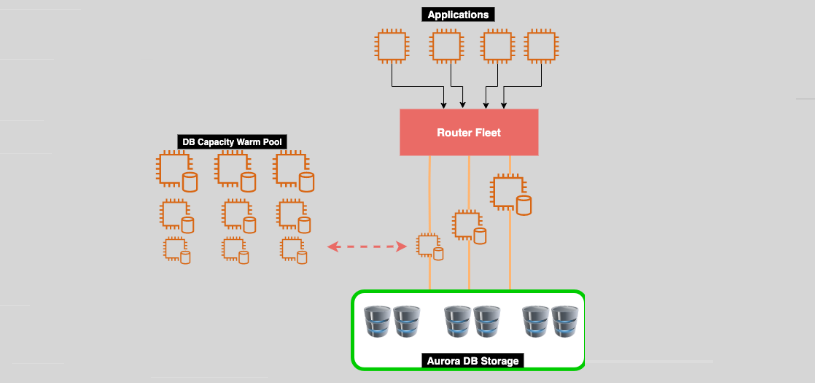

# 🟢🔴🟢 **Amazon Aurora Serverless Version 2**

**Aurora Serverless v2** is a **hybrid auto-scaling** relational database that combines the flexibility of **serverless computing** with the full power of **provisioned Aurora clusters**. Unlike **Aurora Serverless v1**, which had limitations in scalability and feature support, **Serverless v2** provides near-instant **vertical scaling (VL)** and **horizontal scaling (HZ)** to support workloads of any size.

---

    

---

## **🌟 Key Features of Aurora Serverless v2**

✅ **Auto-Scaling Compute (Vertical & Horizontal) 📈**  
✅ **Supports MySQL & PostgreSQL** 💾  
✅ **TLS/SSL Encryption for Secure Connections** 🔐  
✅ **Cluster Volume Encryption for Data at Rest** 🔒  
✅ **Cost-Efficient Pricing (Only Pay for Active Usage)** 💰  
✅ **Supports RDS Proxy, Multi-AZ, and Global Databases** 🌍  
✅ **Seamless Failover with Multi-AZ Replication** 🚀

---

## **📌 How Aurora Serverless v2 Works**

Unlike traditional database clusters that require **manually adjusting instance sizes**, **Aurora Serverless v2** automatically adjusts resources **on demand** while maintaining **high availability and performance**.

**Scaling happens in two ways:**

1️⃣ **Vertical Scaling (VL) 🚀** → Increases/decreases **compute power (CPU & memory) dynamically** without downtime.  
2️⃣ **Horizontal Scaling (HZ) 🔄** → Adds/removes **read replicas** to distribute high read workloads.

---

## **🛠 Aurora Serverless v2 Use Cases**

🔹 **Infrequent Applications** – Websites or apps with unpredictable traffic.  
🔹 **Development & Testing** – Quickly spin up DB environments without provisioning limits.  
🔹 **Multi-Tenant SaaS Applications** – Dynamically scale based on customer activity.  
🔹 **Event-Driven Workloads** – Handles seasonal traffic spikes efficiently.  
🔹 **Cost Optimization** – Pay for only the resources you need, reducing over-provisioning.

## **📊 Capacity Range**

Aurora Serverless is defined using **Aurora Capacity Units (ACUs)**, where:

- **1 ACU = 2 GiB of memory**, with corresponding CPU and networking resources.
- **Scaling from 0.5 to 128 ACUs**, allowing for fine-grained control over the compute resources used by the database.

---

## **1️⃣ Vertical (VL) vs. Horizontal (HZ) Scaling in Aurora Serverless v2**

| **Scaling Type**            | **Aurora Serverless v2 Behavior**                                                             |
| --------------------------- | --------------------------------------------------------------------------------------------- |
| **Vertical Scaling (VL)**   | ✅ Aurora **dynamically adjusts compute power** (CPU/RAM) for the **same database instance**. |
| **Horizontal Scaling (HZ)** | ✅ Aurora **adds/removes read replicas** to handle read-heavy workloads.                      |

### **How Vertical Scaling Works (VL) in Aurora Serverless v2**

✔ Aurora **dynamically increases or decreases CPU/RAM** based on demand.  
✔ It **adjusts capacity in increments of ACUs (Aurora Capacity Units)** without restarting.  
✔ Vertical scaling happens **within seconds** and avoids downtime.

#### **Example of Vertical Scaling**

- 🟢 **Low traffic:** Aurora runs at **2 ACUs**.
- 🔴 **Traffic spikes:** Aurora scales up to **16 ACUs** automatically.
- 🟢 **Traffic drops:** Aurora scales back down to **4 ACUs**.

✅ **VL Scaling = Adjusting compute capacity on the same writer instance.**  
🚫 **VL Scaling does NOT create new instances.**

---

### **How Horizontal Scaling Works (HZ) in Aurora Serverless v2**

✔ Aurora **adds or removes read replicas** dynamically.  
✔ Read replicas share the same **distributed storage layer** as the primary instance.  
✔ Aurora **automatically distributes traffic across replicas** to improve performance.

#### **Example of Horizontal Scaling**

- 🟢 **Low traffic:** 1 writer, 1 read replica.
- 🔴 **High read demand:** Aurora **adds 3 more read replicas** dynamically.
- 🟢 **Traffic drops:** Aurora **removes extra replicas** to save costs.

✅ **HZ Scaling = Adding/removing read replicas dynamically to handle read workloads.**  
🚫 **HZ Scaling does NOT apply to the writer instance.**

---

## **2️⃣ Does Aurora Serverless v2 Scale Write Instances or Read Instances?**

| **Scaling Type**            | **Write Instance (Primary)**                   | **Read Replicas**                                |
| --------------------------- | ---------------------------------------------- | ------------------------------------------------ |
| **Vertical Scaling (VL)**   | ✅ **Yes** (Increases compute for writes)      | ❌ **No** (Read replicas do not VL scale)        |
| **Horizontal Scaling (HZ)** | ❌ **No** (Primary instance does not HZ scale) | ✅ **Yes** (Read replicas scale out dynamically) |

📌 **Key Takeaways:**
✔ **Writes scale vertically (VL)** – Aurora **increases ACUs** but does NOT add more writer instances.  
✔ **Reads scale horizontally (HZ)** – Aurora **adds/removes read replicas** dynamically.  
✔ **Multi-AZ still protects against failure, but it does NOT automatically scale writes.**

---

## **3️⃣ What If the Write Instance Needs More Scaling?**

- Since Aurora **only has one writer per cluster**, it **cannot add another writer for scaling**.
- If a single writer **cannot handle the load**, you must:
  - Use **a bigger instance (VL scaling)**
  - Distribute the workload **across read replicas (HZ scaling)**
  - Consider **Aurora Global Database** for multi-region scaling.

---

---

## **🤔 Why Is Multi-AZ a Separate Option If Aurora Scales Horizontally?**

Aurora Serverless v2 **does not automatically promote read replicas to the writer role during failure.**

- **Without Multi-AZ enabled:** If the writer instance fails, the system has to **launch a new writer**, which takes time (~1 minute or more).
- **With Multi-AZ enabled:** There is an **existing standby replica** that can be **promoted instantly (~30 seconds failover time).**

### **What Happens If a Writer Fails?**

| **Scenario**               | **Without Multi-AZ**                                | **With Multi-AZ (Aurora Replica in a different AZ)**            |
| -------------------------- | --------------------------------------------------- | --------------------------------------------------------------- |
| **Primary (Writer) Fails** | 🚨 New writer must be created, causing downtime.    | ✅ Standby replica is **instantly promoted** as the new writer. |
| **Read Replicas**          | ✅ Continue working but cannot take over as writer. | ✅ Continue working AND a new writer is instantly available.    |
| **Failover Time**          | ⚠️ Takes **1+ minute** to create a new writer.      | ✅ Failover happens in **~30 seconds**.                         |

📌 **Key Takeaways:**  
✔ **Read replicas (HZ scaling) do NOT automatically become a writer** unless Multi-AZ is enabled.  
✔ **Multi-AZ explicitly creates a failover standby replica that can be promoted instantly.**  
✔ **If you don’t enable Multi-AZ, failure recovery is slower (~1 min+).**

---

## **⚙️ Serverless v1 vs Serverless v2**

### **❌ Serverless v1 Limitations**

- Aurora Global Databases are not supported.
- Multi-Master clusters are not supported.
- Aurora Replicas are not supported.
- Backtracking is not supported.
- Exporting snapshots to Amazon S3 is not supported.
- Multi-AZ clusters are not supported.
- RDS Proxy is not supported.

### **✔️ Serverless v2 Enhancements**

- **Feature Parity with Provisioned Clusters**:  
  Serverless v2 now supports the same features as provisioned Aurora clusters, including global databases, Aurora replicas, and IAM DB authentication.

- **Faster Scaling**:  
  Aurora Serverless v2 scales much faster than v1, handling up to **100s of thousands of transactions per second** with rapid scaling, making it suitable for mission-critical applications and SaaS workloads.

- **Support for Multi-AZ Clusters**:  
  It now supports Multi-AZ deployment for higher availability and fault tolerance.

- **RDS Proxy Support**:  
  Serverless v2 integrates with **RDS Proxy**, allowing for connection pooling and improving application performance.

- **Global Databases**:  
  Aurora Global Databases are now supported, providing low-latency global reads and disaster recovery capabilities.

---

## **🎯 Final Answer: How Does Aurora Serverless v2 Scale?**

✔ **Writes (Primary Instance) → Vertical Scaling (VL) (ACUs up/down)**  
✔ **Reads (Replicas) → Horizontal Scaling (HZ) (Adds/removes replicas dynamically)**  
✔ **Multi-AZ does NOT scale writes—it only provides HA/failover.**

🔥 **Aurora Serverless v2 = Vertical scaling for writes + Horizontal scaling for reads** 🚀
