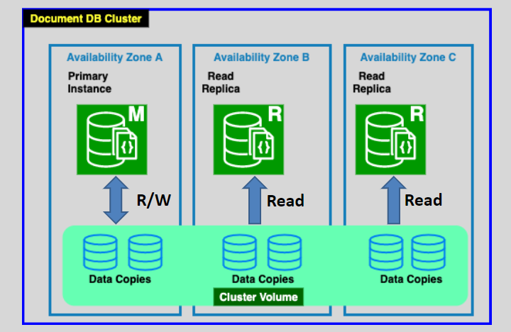

# AWS DocumentDB (like `aurora` architecture but with MongoDB)📄

Amazon DocumentDB is a **fully managed document database service** designed to be compatible with **MongoDB**, a popular NoSQL database. It enables organizations to run scalable, high-performance document-based applications without worrying about the operational complexities of managing infrastructure.

---

## 📝 **What is MongoDB?**

**MongoDB** is an open-source, NoSQL database known for its flexibility, scalability, and performance.

- **Key Characteristics**:
  - **Collections** instead of tables.
  - **Documents** instead of rows.
  - Documents consist of **key-value pairs**, often stored in **JSON-like format**.

MongoDB is widely used for applications requiring rapid development and handling large, semi-structured datasets.

---

## 🌟 **What is Amazon DocumentDB?**

Amazon DocumentDB is a fully managed service that offers **MongoDB compatibility**, allowing developers to use familiar MongoDB tools and APIs.

- **Key Features**:
  - Designed for **high availability** and **fault tolerance**.
  - **Automated scaling** for both storage and compute resources.
  - Managed by AWS, reducing operational overhead for patching, backups, and replication.

---

  

---

## 🔑 **Core Components of DocumentDB**

1. **Cluster Architecture**:

   - A **cluster volume** is shared across all instances (primary and replicas).
   - **Primary Instance**: Handles both **read** and **write** operations.
   - **Read Replicas**: Up to **15 replicas** for read scaling and high availability.

2. **Multi-AZ Deployment**:

   - Replicas are distributed across multiple **Availability Zones** (AZs) for fault tolerance.

3. **VPC Integration**:

   - Runs within a customer’s **VPC**, ensuring secure network isolation.

4. **Backup and Durability**:
   - **Continuous backups** to Amazon S3 with point-in-time recovery.
   - Automatically replicates data across AZs to ensure durability.

---

## 🚀 **Why Use Amazon DocumentDB?**

1. **Managed Service**:

   - AWS handles database provisioning, patching, backups, and scaling, allowing developers to focus on building applications.

2. **MongoDB Compatibility**:

   - Supports popular MongoDB APIs, drivers, and tools, making it easy to migrate MongoDB applications to AWS.

3. **High Performance**:

   - Optimized for OLTP (Online Transaction Processing) workloads with fast reads and writes.

4. **Scalability**:

   - Automatically scales storage up to **64 TB** without downtime.

5. **Cost-Effective**:
   - Pay-as-you-go pricing for compute, storage, and I/O, ensuring cost efficiency.

---

## 🔄 **How Amazon DocumentDB Works**

1. **Primary Instance**:

   - Processes all write requests and replicates data to read replicas.

2. **Read Scaling**:

   - Read replicas distribute read workloads, improving application performance.

3. **Cluster Volume**:

   - Data is stored in a distributed, fault-tolerant **cluster volume** across multiple AZs, ensuring durability.

4. **Backup and Recovery**:
   - Continuous snapshots provide point-in-time recovery to protect against accidental data loss.

---

## 📚 **Use Cases**

1. **Content Management**:

   - Ideal for storing and querying semi-structured content like blogs, articles, or product catalogs.

2. **Mobile and Web Applications**:

   - Supports real-time applications requiring low-latency reads and writes.

3. **IoT Applications**:

   - Handles massive amounts of sensor data stored as JSON documents.

4. **Data Aggregation and Reporting**:
   - Stores and processes event logs or transactional data for analytics.

---

## ✅ **Conclusion**

Amazon DocumentDB simplifies the deployment and management of **MongoDB-compatible databases** in the cloud. With features like **high availability**, **scalability**, and **fault tolerance**, it is a robust solution for building modern, document-based applications. By reducing operational overhead, DocumentDB allows developers to focus on innovation while ensuring their data is secure, durable, and highly available.
