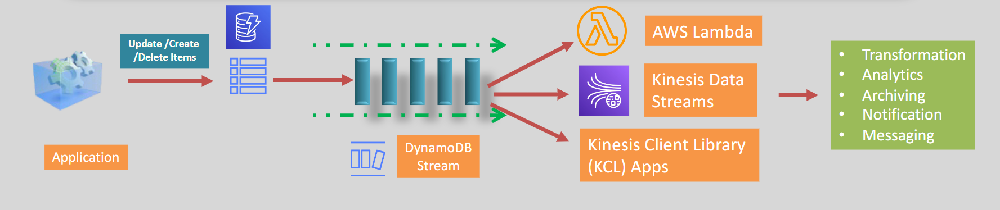

# 🌟 AWS DynamoDB Additional Features

## 🕰️ TTL (Time to Live)

**What It Is:**

- TTL is a feature that automatically deletes items from your DynamoDB table when they expire.

**How It Works:**

- You set an expiry time (TTL attribute) for each item in your table.
- When the expiry time is reached, DynamoDB automatically deletes the item without using your table's write capacity units (WCUs).

**Benefits:**

- Helps maintain or reduce the table size by removing unwanted data.
- No additional charge for using TTL.

**Examples:**

- Deleting session data after a user logs out.
- Removing old event logs, temporary data, or usage patterns.

**Important Tips:**

- Each item must have the same expiry attribute specified when TTL is enabled.
- The TTL attribute value must be in epoch time format (seconds since 1970).

---

## 🔒 Security and Data Protection

**What It Is:**

- Ensures that your data is secure both at rest and in transit.

**Key Features:**

- **Encryption at Rest:** All data in DynamoDB tables is encrypted. This cannot be disabled.
  - Uses DynamoDB-managed KMS keys, customer-managed KMS keys, or customer-provided keys.
- **Encryption in Transit:** All in-transit traffic is protected by TLS (HTTPS).
- **VPC Gateway Endpoint:** Ensures secure access to DynamoDB from within a VPC.
- **IAM Policies:** Used for authentication and authorization to access DynamoDB and DAX.

---

## 🚀 Export to S3

**What It Is:**

- Allows you to export data from your DynamoDB table to an S3 bucket.

**How It Works:**

- You can export data to an S3 bucket in the same or a different AWS account or region.
- Exported data can be in JSON or Ion format (Amazon's data serialization format).

**Benefits:**

- Provides a snapshot of your table's data at a selected point in time.
- Data in S3 is encrypted at rest.

**Use Cases:**

- Backup and recovery.
- Data analysis and archiving.

**Important Tips:**

- You can export data starting from any time within the Point In Time Recovery (PITR) window (retention period).

---

## 🔄 DynamoDB Change Data Capture

**What It Is:**

- Captures item-level changes (create/update/delete) in DynamoDB tables and replicates them to other AWS services.

**How It Works:**

- **Streaming Methods:** DynamoDB offers two methods:
  - Kinesis Data Streams for DynamoDB.
  - DynamoDB Streams.
- **Integration:** Use these changes to trigger other AWS services (like Lambda) to perform actions based on the changes.

**Use Cases:**

- Triggering notifications or workflows when data changes.
- Replicating data to other systems in real-time.

---

### 🔄 DynamoDB Streams

**What It Is:**

- A real-time, ordered flow of data about changes to items in a DynamoDB table.

**How It Works:**

- Build applications that consume these streams and take actions based on the stream records.
- Data is available for 24 hours and then removed.
- Data is encrypted at rest in DynamoDB Streams.

    

---

## 🌐 DynamoDB Global Tables

**What It Is:**

- A fully managed solution to deploy a multi-region, multi-active DynamoDB database.

**How It Works:**

- New items in any table in one region are automatically replicated to tables in other regions within one second.
- Each replica can use a different DynamoDB table class to optimize cost and performance.
- Requires DynamoDB Streams to be enabled.
- In case of isolation or degradation in one region, the application needs to redirect requests to another region and perform reads and writes against a different replica table.

**Benefits:**

- Enables building massively scaled applications with a global user base.
- Provides high availability and failover capabilities.

  
  
  

