# 🔥 **Deep Dive into AWS DynamoDB** 🔥

## 📌 **What is AWS DynamoDB?**

AWS **DynamoDB** is a **fully managed NoSQL database** service provided by Amazon Web Services (AWS). It is designed for **high availability, scalability, and low-latency performance**. DynamoDB is optimized for **key-value** and **document-based** data models.

---

> 📌 Under the covers DynamoDb is a **Java application that runs on Ec2** and persists data on high speed storage devices (**SSD**) for optimum IO performance. These EC2 instances with DynamoDB application deployed to it are referred to as **DynamoDB Nodes** (or just nodes).
>
> 📌 Since DynamoDB table is **serverless**, you as a user **does not have direct access to these nodes**. In every AWS region where DynamoDB is available there are 10s or even 100’s of thousands of such nodes.
>
> 📌 A single partition hosts a single shard of the table. Each of the partitions for the table is replicated across 3 Availability Zones for high durability and availability. Illustration below depicts a single table with data across 2 partitions; each partition replicated across 3 AZ.

  

---

### 1. DynamoDB Node

> 📌 Each node is divided into multiple logical units referred to as partitions.
>
> - A node is shared across multiple Tables owned by multiple users
> - A partition is dedicated to a table

  

---

### 2. DynamoDB Table

> 📌 tables divided into partitions, The size of each item in the partition is restricted to a maximum size of **400 KB**. The maximum amount of data stored in the partition is restricted to **10 GB**. As the size of the table grows, DynamoDB service adds more partitions to the table. This scale-up process is transparent to the user. With this zero-impact scaling up mechanism your table can grow in size to even Petabytes.
> 💡 Note: A table MUST be defined with a Partition key and Sort key for a table is optional. More on this topic later.

  

  

### 3. DynamoDB Partitions (Logical Units)

> 📌 Each of the partition may be taught of as Hashable like data structure that hosts multiple key-value pairs. These key-value pairs belong to a single table shard. The Key is referred to as the **Partition key**. Value may be a single item or an **Item collection**. In this illustration value is an item collection. Each item collection may be thought of as a Hashtable like data structure. Items in the collection are identified by an inner key that is referred to as the **Sort key** or **Range key**.

  

---

## 🏗 **What is DynamoDB Built On?**

DynamoDB is built on the principles of **Amazon Dynamo (a distributed key-value store)**, combined with **modern distributed database architectures**. Here's what powers DynamoDB under the hood:

1. **💾 SSD-Based Storage:**

   - DynamoDB uses **SSD (Solid-State Drives)** for **fast read/write** operations.
   - Provides **high throughput** with **low latency**.

2. **📡 Partitioning and Sharding:**

   - **Horizontal scaling** is achieved through **automatic sharding** of data across multiple partitions.
   - Each partition can store up to **10GB of data** and handle a defined number of **RCUs (Read Capacity Units) and WCUs (Write Capacity Units)**.

3. **🔄 Multi-Region Replication:**

   - **Global Tables** allow data replication across **multiple AWS regions** for high availability and disaster recovery.

4. **📜 Eventual Consistency & Strong Consistency:**

   - DynamoDB offers **eventual consistency** by default but allows **strong consistency** for reads.

5. **⚙️ Internally Uses Raft Protocol (Leader-Based Replication):**
   - DynamoDB internally uses **Raft Consensus Algorithm** to ensure **consistency** and **leader-election** for coordinating writes.

---

## 🔄 **How Does DynamoDB Work Internally?**

### **1️⃣ Partitioning Data Across Nodes**

DynamoDB follows a **partition-based architecture** where data is **hashed** and distributed across multiple **partitions (shards)**.

- **Primary key hashing** (Partition key) determines where data is stored.
- Each partition has a **leader node** responsible for handling writes.
- Data is **replicated** across multiple nodes for fault tolerance.

### **2️⃣ Storage & Indexing**

DynamoDB stores data in **B-trees & LSM trees** for efficient indexing.

- **Primary Index:** Uses **partition key + sort key** for efficient lookups.
- **Global Secondary Index (GSI):** Enables querying **different attributes**.
- **Local Secondary Index (LSI):** Enables sorting within the **same partition**.

### **3️⃣ Read and Write Workflows**

- **Write Requests:** Data goes to the **leader partition**, which replicates it asynchronously.
- **Read Requests:** Reads can be **eventually consistent** (faster) or **strongly consistent** (slower but accurate).

---

### 📜 **DynamoDB Workflow (Mermaid Sequence Diagram)**

```mermaid
sequenceDiagram
    participant Client as 🧑‍💻 Client
    participant DynamoDB as 🔥 DynamoDB
    participant Partition as 🗂 Partition (Shard)
    participant Replica as 🔁 Replica Node

    Client->>DynamoDB: 🔎 Read Request
    DynamoDB->>Partition: 🔑 Find Partition (Hashing Key)
    Partition->>Replica: 🔍 Fetch Data
    Replica-->>Client: 📜 Return Data

    Client->>DynamoDB: ✍️ Write Request
    DynamoDB->>Partition: 🗂 Store Data
    Partition->>Replica: 🔁 Replicate Data
    Replica-->>Client: ✅ Write Acknowledged
```

---

## 🚀 **Example: How DynamoDB Works**

Let’s take an example of an **E-Commerce Order System**.

### **Scenario: Storing and Retrieving Orders**

| Order ID (Partition Key) | User ID (Sort Key) | Product Name | Price   | Status    |
| ------------------------ | ------------------ | ------------ | ------- | --------- |
| `ORD123`                 | `USR001`           | `Laptop`     | `$1000` | `Shipped` |
| `ORD124`                 | `USR002`           | `Phone`      | `$500`  | `Pending` |

### **Write Operation**

When a **new order is placed**, DynamoDB:  
1️⃣ Hashes the **Order ID** (`ORD123`).  
2️⃣ Maps it to a **Partition**.  
3️⃣ Stores the **order details** in that partition.  
4️⃣ Replicates data for **high availability**.

### **Read Operation**

When a **user fetches their order**, DynamoDB:  
1️⃣ Uses **Order ID** to determine the **partition**.  
2️⃣ Fetches **order details** from that partition.  
3️⃣ Returns the data to the client.

---

## 🎯 **Key Features of DynamoDB**

### **⚡️ Auto-Scaling**

DynamoDB automatically adjusts capacity **based on traffic** to prevent over-provisioning.

### **🗂 Flexible Indexing**

- **Primary Key (Partition + Sort)**
- **GSI (Global Secondary Index)**
- **LSI (Local Secondary Index)**

### **📊 On-Demand or Provisioned Mode**

- **On-Demand Mode:** Pay per request (great for unpredictable workloads).
- **Provisioned Mode:** Predefine RCUs and WCUs for cost control.

### **🔄 Streams for Real-time Processing**

DynamoDB Streams allow **event-driven architectures**, useful for:

- **Triggering AWS Lambda functions** on data changes.
- **Replicating data** to other databases.

---

## 🎭 **When to Use DynamoDB?**

✅ **Best for:**

- High-scale applications like **gaming, IoT, e-commerce, and real-time analytics**.
- Applications requiring **millisecond latency**.
- Systems with **unpredictable workloads**.

❌ **Not Ideal for:**

- Applications requiring **complex joins** (DynamoDB doesn’t support joins).
- Large **analytical queries** (use Amazon Redshift for that).

---

## 🏁 **Final Thoughts**

AWS DynamoDB is an incredibly **powerful, scalable, and highly available** NoSQL database. It’s **designed for high-performance applications** with **low-latency access to massive datasets**.

Would you like to explore **hands-on queries** with DynamoDB? Let me know! 🚀
