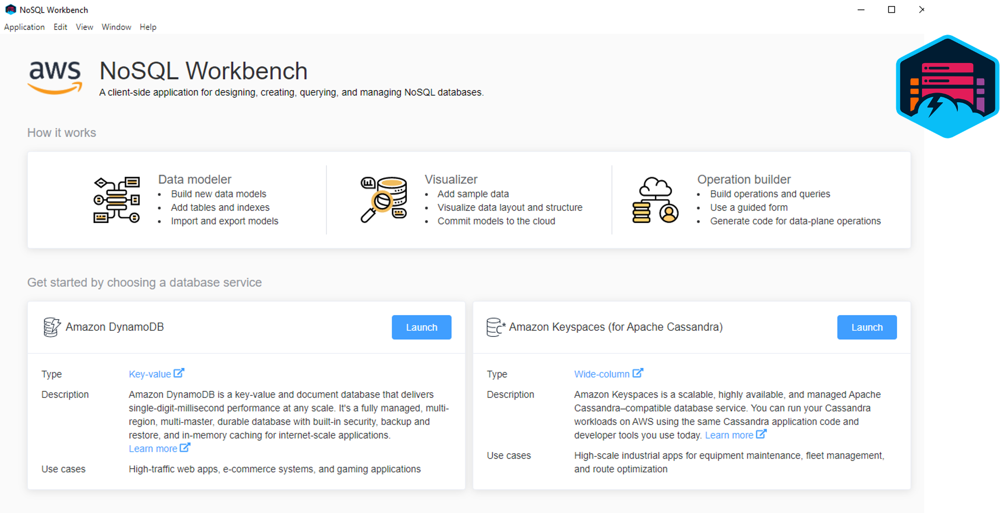
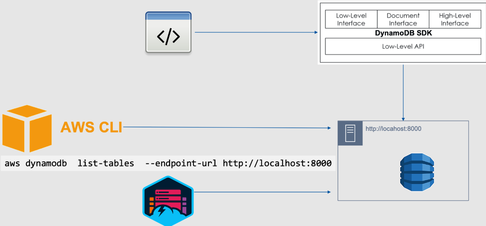
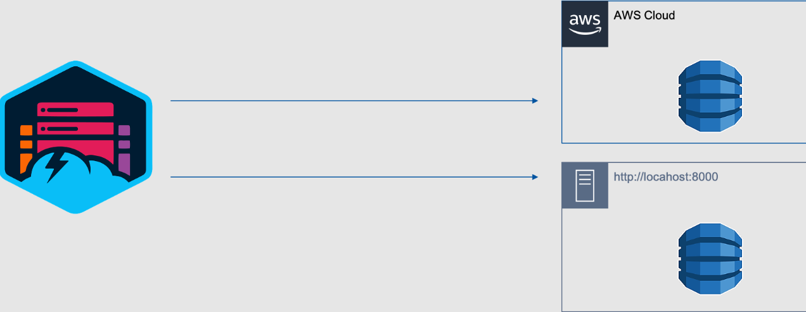

# 🚀 DynamoDB Tools Overview

Amazon DynamoDB provides various tools to help developers interact with, manage, and test DynamoDB databases efficiently. Below is a detailed breakdown of these tools.

---

## 🔧 AWS CLI (Command Line Interface)

The **AWS CLI** is a universal tool that allows you to perform **both control plane and data plane** operations on DynamoDB tables.

- Ideal for **automation** and quick execution of commands.
- Requires installation of the **AWS CLI** to use DynamoDB commands.
- Supports all operations, including **creating, updating, querying, and deleting tables**.

🛠 **Use case**: Running quick DynamoDB operations from the terminal.

📌 **Example Command:**

```sh
aws dynamodb list-tables --region us-east-1
```

## 💻 DynamoDB SDK

The **DynamoDB SDK** is available for multiple programming languages to integrate **DynamoDB into applications**.

🔹 Popular SDKs:

- **Python**: `boto3`
- **Node.js**: `aws-sdk`
- **Java**: `AWS SDK for Java`
- **.NET**: `AWS SDK for .NET`
- **Go**: `AWS SDK for Go`

📌 **Example: Querying a table with Python (Boto3)**

```python
import boto3

dynamodb = boto3.resource('dynamodb', region_name='us-east-1')
table = dynamodb.Table('Users')

response = table.get_item(Key={'UserID': '123'})
print(response['Item'])
```

🛠 **Use case**: Building applications that interact with DynamoDB programmatically.

📌 **Reference:** [DynamoDB SDK Documentation](https://docs.aws.amazon.com/sdk-for-javascript/v3/developer-guide/dynamodb-examples.html)

---

## 🖥️ NoSQL Workbench

NoSQL Workbench is a **GUI-based tool** for designing and managing data models for **Amazon DynamoDB and Amazon Keyspaces**.

✅ Features:

- Allows **designing data models** before deploying them to AWS.
- Supports **adding sample data** for local testing.
- No need for an **AWS account** to test table operations.
- Stores **data models as JSON files**, making them easy to share.

🛠 **Use case**: Interactive table design & local validation before cloud deployment.

📌 **Reference:** [NoSQL Workbench Documentation](https://docs.aws.amazon.com/amazondynamodb/latest/developerguide/workbench.html)

---

<div style="text-align: center;">
  
</div>

---

## 💻 Local DynamoDB (Emulator)

DynamoDB tables exist in the **AWS cloud**, but for development purposes, AWS provides a **local DynamoDB emulator**.

🔹 Why use Local DynamoDB?

- Allows developers to **test applications locally** without incurring AWS costs.
- Works with **AWS CLI, SDKs, and NoSQL Workbench**.
- Runs on your local machine without an **internet connection**.

📌 **Local DynamoDB Endpoint:**

```ini
http://localhost:8000
```

> 💡 Java Runtime Environment (JRE) version 11.x or newer is required for running DynamoDB local.

🛠 **Use case**: Testing DynamoDB applications offline before deploying to AWS.

---

<div style="text-align: center;">
  
</div>

---

## ⚡ Using NoSQL Workbench with Local DynamoDB

The **NoSQL Workbench** can connect to both **AWS DynamoDB tables** and **Local DynamoDB tables**.

📌 **Workflow:**

1. **Design your model** in NoSQL Workbench.
2. **Add sample data** to test queries and relationships.
3. **Commit** the model to the local DynamoDB instance for validation.
4. Once finalized, **deploy to AWS cloud**.

🔁 **Iterative development** ensures that the model is well-tested before moving to production.

🛠 **Use case**: Developing, testing, and refining data models locally before deploying them to AWS.

---

<div style="text-align: center;">
  
</div>

---

## 🏗️ Hands-on: Using the Local Table from CLI

You can interact with **local DynamoDB** using AWS CLI by specifying the `--endpoint-url` parameter.

⚠ **Note:** If using Windows **Command Prompt**, replace `\` with `` ` `` or use **GitBash**.

📌 **Create a table in Local DynamoDB:**

```sh
aws dynamodb create-table \
    --table-name test \
    --attribute-definitions \
       AttributeName=PK,AttributeType=S AttributeName=SK,AttributeType=S  \
    --key-schema \
       AttributeName=PK,KeyType=HASH \
       AttributeName=SK,KeyType=RANGE \
    --provisioned-throughput \
        ReadCapacityUnits=1,WriteCapacityUnits=1 \
    --endpoint-url http://localhost:8000
```

📌 **List all tables in Local DynamoDB:**

```sh
aws dynamodb list-tables --endpoint-url http://localhost:8000
```

📌 **Add items to the Local DynamoDB table:**

```sh
aws dynamodb put-item  \
   --table-name test \
   --item '{
        "PK": {"S": "doe@example.com"},
        "SK": {"S": "John Doe"},
        "Age": {"N": "31"}
   }'   \
   --endpoint-url http://localhost:8000
```

```sh
aws dynamodb put-item  \
   --table-name test \
   --item '{
        "PK": {"S": "doe@example.com"},
        "SK": {"S": "Jane Doe"},
        "Age": {"N": "28"}
   }'   \
   --endpoint-url http://localhost:8000
```

📌 **Retrieve all items from the table (equivalent to `SELECT * FROM test`):**

```sh
aws dynamodb scan --table-name test --endpoint-url http://localhost:8000
```

📌 **Get a specific item:**

```sh
aws dynamodb get-item  \
   --table-name test \
   --key '{
        "PK": {"S": "doe@example.com"},
        "SK": {"S": "John Doe"}
   }' \
   --endpoint-url http://localhost:8000
```

📌 **Delete the table:**

```sh
aws dynamodb delete-table \
   --table-name test \
   --endpoint-url http://localhost:8000
```

📌 **Running commands on AWS Cloud instead of Local DynamoDB:**  
To run these commands **against AWS Cloud**, simply remove the `--endpoint-url` parameter.

---

## 🏗️ Hands-on: Using Workbench with Local DynamoDB

You can commit NoSQL Workbench **samples** to both local DynamoDB and AWS Cloud.

📌 **Example: Workbench Employee Model**

1. **Commit the Employee model** to Local DynamoDB.
2. Run the following commands against the local table.

📌 **Retrieve all items from the Employee table:**

```sh
aws dynamodb scan --table-name Employee --endpoint-url http://localhost:8000
```

📌 **Get an item by specifying its primary key:**

```sh
aws dynamodb get-item  \
   --table-name Employee \
   --key '{
        "LoginAlias": {"S": "johns"}
   }' \
   --endpoint-url http://localhost:8000
```

📌 **Run the same operations in Workbench GUI.**

- Use **Scan** operation to retrieve all items.
- Use **GetItem** operation to fetch specific records.

📌 **Code Generation in Workbench**

- In Workbench, generate the **code** for these operations.
- Select your **preferred programming language** (Python, Java, .NET, etc.).

---

## 📚 References

🔗 [NoSQL Workbench Documentation](https://docs.aws.amazon.com/amazondynamodb/latest/developerguide/workbench.html)

By leveraging these tools, developers can **design, test, and manage DynamoDB applications efficiently**, whether working locally or on AWS Cloud. 🚀
