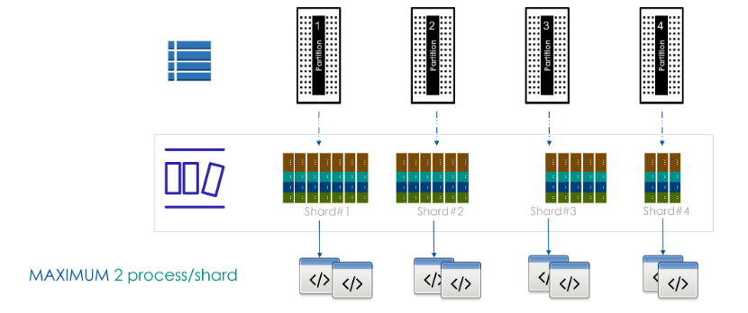
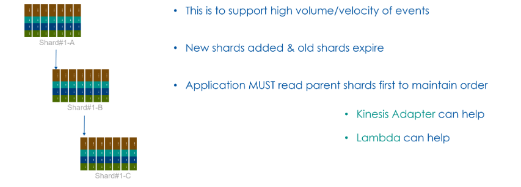

# 🔄 **DynamoDB Streams: Capturing Table Changes in Real-Time**

## 📌 **1. What is DynamoDB Streams?**

**DynamoDB Streams** is a feature that **captures real-time changes** (inserts, updates, deletes) on a table and **stores them in an ordered log for 24 hours**. This allows external applications to **react to data changes** asynchronously.

🔹 **Key Features:**  
✔ **Tracks item-level changes** (INSERT, UPDATE, DELETE).  
✔ **Stores changes for up to 24 hours.**  
✔ **Processes events in order per partition.**  
✔ **Can trigger AWS Lambda for real-time event processing.**  
✔ **Ensures exactly-once delivery per event in a shard.**

💡 **Think of DynamoDB Streams like a change-data-capture (CDC) log in SQL databases!**

---

## 🔍 **2. How DynamoDB Streams Work Internally**

1️⃣ **A table change occurs (INSERT, UPDATE, DELETE).**  
2️⃣ **The change is recorded in a stream log (stored for 24 hours).**  
3️⃣ **An external consumer (e.g., AWS Lambda, Kinesis, or EC2) reads the stream.**  
4️⃣ **The consumer processes the event (e.g., sync data to another system).**

📌 **Example: If a new order is added, a stream event can trigger Lambda to notify the user.**

---

## 🔥 **3. Stream View Types (What Data is Captured?)**

When enabling streams, you must choose **what kind of changes** should be recorded:

| **Stream View Type**    | **What It Captures?**                      | **Use Case Example**                                   |
| ----------------------- | ------------------------------------------ | ------------------------------------------------------ |
| `NEW_IMAGE` 🔹          | Stores the **new version** of an item.     | Log real-time inventory changes.                       |
| `OLD_IMAGE` 🔹          | Stores the **old version** before changes. | Keep a history of deleted data.                        |
| `NEW_AND_OLD_IMAGES` 🔹 | Stores **both old and new versions**.      | Track data changes for auditing.                       |
| `KEYS_ONLY` 🔹          | Stores **only primary key attributes**.    | Detect item deletions without consuming extra storage. |

💡 **Choosing the right stream type depends on your business logic!**

---

## 🔄 **DynamoDB Streams & Shards**

<div style="text-align: center;">
  
</div>

---

DynamoDB Streams capture and log changes to items in a DynamoDB table, enabling **real-time event processing** and **change tracking**. The stream is made up of **shards**, which are logical groupings of records that help distribute and parallelize data processing.

### 📌 **How Shards Work in DynamoDB Streams**

- **Each shard corresponds to a table partition** – there is a **1:1 relationship** between DynamoDB table partitions and stream shards.
- **Each record in a shard represents a modification** (insert, update, delete) on an item in the corresponding partition.
- **Shards are hierarchical** – When new shards are created (due to resharding), they are linked to parent shards.
- **Applications must process parent shards first** before reading from child shards to maintain order.

### 📌 **Key Characteristics of Shards**

| **Feature**                   | **Description**                                                                          |
| ----------------------------- | ---------------------------------------------------------------------------------------- |
| **1:1 Relationship**          | Each partition has one corresponding shard.                                              |
| **Max 2 Consumers per Shard** | Only **two processes** can read from a single shard simultaneously.                      |
| **Hierarchical Structure**    | Parent shards must be read before child shards.                                          |
| **Shards Evolve Over Time**   | As table partitions split due to growth, new shards are created while older ones expire. |

### ✅ **Example: Reading from Shards**

1️⃣ **A table has 4 partitions**, so 4 shards are created initially.  
2️⃣ **When an update happens in Partition #2**, a stream record is added to **Shard #2**.  
3️⃣ **A consumer application reads from all active shards** to process data changes.

#### 🔹 **Resharding Process**

<div style="text-align: center;">
  
</div>

- When the table scales and new partitions are created, **new shards are added while old shards expire**.
- Applications must **read from parent shards first** before reading from child shards.

### 📌 **Processing DynamoDB Stream Shards**

- **AWS Lambda or Kinesis Adapter** can be used to **consume and process stream data efficiently**.
- Applications using DynamoDB Streams should **track and manage shard evolution** to maintain **correct event processing order**.

--

## ⚙️ **4. Enabling DynamoDB Streams**

### ✅ **Enable Streams on an Existing Table (AWS CLI)**

```sh
aws dynamodb update-table \
    --table-name Orders \
    --stream-specification StreamEnabled=true,StreamViewType=NEW_AND_OLD_IMAGES
```

📌 **Now, every time an order is updated, both the old and new version will be stored in the stream.**

---

## 📊 **5. Stream Event Structure (What’s Inside a Record?)**

Each stream record contains:

```json
{
  "eventID": "12345",
  "eventName": "MODIFY",
  "eventSource": "aws:dynamodb",
  "dynamodb": {
    "Keys": { "OrderID": { "S": "ORD-001" } },
    "OldImage": { "Status": { "S": "Pending" } },
    "NewImage": { "Status": { "S": "Shipped" } },
    "StreamViewType": "NEW_AND_OLD_IMAGES",
    "SequenceNumber": "987654321"
  }
}
```

📌 **Breakdown of Fields:**

- **`eventName`** → `"INSERT"`, `"MODIFY"`, `"REMOVE"`
- **`Keys`** → The **primary key** of the affected item.
- **`OldImage`** → The **old version** (before update).
- **`NewImage`** → The **new version** (after update).
- **`SequenceNumber`** → Ensures events are processed in order.

---

## 🔄 **6. Reading & Processing Streams**

### ✅ **Read Stream Data Using AWS CLI**

```sh
aws dynamodb describe-table --table-name Orders \
    --query "Table.LatestStreamArn"
```

📌 **This fetches the latest stream ARN, which is needed to process events.**

### ✅ **Fetch Stream Records**

```sh
aws dynamodb get-shard-iterator \
    --stream-arn arn:aws:dynamodb:us-east-1:123456789012:table/Orders/stream/2025-03-09T12:00:00.000 \
    --shard-id shardId-00000001642421212134-12345678 \
    --shard-iterator-type TRIM_HORIZON
```

📌 **Retrieves the first batch of records in the stream.**

---

## ⚡ **7. Automating Processing with AWS Lambda**

One of the most **common use cases** for DynamoDB Streams is triggering **AWS Lambda functions** on changes.

📌 **Example Use Cases:**  
✔ **Notify users when an order status changes.**  
✔ **Sync DynamoDB with Elasticsearch for search indexing.**  
✔ **Update a caching layer when data changes.**

### ✅ **Step 1: Create a Lambda Function to Process Streams**

```python
import json

def lambda_handler(event, context):
    for record in event['Records']:
        event_name = record['eventName']
        new_image = record['dynamodb'].get('NewImage', {})
        old_image = record['dynamodb'].get('OldImage', {})

        print(f"Event Type: {event_name}")
        print(f"Old Item: {old_image}")
        print(f"New Item: {new_image}")

    return {"statusCode": 200, "body": json.dumps("Stream Processed!")}
```

📌 **This function logs every change made to the DynamoDB table.**

### ✅ **Step 2: Attach Lambda to DynamoDB Streams**

```sh
aws lambda create-event-source-mapping \
    --function-name ProcessOrderStream \
    --event-source arn:aws:dynamodb:us-east-1:123456789012:table/Orders/stream/2025-03-09T12:00:00.000 \
    --starting-position TRIM_HORIZON
```

📌 **Now, every time an order is inserted/updated, the Lambda function runs automatically!** 🚀

---

## 🏆 **8. When Should You Use DynamoDB Streams?**

✅ **Best Use Cases for Streams:**  
✔ **Triggering real-time notifications** (e.g., send email on order updates).  
✔ **Syncing data to external systems** (e.g., Elasticsearch, Redshift, another DB).  
✔ **Building event-driven architectures** (e.g., microservices reacting to data changes).  
✔ **Auditing data changes** (e.g., logging updates to an audit table).

❌ **Avoid Using Streams When:**

- You need **long-term storage of change history** (streams expire after 24 hours).
- You want **exact real-time processing** (streams have slight latency).
- You have **high-throughput workloads** (streams add some read overhead).

---

## 🎯 **9. Key Takeaways**

✔ **DynamoDB Streams capture real-time changes (INSERT, UPDATE, DELETE).**  
✔ **Stores change records for 24 hours.**  
✔ **Supports four view types (`NEW_IMAGE`, `OLD_IMAGE`, etc.).**  
✔ **Can trigger AWS Lambda for automatic processing.**  
✔ **Commonly used for real-time notifications, data sync, and event-driven apps.**  
✔ **Stream processing is ordered per partition.**

---

### 🎯 **Final Thought**

💡 **If SQL databases use Change Data Capture (CDC), DynamoDB Streams provide the same capability in a serverless, event-driven way.**

🔥 **Now, does DynamoDB Streams make sense from your SQL background?** 😃
