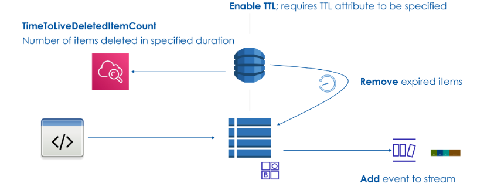

# ⏳ **DynamoDB Time-To-Live (TTL) Explained**

<div style="text-align: center;">
  
</div>

---

## 📌 **1. What is TTL in DynamoDB?**

**Time-To-Live (TTL)** is a feature in DynamoDB that allows you to **automatically delete expired items** from a table **without consuming write capacity**.

🔹 **Key Points:**  
✔ **Enables automatic item deletion based on a timestamp.**  
✔ **Reduces storage cost by removing unnecessary data.**  
✔ **Does NOT consume write throughput (WCU) when deleting expired items.**  
✔ **If DynamoDB Streams are enabled, an event is triggered when an item is deleted.**  
✔ **TTL deletions are eventually consistent (deletion may take hours or days).**  
✔ **TTL is free, but using it with Global Tables incurs costs.**

💡 **Think of TTL like an automatic "garbage collector" for old data!**

---

## 🔥 **2. How TTL Works Internally**

1️⃣ **You define a TTL attribute in your table schema** (e.g., `ExpiresAt`).  
2️⃣ **When inserting or updating an item, set the TTL value as a UNIX timestamp** (seconds since epoch).  
3️⃣ **DynamoDB continuously monitors items for expiration**.  
4️⃣ **Expired items are eventually deleted** (but not immediately).  
5️⃣ **If DynamoDB Streams are enabled, a deletion record is written to the stream.**  
6️⃣ **CloudWatch metric `TimeToLiveDeletedItemCount` tracks TTL deletions.**

📌 **Example of UNIX Timestamp Values:**

| **Date**              | **UNIX Timestamp** |
| --------------------- | ------------------ |
| `2025-03-10 10:00:00` | `1741408800`       |
| `2025-03-11 12:00:00` | `1741495200`       |

---

## 🏗 **3. Setting Up TTL in DynamoDB (AWS CLI & Console)**

### ✅ **Enable TTL on an Existing Table**

```sh
aws dynamodb update-time-to-live \
    --table-name Orders \
    --time-to-live-specification "Enabled=true, AttributeName=ExpiresAt"
```

📌 **Explanation:**

- Enables TTL for the `Orders` table.
- Uses the `ExpiresAt` attribute as the expiration timestamp.

### ✅ **Insert an Item with TTL**

```sh
aws dynamodb put-item \
    --table-name Orders \
    --item '{
        "OrderID": {"S": "ORD-123"},
        "CustomerID": {"S": "User456"},
        "TotalAmount": {"N": "250"},
        "ExpiresAt": {"N": "1741408800"}
    }'
```

📌 **This order will be automatically deleted when `ExpiresAt` timestamp is reached.**

---

## 🔄 **4. How TTL Deletions Work in the Background**

🚀 **What Happens Internally?**  
1️⃣ **DynamoDB continuously scans the table for expired items.**  
2️⃣ **Items past their TTL value are marked for deletion.**  
3️⃣ **Deletion happens asynchronously (hours or even days later).**  
4️⃣ **Deleted items do NOT consume WCU (Write Capacity Units).**  
5️⃣ **If Streams are enabled, an event is recorded when an item is deleted.**

📌 **Key Facts:**  
✔ TTL deletions do NOT immediately free up storage.  
✔ Items can still be retrieved via `GetItem` **until actually deleted**.  
✔ The TTL attribute must be a **top-level number** in UNIX Epoch format.

---

## 📊 **5. CloudWatch Metrics for TTL**

DynamoDB provides a CloudWatch metric to track TTL deletions:

| **Metric Name**              | **Description**                 |
| ---------------------------- | ------------------------------- |
| `TimeToLiveDeletedItemCount` | Number of items deleted via TTL |

### ✅ **Check TTL Deletion Metrics**

```sh
aws cloudwatch get-metric-statistics \
    --namespace AWS/DynamoDB \
    --metric-name TimeToLiveDeletedItemCount \
    --dimensions Name=TableName,Value=Orders \
    --start-time 2025-03-10T00:00:00Z \
    --end-time 2025-03-11T00:00:00Z \
    --period 3600 \
    --statistics Sum \
    --region us-east-1
```

📌 **This command fetches the number of TTL deletions in the last 24 hours.**

---

## ⚠️ **6. TTL Limitations & Gotchas**

❌ **TTL deletions are not immediate**—they may take **hours or even days**.  
❌ **Only items with a TTL attribute will expire**—others remain untouched.  
❌ **TTL only works with top-level attributes** (nested attributes will NOT work).  
❌ **If the TTL attribute is missing or invalid (e.g., a string), the item won't expire.**  
❌ **TTL deletions are NOT replicated in Global Tables (TTL is local to each region).**

---

## 🎯 **7. When Should You Use TTL?**

✅ **Use TTL for:**

- **Temporary session data** (e.g., authentication tokens).
- **Soft deletes** (e.g., automatically remove expired orders or logs).
- **Reducing storage costs** (e.g., removing old, unused items).
- **Time-limited caches** (e.g., expiring price quotes).

❌ **Do NOT use TTL for:**

- **Immediate deletions** (TTL does not guarantee real-time deletion).
- **Critical business logic** that depends on **precise expiration timing**.

---

## 🏆 **8. Key Takeaways**

✔ **TTL allows automatic deletion of expired items.**  
✔ **Uses a UNIX Epoch timestamp to determine expiration.**  
✔ **TTL deletions do NOT consume write capacity.**  
✔ **Deletions happen asynchronously (can take hours or days).**  
✔ **CloudWatch metric `TimeToLiveDeletedItemCount` tracks TTL deletions.**  
✔ **TTL is NOT replicated in Global Tables.**

---

### 🎯 **Final Thought**

💡 **If SQL databases use scheduled jobs (`DELETE FROM table WHERE expires_at < NOW()`), DynamoDB TTL provides a built-in, cost-efficient alternative.**

🔥 **Now, does DynamoDB TTL make sense from an SQL perspective?** 😃
