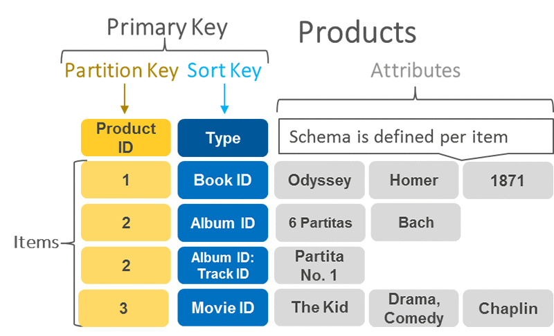
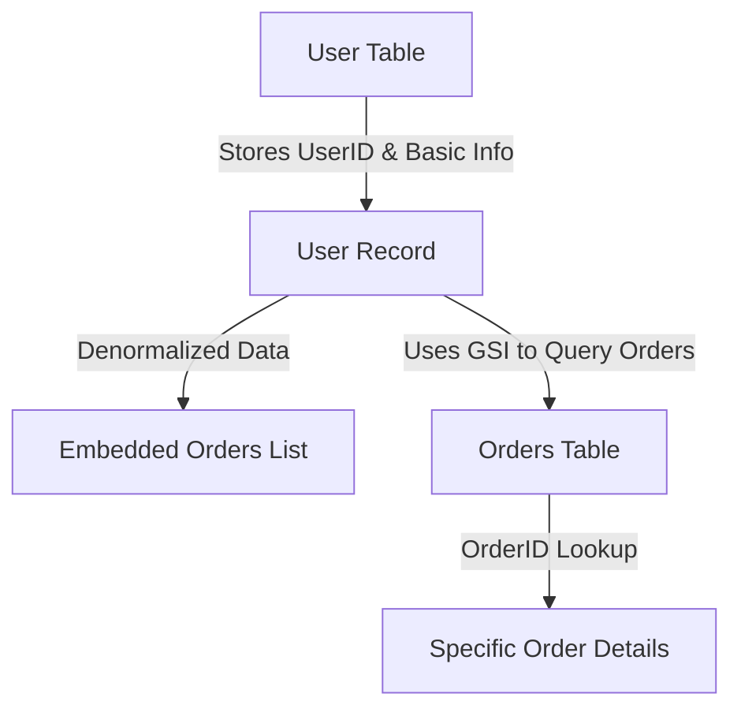

# 🔥 **DynamoDB Data Model: No Relationships, No Joins, and How to Design Tables**

AWS DynamoDB is a **serverless NoSQL database** optimized for **scalability, performance, and low latency**. Unlike SQL databases, **DynamoDB does not have relationships between tables**—instead, data is structured for **fast key-value lookups and denormalized storage**.

---

<div style="text-align: center;">
  
</div>

---

## 🏗 **DynamoDB vs. SQL vs. Document Databases**

| Feature                   | DynamoDB (NoSQL)                      | SQL Databases (PostgreSQL, MySQL) | Document Databases (MongoDB)  |
| ------------------------- | ------------------------------------- | --------------------------------- | ----------------------------- |
| **Storage Model**         | Key-Value & Wide-Column Tables        | Full Relational Database          | Collections & Documents       |
| **Joins Between Tables?** | ❌ No built-in joins                  | ✅ Supports `JOIN` queries        | ❌ No built-in joins          |
| **Data Structure**        | Items (Rows) with flexible attributes | Tables with rows & columns        | JSON-like flexible schema     |
| **Relationship Support**  | ❌ No foreign keys                    | ✅ Foreign keys & constraints     | ❌ No foreign keys            |
| **Best Use Case**         | Fast, scalable key-value lookups      | Complex queries, transactions     | Flexible semi-structured data |

---

## 🏢 **How DynamoDB Stores Data**

DynamoDB **only provides tables**—there are no databases with relationships like SQL.  
Each table consists of **items (rows)** with flexible **attributes (columns)**.

### **📌 Data Structure**

- **Table** = Collection of items (like a SQL table).
- **Item** = Single row in a table (flexible schema).
- **Attributes** = Columns in a row (can be different per item).

#### 🛠 **Example: Storing Users in DynamoDB**

| **UserID (Partition Key)** | **Name** | **Email**         | **Orders**           |
| -------------------------- | -------- | ----------------- | -------------------- |
| `USR001`                   | Alice    | <alice@email.com> | `[ORD1001, ORD1002]` |
| `USR002`                   | Bob      | <bob@email.com>   | `[ORD1003]`          |

- ✔️ **DynamoDB does not support `JOINs`**, so related data **must be stored in the same item** (denormalization).
- ✔️ Instead of a separate **Users** and **Orders** table, the orders are **stored as an array inside the user record**.

---

## ❌ **Why DynamoDB Has No Relationships or Joins**

DynamoDB is **designed for speed and scalability**—not complex queries. SQL databases use **`JOINs`**, but DynamoDB avoids them because:

**1️⃣ SQL joins require scanning multiple tables, slowing down performance.**  
**2️⃣ DynamoDB scales horizontally, and relationships create partitioning issues.**  
**3️⃣ Joins require relational integrity, which DynamoDB does not enforce.**

---

## 🔄 **How to Model Relationships in DynamoDB**

Since **DynamoDB does not support joins**, you must **design tables based on access patterns**.

### ✅ **1️⃣ Store Related Data in a Single Item (Denormalization)**

- **Best for:** Fast queries with minimal lookups.
- **Example:** Instead of a separate `Orders` table, store order details inside the `Users` table.

| **UserID** | **Name** | **Orders (Embedded List)**                                                     |
| ---------- | -------- | ------------------------------------------------------------------------------ |
| `USR001`   | Alice    | `[{"OrderID": "ORD1001", "Amount": 50}, {"OrderID": "ORD1002", "Amount": 30}]` |

🔹 **Pros:** Faster lookups, fewer queries.  
🔹 **Cons:** Data duplication if order details change frequently.

---

### ✅ **2️⃣ Use Global Secondary Indexes (GSI) for Lookup**

If you need to **query related data efficiently**, use **Global Secondary Indexes (GSI)**.

#### **Example: Orders Table with a GSI on `UserID`**

| **OrderID (Primary Key)** | **UserID (GSI)** | **Amount** |
| ------------------------- | ---------------- | ---------- |
| `ORD1001`                 | `USR001`         | `$50`      |
| `ORD1002`                 | `USR001`         | `$30`      |

Now, you can **query all orders for a specific user** by using the `UserID` index.

🔹 **Pros:** Supports fast queries without scanning the entire table.  
🔹 **Cons:** More expensive than single-table queries.

---

### 📜 **DynamoDB Relationship Modeling Workflow (Mermaid Diagram)**



---

## 🚀 **Performance Best Practices**

### ✅ **1️⃣ Use Single-Table Design for Speed**

- Instead of **multiple tables**, store everything in **one table** with different item types.
- Example: A table with **Users, Orders, and Products**, each using a **different partition key structure**.

### ✅ **2️⃣ Avoid Scans, Use Query Instead**

- Scans **read the entire table** and are slow.
- Queries use **partition keys and indexes** for **faster lookups**.

### ✅ **3️⃣ Use Composite Keys for Related Data**

- **Partition Key:** `UserID`
- **Sort Key:** `#Order#ORD1001`
- This allows queries like:

  ```sh
  Get all orders where UserID = 'USR001'
  ```

---

## 🏁 **Final Takeaways**

✅ **DynamoDB does not have full database relationships—only isolated tables.**  
✅ **There are no joins, no foreign keys, and no relational integrity.**  
✅ **Denormalization (storing related data together) is key for fast lookups.**  
✅ **GSIs can help query related data without table joins.**  
✅ **Use single-table design and composite keys for efficient queries.**

🔥 **Want a real-world example with AWS SDK or CLI? Let me know!** 🚀
