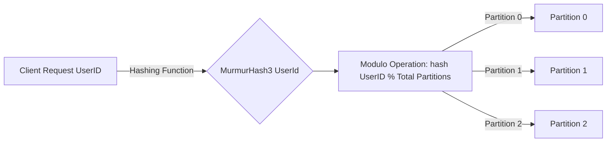

# 🎯 **How Does DynamoDB Define the Total Number of Partitions?**

DynamoDB determines the total number of **partitions** based on **table size** and **throughput capacity**.

## **1️⃣ Partition Calculation Based on Storage**

Each partition in DynamoDB can store **up to 10GB** of data.  
🔹 If you insert **50GB** of data, DynamoDB will create:
\[
50GB / 10GB = 5 \text{ partitions}
\]

- If the table grows beyond **10GB per partition**, DynamoDB **automatically splits partitions**.

## **2️⃣ Partition Calculation Based on Throughput**

- Each partition can handle **up to 3,000 Read Capacity Units (RCUs)** and **1,000 Write Capacity Units (WCUs)**.
- If you provision **10,000 RCUs**, DynamoDB will **spread the load across multiple partitions** to avoid overloading a single one.

### 🔢 **Example: Calculating Partitions Based on Capacity**

| **Scenario**                 | **Partition Count** |
| ---------------------------- | ------------------- |
| **5GB table, 500 RCUs**      | 1 Partition         |
| **20GB table, 4,000 RCUs**   | 4 Partitions        |
| **100GB table, 10,000 RCUs** | 10+ Partitions      |

---

## 🔢 **How Does DynamoDB Find the Correct Partition?**

DynamoDB uses a **consistent hashing algorithm** to distribute data across partitions.

### **📌 Step 1: Hashing the Partition Key**

When you insert or query data, DynamoDB **hashes** the partition key using the **MurmurHash3** algorithm.

\[
\text{hash}(partition_key) \mod \text{total partitions} = \text{Partition Number}
\]

### **📌 Step 2: Mapping the Hash to a Partition**

Let's say we have **3 partitions** and we insert three users:

| **UserID** | **Hashed Value (Simulated)** | **Partition**                    |
| ---------- | ---------------------------- | -------------------------------- |
| `USR1001`  | 89347292                     | `89347292 % 3 = 2` (Partition 2) |
| `USR2002`  | 23984713                     | `23984713 % 3 = 1` (Partition 1) |
| `USR3003`  | 59012384                     | `59012384 % 3 = 0` (Partition 0) |

So:

- `USR1001` → Partition **2**
- `USR2002` → Partition **1**
- `USR3003` → Partition **0**

---

### 📜 **Visualizing How Hashing Finds the Partition**

- The **hash function** ensures even distribution.
- The **modulo operation** maps the hashed value to a **specific partition**.
- **If partitions increase**, DynamoDB automatically **recomputes the mappings** to balance data.

---

## 🚀 **What Happens When Partitions Increase?**

### **🛠 Case 1: More Data is Added**

- If **a partition exceeds 10GB**, DynamoDB **splits it into two partitions**.
- The **hashing function adjusts** so that old and new partitions get a balanced share.

### **🛠 Case 2: Read/Write Capacity Exceeds a Partition's Limit**

- If a partition is **handling too many requests**, DynamoDB **creates a new partition** and redistributes the workload.

---

## 🏁 **Key Takeaways**

✅ **Total partitions** are based on **storage (10GB limit per partition) and throughput needs**.  
✅ DynamoDB uses **MurmurHash3** to determine which partition holds the data.  
✅ The **hash result modulo total partitions** ensures **even distribution**.  
✅ DynamoDB **automatically resizes partitions** as the table grows.

---

🔥 **Want to test this with real AWS CLI or SDK examples? Let me know!** 🚀
