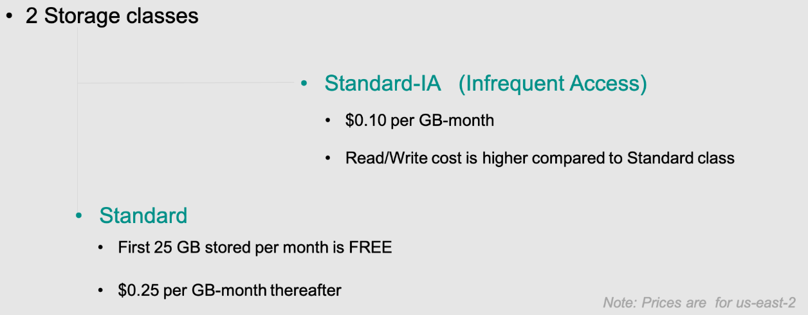

# 📦 DynamoDB Storage Classes

DynamoDB offers **two storage classes** that provide the **same high performance** but differ in **cost structure**. Users can select the most cost-effective option based on their workload characteristics.



## 🔹 **Standard (Default)**

- 💰 **Higher storage cost** compared to Standard-IA.
- ✅ **Lower read and write costs**, making it ideal for frequently accessed tables.
- 🚀 Best for **high-traffic applications** requiring frequent reads and writes.

## 🔸 **Standard-IA (Infrequent Access)**

- 💰 **Lower storage cost** compared to Standard.
- 📈 **Higher read and write costs**, making it suitable for tables with **low request rates**.
- 🏷️ Best for **large tables with infrequent access**, where storage savings outweigh the increased I/O cost.
- 🔄 **Designed for cost efficiency** when data is accessed **sporadically**.

> 📌 **Key difference:** Standard-IA has **lower storage costs** but **higher I/O costs**, making it ideal for **write-heavy but infrequently read datasets**.

---

## 🔍 When to Use **Standard-IA**?

✅ **Best suited for workloads like:**

- **Cold storage** – Large datasets that are rarely accessed.
- **Historical logs and archives** – Older transactional records, compliance data.
- **IoT & telemetry data** – Large-scale event logs used for occasional anomaly detection.
- **Machine learning feature stores** – Datasets stored for batch processing but not frequently queried.
- **Backup tables** – Rarely accessed but retained for disaster recovery.

📌 **Example Use Case:** A **stream capture of device data** with **real-time anomaly detection** where most data is written continuously but read only occasionally.

---

## ⚡ Switching Between Storage Classes

DynamoDB allows users to **change the storage class** of an existing table **at any time**. This provides flexibility in optimizing costs based on workload changes.

📌 **How to update a table’s storage class using AWS CLI?**

```sh
aws dynamodb update-table \
  --table-name MyTable \
  --table-class STANDARD_IA
```

📌 **Check the storage class of a table:**

```sh
aws dynamodb describe-table --table-name MyTable
```

---

## 🎯 Optimizing Costs with Storage Classes

| Feature              | **Standard**                    | **Standard-IA**                     |
| -------------------- | ------------------------------- | ----------------------------------- |
| **Storage Cost**     | Higher                          | Lower                               |
| **Read/Write Cost**  | Lower                           | Higher                              |
| **Best For**         | High-traffic tables             | Large tables with low request rates |
| **Use Case Example** | E-commerce, real-time analytics | Cold storage, infrequent reporting  |

By choosing the right **storage class**, you can optimize costs while ensuring **scalability and performance** for your workload. 🚀
