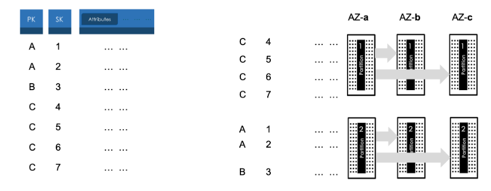
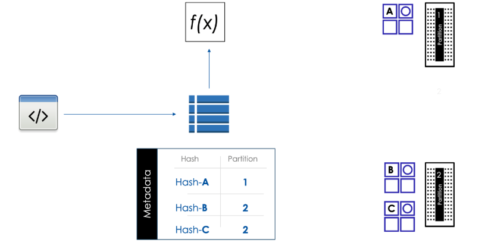
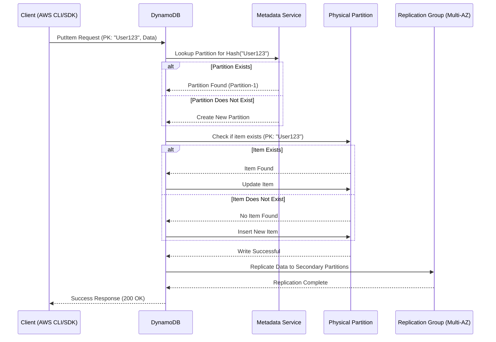
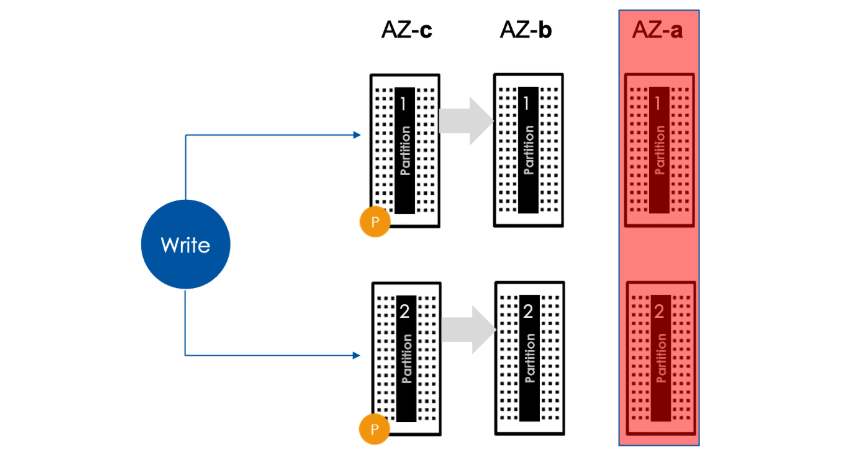
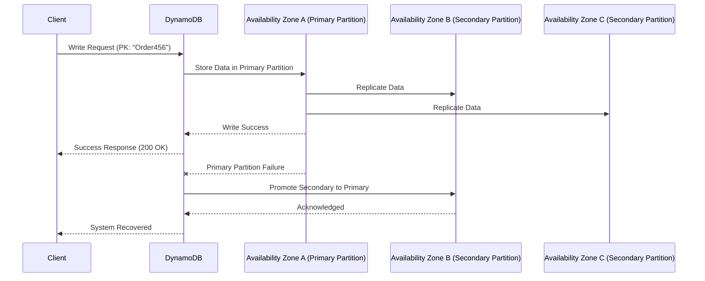

# 🔍 **DynamoDB Write Operations: Under the Hood**

When a write request is sent to **Amazon DynamoDB**, multiple steps take place behind the scenes to ensure **data integrity, durability, and availability**.

📌 **Partitioning & Sorting**

- Items with the **same Partition Key** are **physically colocated** in the same **partition**.
- If a **Sort Key** exists (composite primary key), items within the partition are **stored in sorted order**.
- Each **partition stores multiple items**, and DynamoDB ensures **even distribution** of data using **hash-based partitioning**.

📌 **Write Constraints:**

- **Writes are atomic** – If any attribute write **fails**, the entire operation is **rolled back**.
- You **must provide key attributes** (`Partition Key` & `Sort Key` if applicable).
- **Max item size:** 400 KB. If an item exceeds this limit, the write **fails**.

---

    

---

## 📊 **Table Metadata in DynamoDB**

Every **DynamoDB table** has **metadata** that stores key information, including:

✅ **Primary Key Structure:** Defines **Partition Key (PK)** and **Sort Key (SK)**.  
✅ **Partition Mapping:** Maps **hashed Partition Keys to physical partitions**.  
✅ **Item Placement:** Determines which partition stores a specific item.  
✅ **Replication Info:** Maintains **replication data** across availability zones.

📌 **Table Definition:**

| Attribute           | Type              | Description                             |
| ------------------- | ----------------- | --------------------------------------- |
| `Partition Key`     | String            | Used for partition hashing              |
| `Sort Key`          | String (Optional) | Orders items within a partition         |
| `Attributes`        | JSON              | Other item attributes                   |
| `Storage Partition` | String            | The physical partition storing the item |
| `Replication Group` | String            | Defines replication across AZs          |

📌 **Example Hash Partition Mapping:**

| **Item Key (PK)** | **Hashed Key** | **Partition** | **Sort Key (if applicable)** |
| ----------------- | -------------- | ------------- | ---------------------------- |
| `User123`         | `Hash-A`       | Partition-1   | `CreatedAt=2024-03-09`       |
| `Order456`        | `Hash-B`       | Partition-2   | `CreatedAt=2024-03-08`       |

> 💡 **Hash-A** represents the hashed value of `User123`'s Partition Key, which is mapped to **Partition-1**.

---

## 📝 **How DynamoDB Handles Writes**

When a **PutItem** request is sent to DynamoDB, the system performs **two main checks**:

1️⃣ **Partition Check**: Determines whether the partition for the item's **Partition Key** exists.  
2️⃣ **Item Check**: If the partition exists, DynamoDB checks whether the specific **item** already exists within that partition.

DynamoDB dynamically manages **partitions and metadata**, ensuring scalability, availability, and efficient data distribution.

---

🪜 **Complete Step-by-Step Write Process:**

- 1️⃣ **Client sends a `PutItem` request** with the item’s data.
- 2️⃣ **DynamoDB hashes the Partition Key** and queries the **metadata service** for partition mapping.
- 3️⃣ **Metadata service checks if the partition exists**:

  - ✅ **If the partition exists** → DynamoDB **routes the request** to that partition.
  - ❌ **If the partition does not exist** → DynamoDB **creates a new partition**.

- 4️⃣ **Once the partition is found/created**, DynamoDB **checks if the item already exists in that partition**:

  - ✅ **If the item exists** → It is **updated**.
  - ❌ **If the item does not exist** → It is **inserted** as a new item.

- 5️⃣ **DynamoDB writes the item to the partition** and **updates replication groups** across multiple Availability Zones (AZs).
- 6️⃣ **Success response is sent to the client**.

---

    

---

---

## 🔗 **Handling Items with Common Partition Keys**

For **composite primary keys**, multiple items can have the **same Partition Key** but **different Sort Keys**.

📌 **Example:**

| **Partition Key** | **Sort Key** | **Item Data**      |
| ----------------- | ------------ | ------------------ |
| `User123`         | `Order#1`    | `{Item: "Laptop"}` |
| `User123`         | `Order#2`    | `{Item: "Mouse"}`  |

✅ **DynamoDB ensures all items with the same Partition Key are stored together** in a **single partition**, maintaining **sorted order**.

---

## 🔐 **Data Durability & Replication**

### 🔹 **How DynamoDB Ensures Data Durability**

To prevent **data loss**, DynamoDB **replicates data** across **multiple Availability Zones (AZs)** in the AWS region.

📌 **Replication Process:**  
1️⃣ Writes go to the **primary partition**.  
2️⃣ Changes are **replicated to secondary partitions** across **multiple AZs**.

### 🛡️ **High Availability & Failover**

✅ **Automatic failover:** If the **primary partition fails**, one of the **secondary partitions** is promoted to **primary**.  
✅ **Transparent recovery:** The failover process happens **seamlessly** without user intervention.

---

    

---

---

## 🎯 **Summary: Write Operations in DynamoDB**

✔ **Writes are atomic and consistent.**  
✔ **DynamoDB dynamically maps partitions using metadata.**  
✔ **Data is automatically replicated for durability.**  
✔ **Failure recovery is seamless & transparent to users.**
