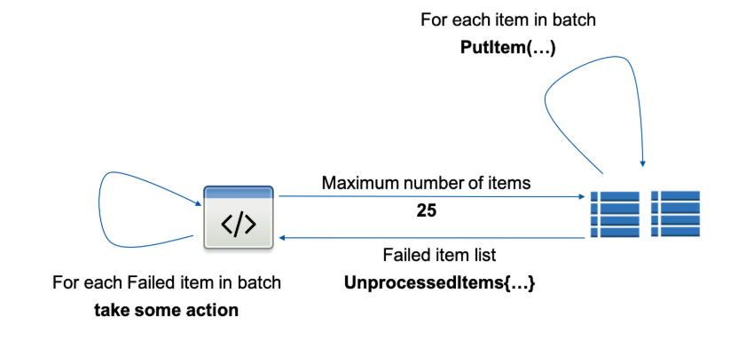
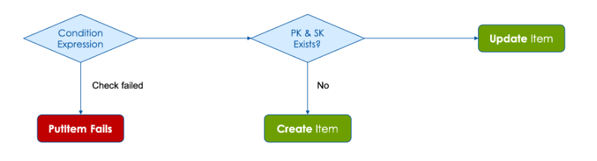

# 🚀 **Using Write Operations in DynamoDB**

DynamoDB provides powerful **write operations** for inserting, updating, and managing data efficiently. This guide covers the **PutItem**, **BatchWriteItem**, and **Condition Expressions** with real-world usage examples.

---

## 🔹 **PutItem: Writing a Single Item**

The `PutItem` operation is used to write **one item at a time** into a DynamoDB table. If an item with the **same primary key** already exists, `PutItem` **overwrites it** unless a **Condition Expression** is applied.

### 📌 **PutItem Parameters**

| Parameter                   | Required | Description                                           |
| --------------------------- | -------- | ----------------------------------------------------- |
| `TableName`                 | ✅ Yes   | The name of the table.                                |
| `Item`                      | ✅ Yes   | JSON object with key and non-key attributes.          |
| `ConditionExpression`       | ❌ No    | Ensures a write only occurs under certain conditions. |
| `ExpressionAttributeNames`  | ❌ No    | Placeholder names used in `ConditionExpression`.      |
| `ExpressionAttributeValues` | ❌ No    | Placeholder values for conditions.                    |

---

### ✅ **Example: Writing a New Employee Record**

```sh
aws dynamodb put-item \
    --table-name Employee \
    --item '{
        "LoginAlias": {"S": "irenes"},
        "FirstName": {"S": "Irene"},
        "LastName": {"S": "Smith"},
        "ManagerLoginAlias": {"S": "mateoj"},
        "Designation": {"S": "Developer"},
        "Skills": {"SS": ["Python","AWS"]}
    }'
```

📌 **Behavior:**

- If **`LoginAlias="irenes"` does not exist**, the item is **created**.
- If **`LoginAlias="irenes"` already exists**, the item is **overwritten**.

---

## 🔹 **BatchWriteItem: Writing Multiple Items in a Single Request**

<div style="text-align:center">
  
</div>

---

The `BatchWriteItem` API allows writing **up to 25 items** in a single request across **one or more tables**, reducing **network overhead** and improving performance.

📌 **Key Features of Batch Writes:**  
✅ Supports **PutItem**, **DeleteItem**, but **not UpdateItem**.  
✅ Each item write is **independent**—if one fails, others still succeed.  
✅ **Unprocessed items** are returned in the response, and the application must retry them.

### ✅ **Example: Writing Multiple Employees in a Single Request**

```sh
aws dynamodb batch-write-item \
    --request-items '{
        "Employee": [
            {
                "PutRequest": {
                    "Item": {
                        "LoginAlias": {"S": "johns"},
                        "FirstName": {"S": "John"},
                        "LastName": {"S": "Doe"},
                        "Skills": {"SS": ["Java", "Kubernetes"]}
                    }
                }
            },
            {
                "PutRequest": {
                    "Item": {
                        "LoginAlias": {"S": "janes"},
                        "FirstName": {"S": "Jane"},
                        "LastName": {"S": "Doe"},
                        "Skills": {"SS": ["React", "TypeScript"]}
                    }
                }
            }
        ]
    }'
```

📌 **Behavior:**

- Inserts multiple records in a **single request**, improving efficiency.
- If **some writes fail**, DynamoDB returns them in `UnprocessedItems`.
- The application must **retry failed writes**.

---

## 🔹 **Using Condition Expressions in Writes**

<div style="text-align: center;">
    
</div>

---

**Condition Expressions** prevent accidental overwrites or ensure data integrity by enforcing rules during writes.

📌 **Common Condition Functions:**

| Function                     | Description                                             |
| ---------------------------- | ------------------------------------------------------- |
| `attribute_exists(attr)`     | Ensures an attribute **exists** before writing.         |
| `attribute_not_exists(attr)` | Ensures an attribute **does not exist** before writing. |
| `contains(attr, value)`      | Ensures the attribute contains a specific value.        |
| `size(attr)`                 | Ensures the attribute size meets a condition.           |

📌 **Logical Operators Supported:**

- **AND**, **OR**, **NOT**
- **Comparison Operators**: `=`, `<>`, `<`, `>`, `<=`, `>=`, `BETWEEN`, `IN`

---

### ✅ **Example: Prevent Overwriting an Existing Item**

```sh
aws dynamodb put-item \
    --table-name Employee  \
    --item '{
        "LoginAlias": {"S": "irenes"},
        "FirstName": {"S": "Irene"},
        "LastName": {"S": "Sherwin"},
        "ManagerLoginAlias": {"S": "rajs"},
        "Designation": {"S": "Accountant"},
        "Skills": {"SS": ["General Accounting"]}
    }' \
    --condition-expression "attribute_not_exists(LoginAlias)"
```

📌 **Behavior:**

- If `LoginAlias="irenes"` **does not exist**, the item is **created**.
- If `LoginAlias="irenes"` **already exists**, the write **fails** with `ConditionCheckFailedException`.

---

### ✅ **Example: Only Update If The Employee Has a Manager**

```sh
aws dynamodb put-item \
    --table-name Employee  \
    --item '{
        "LoginAlias": {"S": "johns"},
        "FirstName": {"S": "John"},
        "LastName": {"S": "Doe"},
        "ManagerLoginAlias": {"S": "mateoj"},
        "Designation": {"S": "Senior Developer"}
    }' \
    --condition-expression "attribute_exists(ManagerLoginAlias)"
```

📌 **Behavior:**

- If `ManagerLoginAlias` **exists**, the update is allowed.
- If `ManagerLoginAlias` **does not exist**, the write **fails**.

---

### ✅ **Example: Ensure an Attribute’s Value Before Updating**

```sh
aws dynamodb put-item \
    --table-name Employee  \
    --item '{
        "LoginAlias": {"S": "johns"},
        "FirstName": {"S": "John"},
        "LastName": {"S": "Doe"},
        "Age": {"N": "32"}
    }' \
    --condition-expression "Age >= :min_age" \
    --expression-attribute-values '{":min_age": {"N": "30"}}'
```

📌 **Behavior:**

- If `Age` **is 30 or higher**, the write succeeds.
- If `Age` **is less than 30**, the write **fails**.

---

## 🔥 **Comparison: PutItem vs. BatchWriteItem**

| Feature                       | **PutItem**         | **BatchWriteItem**    |
| ----------------------------- | ------------------- | --------------------- |
| **Max Items Per Request**     | 1                   | 25                    |
| **Condition Expressions**     | ✅ Yes              | ❌ No                 |
| **Supports Partial Failures** | ❌ No               | ✅ Yes                |
| **Overwrites Existing Item**  | ✅ Yes (by default) | ✅ Yes (if PK exists) |
| **Best Use Case**             | Single writes       | Bulk writes           |

---

## 🎯 **Key Takeaways**

✔ **Use `PutItem` for single writes and `BatchWriteItem` for bulk writes.**  
✔ **Condition Expressions prevent accidental updates and enforce business rules.**  
✔ **Unprocessed writes in `BatchWriteItem` must be retried manually.**  
✔ **DynamoDB automatically handles replication and failover in the background.**
