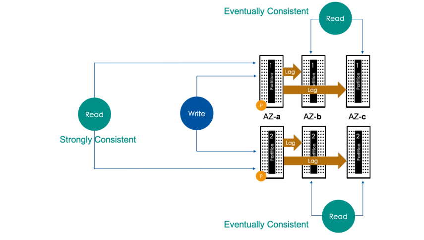
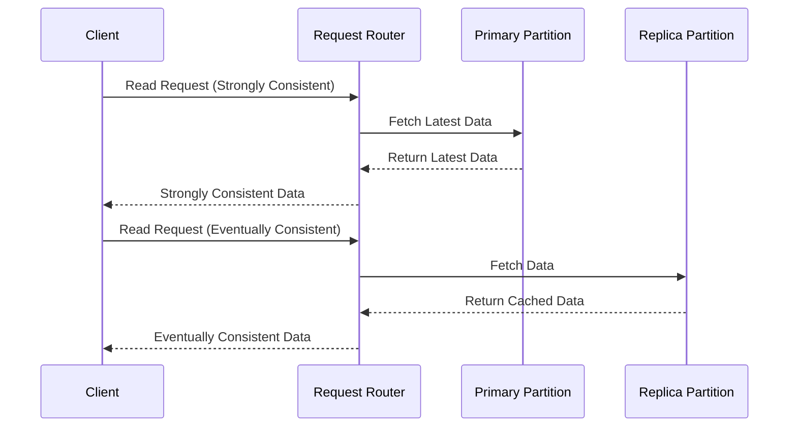
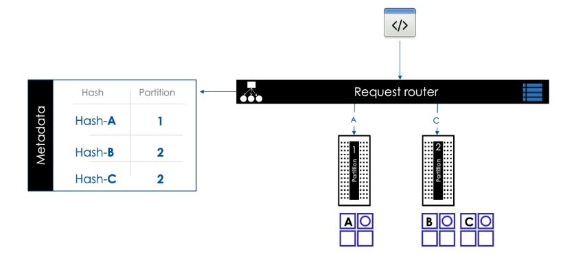
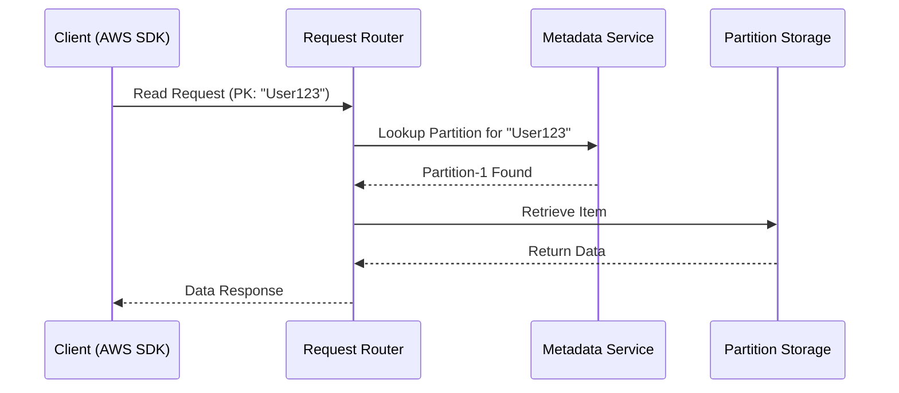
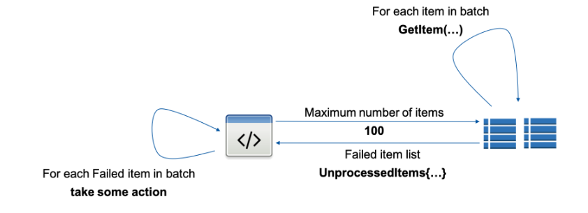
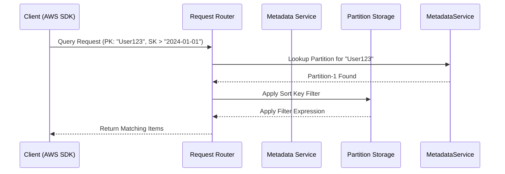

# 🔍 **DynamoDB Read Operations: Under the Hood**

DynamoDB provides multiple ways to retrieve data efficiently, using **strongly consistent reads**, **eventually consistent reads**, and **various query techniques**. This guide explains **how DynamoDB processes read requests**, optimizes performance, and ensures high availability.

---

<div style="text-align: center;">
  
</div>

---

## 📌 **DynamoDB Read Basics**

✅ **Two Read Methods**

- 1️⃣ **DynamoDB API** – Uses operations like `GetItem`, `BatchGetItem`, `Scan`, and `Query`.
- 2️⃣ **PartiQL (SQL-like syntax)** – Allows SQL-style queries against DynamoDB tables.

✅ **Read Constraints**

- **Maximum data returned** per read operation = **1 MB**.
- **Maximum item size** = **400 KB**.

---

## 🔄 **DynamoDB Read Consistency**

DynamoDB supports **two types of reads**, depending on the source partition:

1️⃣ **Strongly Consistent Read** (Latest Data)

- Reads directly from the **primary partition**.
- Always returns the **latest data**.
- **Higher latency & cost**.

2️⃣ **Eventually Consistent Read** (Faster, Cost-Effective)

- Reads from **replica partitions** (secondary partitions).
- Data may be **slightly outdated** due to replication lag.
- **Default behavior** for `GetItem`, `Query`, and `Scan`.

📌 **Diagram: Strongly Consistent vs. Eventually Consistent Reads**



---

## 🔍 **DynamoDB Read Operations**

DynamoDB supports **three types of read operations**:

| **Read Type**  | **Description**                                                                    |
| -------------- | ---------------------------------------------------------------------------------- |
| **GetItem** 📝 | Reads a **single item** using the **Partition Key** (and Sort Key, if applicable). |
| **Query** 🔎   | Retrieves **multiple items** from a partition **based on a Sort Key filter**.      |
| **Scan** 📊    | Reads **all items** in a table **without filters** (expensive).                    |

---

## 📌 **How DynamoDB Routes Read Requests**

<div style="text-align: center;">
  
</div>

---

DynamoDB maintains a **metadata service** that maps **Partition Keys to partitions**.

1️⃣ **Client sends a read request** (`GetItem`, `Query`, `Scan`).  
2️⃣ **Request Router** looks up the **Partition Key mapping** in the **metadata service**.  
3️⃣ **DynamoDB routes the request** to the **correct partition** based on consistency mode.

📌 **Example: Routing Read Requests Based on Partition Key**

| **Partition Key** | **Hashed Value** | **Mapped Partition** |
| ----------------- | ---------------- | -------------------- |
| `User123`         | `Hash-A`         | Partition-1          |
| `Order456`        | `Hash-B`         | Partition-2          |

📌 **Diagram: How DynamoDB Routes Read Requests**



---

## 🔹 **Using `GetItem` to Retrieve a Single Item**

📌 **Key Features**  
✅ Retrieves **a single item** using the **Partition Key**.  
✅ Supports **strongly consistent reads** with `ConsistentRead=true`.  
✅ Uses `ProjectionExpression` to limit retrieved attributes.

### ✅ **Example: Retrieve an Employee Record**

```sh
aws dynamodb get-item \
    --table-name Employee \
    --key '{"LoginAlias": {"S": "irenes"}}'
```

📌 **Behavior:**

- Returns **all attributes** if no projection is used.
- If the item **does not exist**, the response is **empty**.

---

## 🔹 **Using `BatchGetItem` to Retrieve Multiple Items**

<div style="text-align: center;">
  
</div>

---

📌 **Key Features**  
✅ **Retrieves multiple items** (up to **100 items or 16 MB**).  
✅ Uses multiple `GetItem` operations **internally**.  
✅ Returns **UnprocessedKeys** if some items fail to fetch.

### ✅ **Example: Retrieve Multiple Employees**

```sh
aws dynamodb batch-get-item \
    --request-items file://batch-get.json
```

📌 **Example `batch-get.json` File**

```json
{
  "Employee": {
    "Keys": [{ "LoginAlias": { "S": "rajs" } }, { "LoginAlias": { "S": "johns" } }],
    "ProjectionExpression": "FirstName, LastName"
  }
}
```

📌 **Behavior:**

- Retrieves multiple employees from the `Employee` table.
- Returns **only `FirstName` and `LastName`** attributes.

---

## 🔹 **Using `Query` for Multiple Items Based on Sort Key**

📌 **Key Features**  
✅ Retrieves **all items with the same Partition Key**.  
✅ Uses `KeyConditionExpression` to filter by **Sort Key**.  
✅ Returns data in **ascending/descending order**.

### ✅ **Example: Query All Orders for a Customer**

```sh
aws dynamodb query \
   --table-name Orders \
   --key-condition-expression 'CustomerID = :customer' \
   --expression-attribute-values '{":customer": {"S": "User123"}}'
```

📌 **Behavior:**

- Retrieves **all orders** where `CustomerID = "User123"`.
- Uses **Sort Key** ordering (e.g., `OrderDate`).

---

## 🔹 **Using `Scan` for Reading All Items (Expensive)**

📌 **Key Features**  
✅ Reads **all items** in the table.  
✅ **Expensive & slow** for large tables.  
✅ Supports `FilterExpression` for reducing results **after retrieval**.

### ✅ **Example: Scan All Employees Managed by a Specific Manager**

```sh
aws dynamodb scan \
    --table-name Employee \
    --filter-expression "ManagerLoginAlias = :manager" \
    --expression-attribute-values '{":manager": {"S": "johns"}}'
```

📌 **Behavior:**

- Reads **all employees** and **filters only those managed by `johns`**.
- **Does not improve query performance**, only reduces result size.

---

## 🔥 **Optimizing Read Performance**

| Optimization          | Description                                                           |
| --------------------- | --------------------------------------------------------------------- |
| **Projections** 🎯    | Use `ProjectionExpression` to limit attributes returned.              |
| **Filters** 🔎        | Use `FilterExpression` to **reduce the result set**.                  |
| **Parallel Scans** 🚀 | Increase performance by scanning **multiple partitions in parallel**. |
| **Pagination** 📄     | Handle large results using `LastEvaluatedKey`.                        |
| **Indexes** 📌        | Use **Global Secondary Indexes (GSI)** for faster queries.            |

---

## 📜 **Sequence Diagram: Query Processing Workflow**



---

## 🎯 **Key Takeaways**

✔ **Use `GetItem` for single reads and `BatchGetItem` for bulk reads.**  
✔ **Use `Query` for retrieving multiple items within a partition.**  
✔ **Use `Scan` only if necessary (it's expensive!).**  
✔ **Use Projections and Filters to optimize performance.**  
✔ **Enable Parallel Scans to speed up table-wide searches.**

Mastering these **read operations** ensures efficient, scalable, and cost-effective data retrieval in DynamoDB! 🚀
