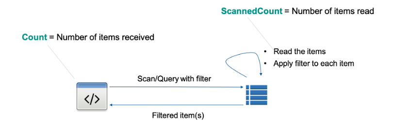

# 🔍 **DynamoDB Filters**

When retrieving data in DynamoDB, there are **two main ways** to apply filters:  
✅ **KeyConditionExpression** (Efficient, applies **before reading data**)  
✅ **FilterExpression** (Less efficient, applies **after reading data**)

This guide explains **how both work**, their **differences**, and how to use them effectively.

---

## 📌 **How Filtering Works in DynamoDB?**

### 🔹 **KeyConditionExpression (Efficient Filtering)**

- **Filters items before retrieval** → **reduces read costs (RCUs)**.
- Works **only with primary key attributes** (Partition Key & Sort Key).
- **Does not support non-key attributes** (e.g., filtering by `Status`).
- Faster because it retrieves **only relevant data**.

### 🔹 **FilterExpression (Post-Read Filtering)**

- **Filters items after they are read** from storage.
- Works with **any attribute** (key and non-key attributes).
- **Does not reduce RCUs** (because all items are loaded first).
- Can be expensive for large datasets.

---

## 🔄 **How They Work: Step-by-Step Comparison**

### ✅ **Using `KeyConditionExpression`**

1️⃣ DynamoDB retrieves **only the items that match the key condition**.  
2️⃣ It **does not read unnecessary data** (saving RCUs).  
3️⃣ The final result is returned to the client.

### ❌ **Using `FilterExpression`**

1️⃣ DynamoDB **retrieves all matching items based on the key condition** (or scans the table).  
2️⃣ It **loads the full dataset into memory** (consuming RCUs).  
3️⃣ The filter is **applied after retrieval**, removing unwanted items.

📌 **Key takeaway:** **Use `KeyConditionExpression` whenever possible!**

---

## 🔹 **Comparison: KeyConditionExpression vs. FilterExpression**

| Feature                            | **KeyConditionExpression** ✅ | **FilterExpression** ❌   |
| ---------------------------------- | ----------------------------- | ------------------------- |
| **When is it applied?**            | Before retrieving data        | After retrieving data     |
| **Reduces RCU usage?**             | ✅ Yes                        | ❌ No                     |
| **Works with non-key attributes?** | ❌ No                         | ✅ Yes                    |
| **Supports comparisons?**          | ✅ Yes (on Sort Key)          | ✅ Yes (on any attribute) |
| **Can be used with Query?**        | ✅ Yes                        | ✅ Yes                    |
| **Can be used with Scan?**         | ❌ No                         | ✅ Yes                    |

---

## 📝 **Examples of KeyConditionExpression & FilterExpression**

### ✅ **Example 1: Query Orders Using `KeyConditionExpression` (Efficient)**

```sh
aws dynamodb query \
    --table-name Orders \
    --key-condition-expression "CustomerID = :cust" \
    --expression-attribute-values '{ ":cust": {"S": "User123"} }'
```

📌 **Behavior:**

- Retrieves **only orders for `CustomerID = User123`**.
- Uses **partition key efficiently** → **RCU usage is minimal**.

---

### ❌ **Example 2: Query Orders Using `FilterExpression` (Inefficient)**

```sh
aws dynamodb query \
    --table-name Orders \
    --key-condition-expression "CustomerID = :cust" \
    --filter-expression "Status = :status" \
    --expression-attribute-values '{
        ":cust": {"S": "User123"},
        ":status": {"S": "Completed"}
    }'
```

📌 **Issues:**

- Retrieves **all orders** for `User123` into memory (**high RCU usage**).
- Then **filters out non-matching orders** (wasted RCUs).

💡 **Optimization Tip:** If you need to filter by `Status`, use a **Global Secondary Index (GSI)** instead!

---

## 📌 **How `FilterExpression` Works**

<div style="text-align: center;">
  
</div>

---

1️⃣ **Query or Scan fetches all matching items based on key conditions.**  
2️⃣ **DynamoDB loads the full dataset into memory** (this is what consumes RCUs).  
3️⃣ **FilterExpression is applied to the retrieved dataset**.  
4️⃣ **Only items that match the filter are returned to the client**.

📌 **Key takeaway:** **Filter expressions do not reduce read costs because they are applied after items are read from storage.**

---

## 🔹 **Comparison: Query vs. FilterExpression**

| **Scenario**                             | **Uses Indexes?** | **Applies Before Reading Data?** | **Reduces RCU Usage?** |
| ---------------------------------------- | ----------------- | -------------------------------- | ---------------------- |
| **Query with KeyConditionExpression** ✅ | **Yes**           | **Before** retrieving items      | ✅ **Yes**             |
| **FilterExpression on Query/Scan** ❌    | **No**            | **After** retrieving items       | ❌ **No**              |

---

## 🔹 **How `FilterExpression` Affects RCUs?**

- **Query operations** **only consume RCUs for items that match the key condition**, but applying a `FilterExpression` on non-key attributes **does not reduce the RCUs used**.
- **Scan operations** consume **RCUs for all items scanned**, even if the filter eliminates many of them.

📌 **Formula for RCUs Used:**

```plaintext
Total RCUs Used = (All Retrieved Item Size / 4 KB) * Consistency Factor
```

- **Strongly Consistent Reads**: Consistency Factor = **1**
- **Eventually Consistent Reads**: Consistency Factor = **0.5**

---

## 📝 **Using `FilterExpression` in Queries**

### ✅ **Example 1: Query Orders with a Filter on `TotalAmount`**

```sh
aws dynamodb query \
    --table-name Orders \
    --key-condition-expression "CustomerID = :cust" \
    --filter-expression "TotalAmount > :amount" \
    --expression-attribute-values '{
        ":cust": {"S": "User123"},
        ":amount": {"N": "100"}
    }'
```

📌 **Explanation:**

- Queries **all orders** for `CustomerID = "User123"`.
- **Retrieves all orders into memory** (costing RCUs).
- **Filters out orders where `TotalAmount <= 100`**.
- **Returned dataset is smaller, but RCUs are still charged for all retrieved items**.

---

### ✅ **Example 2: Query Employees with a Filter on Department**

```sh
aws dynamodb query \
    --table-name Employee \
    --key-condition-expression "ManagerID = :mgr" \
    --filter-expression "Department = :dept" \
    --expression-attribute-values '{
        ":mgr": {"S": "MGR123"},
        ":dept": {"S": "Engineering"}
    }'
```

📌 **Explanation:**

- Queries **all employees** who report to `MGR123`.
- **Retrieves all direct reports** into memory.
- **Filters only employees in `Engineering`**.

---

## 📝 **Using `FilterExpression` in Scans**

### ✅ **Example 3: Scan Employees and Filter by Job Title**

```sh
aws dynamodb scan \
    --table-name Employee \
    --filter-expression "JobTitle = :title" \
    --expression-attribute-values '{":title": {"S": "Software Engineer"}}'
```

📌 **Explanation:**

- Reads **every item in the table**, consuming **RCUs for all scanned items**.
- **Filters out non-matching items only after retrieval**.

📌 **Expensive!** Consider using **GSIs (Global Secondary Indexes)** instead of scanning.

---

## 🔹 **Optimizing Read Costs: Alternatives to `FilterExpression`**

Instead of using `FilterExpression`, **optimize queries using the following:**

| **Optimization**                                               | **Method**                                     | **Effect on RCU Costs**                      |
| -------------------------------------------------------------- | ---------------------------------------------- | -------------------------------------------- |
| **Use `KeyConditionExpression` instead of `FilterExpression`** | Query based on **Partition Key + Sort Key**    | ✅ **Lowers RCUs by retrieving fewer items** |
| **Use Global Secondary Indexes (GSIs)**                        | Create an index on non-key attributes          | ✅ **Retrieves fewer items, reducing RCUs**  |
| **Use `ProjectionExpression`**                                 | Retrieve only needed attributes                | ✅ **Reduces data transfer costs**           |
| **Use `Limit` parameter**                                      | Restrict the number of items returned per call | ✅ **Prevents excessive reads per request**  |

---

## 🔥 **FilterExpression vs. GSI: Which One is Better?**

📌 **Using `FilterExpression` (Bad for Performance)**

```sh
aws dynamodb query \
    --table-name Orders \
    --key-condition-expression "CustomerID = :cust" \
    --filter-expression "Status = :status" \
    --expression-attribute-values '{
        ":cust": {"S": "User123"},
        ":status": {"S": "Completed"}
    }'
```

🔴 **Issues:**

- Reads **all orders** for `User123` before filtering.
- **Consumes RCUs for all retrieved items** (even if most are filtered out).

📌 **Using GSI Instead (Better Performance)**

```sh
aws dynamodb query \
    --table-name Orders \
    --index-name StatusIndex \
    --key-condition-expression "Status = :status" \
    --expression-attribute-values '{":status": {"S": "Completed"}}'
```

✅ **Advantages of GSI:**

- Queries **only "Completed" orders**, reducing RCUs.
- More efficient than scanning and filtering after retrieval.

---

## 🏆 **Key Takeaways**

✔ **`FilterExpression` does not reduce RCU consumption because it is applied after retrieving items.**  
✔ **For optimal performance, always use `KeyConditionExpression` instead of `FilterExpression` where possible.**  
✔ **Scans are costly; avoid using `FilterExpression` with `Scan` unless necessary.**  
✔ **Use GSIs to query non-key attributes efficiently.**  
✔ **Use `ProjectionExpression` to retrieve only required attributes, reducing data transfer costs.**

By **avoiding unnecessary filters and using indexes**, you can **reduce read costs and improve query performance** in DynamoDB! 🚀
