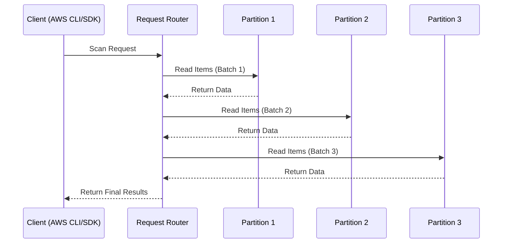
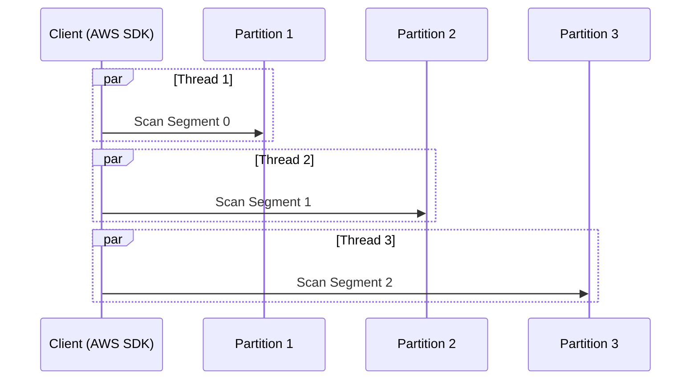

# 🔍 **DynamoDB Scan & Parallel Scan: Detailed Explanation**

The **Scan operation** in DynamoDB is used to **retrieve all items** from a table **without using indexes**. However, scanning a large table **can be slow and expensive**. To improve performance, **Parallel Scan** allows scanning multiple partitions **simultaneously** using multiple workers.

This guide covers:  
✅ **How Scan works**  
✅ **How Parallel Scan works**  
✅ **Impact on Read Capacity Units (RCUs)**  
✅ **Best practices to optimize scans**  
✅ **Real-world examples with AWS CLI & Python**

---

## 📌 **1. How Scan Works in DynamoDB**

- **A Scan operation reads every item** in the table **one by one**, filtering results **after retrieval**.
- It is **expensive** because it reads **all partitions** in a table.
- **Filter expressions** do **not reduce RCUs** since all data is read before filtering.

📌 **Diagram: How Scan Reads Items Sequentially**



---

## 📌 **2. Scan Parameters & Examples**

| **Parameter**          | **Required?** | **Description**                                      |
| ---------------------- | ------------- | ---------------------------------------------------- |
| `TableName`            | ✅ Yes        | Name of the table.                                   |
| `ProjectionExpression` | ❌ No         | Specifies which attributes to return.                |
| `FilterExpression`     | ❌ No         | Filters items **after retrieval**.                   |
| `Limit`                | ❌ No         | Limits number of items per request.                  |
| `TotalSegments`        | ❌ No         | Number of partitions to scan in parallel.            |
| `Segment`              | ❌ No         | Specifies which segment to scan (for Parallel Scan). |
| `LastEvaluatedKey`     | ❌ No         | Used for **pagination** when results exceed 1 MB.    |

---

### ✅ **Example 1: Basic Scan (Retrieving All Items)**

```sh
aws dynamodb scan \
    --table-name Employee
```

📌 **Behavior:**

- Reads **every item** in the `Employee` table.
- **Expensive** for large tables.

---

### ✅ **Example 2: Scan with `FilterExpression`**

```sh
aws dynamodb scan \
    --table-name Employee \
    --filter-expression "JobTitle = :title" \
    --expression-attribute-values '{":title": {"S": "Software Engineer"}}'
```

📌 **Behavior:**

- Reads **all employees** but **only returns those with `JobTitle = Software Engineer`**.
- **Still consumes RCUs for all retrieved items**, even those **filtered out**.

---

### ✅ **Example 3: Scan with `ProjectionExpression`**

```sh
aws dynamodb scan \
    --table-name Employee \
    --projection-expression "FirstName, LastName"
```

📌 **Behavior:**

- Returns **only** `FirstName` and `LastName`.
- **Reduces network transfer cost**, but **does not reduce RCU usage**.

---

## 📌 **3. How Parallel Scan Works**

🚀 **Parallel Scan improves performance by scanning multiple partitions simultaneously**.

- **Each worker scans a separate partition** (controlled via `TotalSegments` & `Segment`).
- Ideal for **large tables** where a sequential scan is too slow.
- Requires the client to **split the scan into multiple threads or processes**.

📌 **Diagram: How Parallel Scan Works**



📌 **Key Parallel Scan Parameters:**

| **Parameter**   | **Description**                                                      |
| --------------- | -------------------------------------------------------------------- |
| `TotalSegments` | The number of parallel workers (threads).                            |
| `Segment`       | The specific segment number (each worker scans a different segment). |

---

### ✅ **Example 4: Parallel Scan with 3 Workers (AWS CLI)**

```sh
aws dynamodb scan \
    --table-name Employee \
    --total-segments 3 \
    --segment 0
```

📌 **Behavior:**

- **Only scans Segment 0** (other segments must be scanned separately).
- The application must **run multiple scan commands in parallel**.

---

## 📌 **4. Implementing Parallel Scan in Python (Boto3)**

### ✅ **Example 5: Multi-Threaded Parallel Scan (Python)**

```python
import boto3
import threading

# Initialize DynamoDB client
dynamodb = boto3.client('dynamodb')

TABLE_NAME = "Employee"
TOTAL_SEGMENTS = 3  # Number of parallel segments

# Function to scan each segment
def scan_segment(segment):
    last_evaluated_key = None
    while True:
        scan_params = {
            "TableName": TABLE_NAME,
            "TotalSegments": TOTAL_SEGMENTS,
            "Segment": segment
        }

        if last_evaluated_key:
            scan_params["ExclusiveStartKey"] = last_evaluated_key

        response = dynamodb.scan(**scan_params)

        # Process retrieved items
        for item in response.get("Items", []):
            print(item)

        last_evaluated_key = response.get("LastEvaluatedKey")
        if not last_evaluated_key:
            break  # No more data

# Create threads
threads = []
for segment in range(TOTAL_SEGMENTS):
    thread = threading.Thread(target=scan_segment, args=(segment,))
    thread.start()
    threads.append(thread)

# Wait for all threads to finish
for thread in threads:
    thread.join()
```

📌 **Behavior:**

- **Each thread scans a different segment** of the table in **parallel**.
- The scan continues until **all items have been retrieved**.
- **Faster than sequential scan**, but still expensive in RCUs.

---

## 📌 **5. RCU Cost Calculation for Scan & Parallel Scan**

| **Factor**                      | **Impact on RCU Usage**                   |
| ------------------------------- | ----------------------------------------- |
| **Strongly Consistent Reads**   | **Consumes 1 RCU per 4 KB**               |
| **Eventually Consistent Reads** | **Consumes 0.5 RCU per 4 KB**             |
| **FilterExpression**            | **Does NOT reduce RCU usage**             |
| **ProjectionExpression**        | **Reduces network cost but not RCU cost** |
| **Parallel Scan**               | **Faster but does not reduce RCUs**       |

📌 **Formula for RCUs Used in Scan:**

```plaintext
Total RCUs = (Total Scanned Item Size / 4 KB) * Consistency Factor
```

---

## 🎯 **Key Takeaways**

✔ **Scan is expensive** because it reads **all items** sequentially.  
✔ **Parallel Scan speeds up scanning** by using multiple workers.  
✔ **RCUs are charged for all scanned items**, even those filtered out.  
✔ **Use `ProjectionExpression` to reduce data transfer, but not RCU usage**.  
✔ **Use Parallel Scan only when absolutely necessary** (e.g., full-table analytics).  
✔ **If possible, replace Scan with Query or Global Secondary Indexes (GSIs).**

Mastering **Scan and Parallel Scan** ensures efficient and cost-effective **DynamoDB read operations**! 🚀
