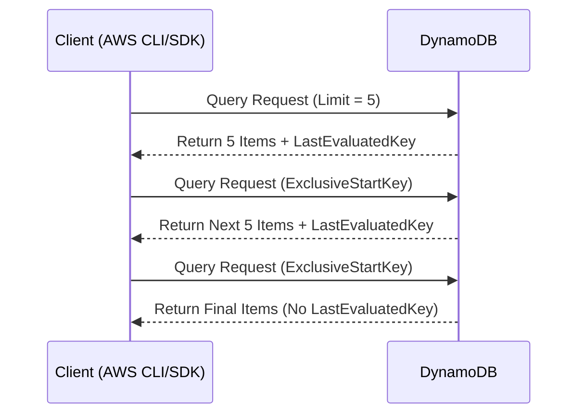

# 📜 **DynamoDB Pagination: Handling Large Result Sets Efficiently**

When using **Query** or **Scan** operations in DynamoDB, the **maximum response size is limited to 1 MB**. If the result set is larger than **1 MB**, DynamoDB **paginates** the results by returning a **partial response** and a `LastEvaluatedKey`.

To **fetch all results**, the client must **make additional requests**, passing `LastEvaluatedKey` until no more pages are available.

---

## 🔹 **How DynamoDB Pagination Works**

📌 **Step-by-Step Process:**  
1️⃣ **Client makes an initial request** (e.g., Query or Scan).  
2️⃣ If the response is **larger than 1 MB**, DynamoDB returns **a partial set of results**.  
3️⃣ The response includes a `LastEvaluatedKey`, which **points to the next page** of data.  
4️⃣ Client makes another request, passing `LastEvaluatedKey` as `ExclusiveStartKey`.  
5️⃣ Steps **repeat until no `LastEvaluatedKey` is returned**, indicating the **final page**.

📌 **Diagram: Paginated Query in DynamoDB**



📌 **Key Points:**

- If `LastEvaluatedKey` is **present**, more data is available.
- The client must **continue querying** with `ExclusiveStartKey`.
- If `LastEvaluatedKey` is **absent**, **all data has been retrieved**.

---

## 📝 **Pagination with Query Operation**

📌 **Using `LastEvaluatedKey` to Fetch All Data**

### ✅ **Example 1: Initial Query Request (First Page of Results)**

```sh
aws dynamodb query \
    --table-name Orders \
    --key-condition-expression 'CustomerID = :customer' \
    --expression-attribute-values '{":customer": {"S": "User123"}}' \
    --limit 5
```

📌 **Response (First Page of Results)**

```json
{
  "Items": [
    { "OrderID": { "S": "001" }, "OrderDate": { "S": "2024-02-10" } },
    { "OrderID": { "S": "002" }, "OrderDate": { "S": "2024-02-12" } },
    { "OrderID": { "S": "003" }, "OrderDate": { "S": "2024-02-15" } },
    { "OrderID": { "S": "004" }, "OrderDate": { "S": "2024-02-18" } },
    { "OrderID": { "S": "005" }, "OrderDate": { "S": "2024-02-20" } }
  ],
  "LastEvaluatedKey": {
    "CustomerID": { "S": "User123" },
    "OrderID": { "S": "005" }
  }
}
```

📌 **Explanation:**

- The response **only contains 5 items** (because of `--limit 5`).
- `LastEvaluatedKey` **indicates more data is available**.

---

### ✅ **Example 2: Request Next Page Using `ExclusiveStartKey`**

```sh
aws dynamodb query \
    --table-name Orders \
    --key-condition-expression 'CustomerID = :customer' \
    --expression-attribute-values '{":customer": {"S": "User123"}}' \
    --exclusive-start-key '{"CustomerID": {"S": "User123"}, "OrderID": {"S": "005"}}' \
    --limit 5
```

📌 **Response (Second Page of Results)**

```json
{
  "Items": [
    { "OrderID": { "S": "006" }, "OrderDate": { "S": "2024-02-22" } },
    { "OrderID": { "S": "007" }, "OrderDate": { "S": "2024-02-25" } },
    { "OrderID": { "S": "008" }, "OrderDate": { "S": "2024-02-28" } }
  ]
}
```

📌 **Explanation:**

- The second query **retrieves the next 5 items**.
- Since **no `LastEvaluatedKey` is present**, this is the **final page**.

---

## 📝 **Pagination with Scan Operation**

📌 **Similar to `Query`, the `Scan` operation also paginates when the result size exceeds 1 MB.**

### ✅ **Example 3: Scanning a Table with Pagination**

```sh
aws dynamodb scan \
    --table-name Employee \
    --limit 3
```

📌 **Response (First Page of Results)**

```json
{
  "Items": [
    { "LoginAlias": { "S": "user1" }, "FirstName": { "S": "John" } },
    { "LoginAlias": { "S": "user2" }, "FirstName": { "S": "Jane" } },
    { "LoginAlias": { "S": "user3" }, "FirstName": { "S": "Alice" } }
  ],
  "LastEvaluatedKey": {
    "LoginAlias": { "S": "user3" }
  }
}
```

📌 **Explanation:**

- Returns only **3 items** due to `--limit 3`.
- `LastEvaluatedKey` indicates **more data is available**.

---

### ✅ **Example 4: Fetching the Next Page**

```sh
aws dynamodb scan \
    --table-name Employee \
    --exclusive-start-key '{"LoginAlias": {"S": "user3"}}' \
    --limit 3
```

📌 **Response (Second Page of Results)**

```json
{
  "Items": [
    { "LoginAlias": { "S": "user4" }, "FirstName": { "S": "Bob" } },
    { "LoginAlias": { "S": "user5" }, "FirstName": { "S": "Charlie" } }
  ]
}
```

📌 **Explanation:**

- **No `LastEvaluatedKey` in response**, meaning **no more data left**.

---

## 🔹 **Handling Pagination in Python (Boto3)**

📌 **Example: Automatically Fetching All Pages Using `LastEvaluatedKey`**

```python
import boto3

# Initialize DynamoDB client
dynamodb = boto3.client('dynamodb')

table_name = "Orders"
customer_id = "User123"
last_evaluated_key = None

while True:
    # Construct query request
    query_params = {
        "TableName": table_name,
        "KeyConditionExpression": "CustomerID = :customer",
        "ExpressionAttributeValues": {":customer": {"S": customer_id}},
        "Limit": 5
    }

    # If there's a LastEvaluatedKey, include it in the request
    if last_evaluated_key:
        query_params["ExclusiveStartKey"] = last_evaluated_key

    # Execute query
    response = dynamodb.query(**query_params)

    # Print results
    for item in response.get("Items", []):
        print(item)

    # Check if there are more pages
    last_evaluated_key = response.get("LastEvaluatedKey")
    if not last_evaluated_key:
        break  # No more pages left
```

📌 **Behavior:**

- The script **automatically fetches all pages**.
- `LastEvaluatedKey` is **used iteratively** until no more data is left.

---

## 🎯 **Key Takeaways**

✔ **DynamoDB paginates results when the data size exceeds 1MB.**  
✔ **Use `LastEvaluatedKey` to fetch the next page.**  
✔ **Query & Scan both require multiple calls to fetch all results.**  
✔ **Python (Boto3) allows automating pagination with a loop.**  
✔ **Always check for `LastEvaluatedKey` before making another request.**

Mastering **pagination** ensures efficient **retrieval of large datasets** in DynamoDB! 🚀
