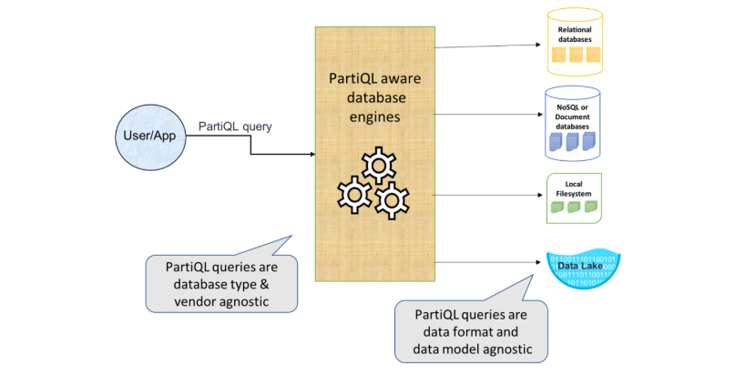

# 🔍 **Introduction to PartiQL in Amazon DynamoDB**

<div style="text-align: center;">
  
</div>

## 📌 **What is PartiQL?**

**PartiQL (pronounced “particle”)** is a SQL-compatible query language that allows you to interact with **Amazon DynamoDB** using **SQL-like syntax**. It provides a **simpler and more familiar way** to perform CRUD operations without needing to construct complex DynamoDB API requests.

🚀 **Why use PartiQL?**  
✅ **SQL-like Syntax**: Easy for those familiar with traditional SQL.  
✅ **Supports CRUD Operations**: `SELECT`, `INSERT`, `UPDATE`, `DELETE`.  
✅ **Works with Nested Data**: Supports querying JSON-like structures.  
✅ **Consistent Performance**: Operates efficiently under DynamoDB constraints.  
✅ **Eliminates Complex API Calls**: No need for `GetItem`, `PutItem`, `UpdateItem`, etc.

---

## 🛠️ **Enabling PartiQL in DynamoDB**

PartiQL is **built-in** to DynamoDB and requires **no additional setup**. You can use it via:  
1️⃣ **AWS Console** (DynamoDB -> PartiQL Editor)  
2️⃣ **AWS CLI** (`aws dynamodb execute-statement`)  
3️⃣ **Boto3 SDK (Python)**

---

## 🔹 **PartiQL vs Traditional DynamoDB API**

| Feature         | PartiQL                          | DynamoDB API        |
| --------------- | -------------------------------- | ------------------- |
| Syntax          | SQL-like (`SELECT * FROM table`) | JSON-based requests |
| Complexity      | Simple                           | More verbose        |
| Nested Data     | ✅ Yes                           | ✅ Yes              |
| Bulk Operations | ✅ Yes (Batch Queries)           | ❌ No               |
| Learning Curve  | Easy (for SQL users)             | Moderate            |
| Index Support   | ✅ Yes                           | ✅ Yes              |

---

## 📝 **Basic PartiQL Query Syntax**

### ✅ **1. Retrieve Data (`SELECT`)**

```sql
SELECT * FROM Employee WHERE EmployeeID = 'E123'
```

### ✅ **2. Insert Data (`INSERT`)**

```sql
INSERT INTO Employee VALUE {'EmployeeID': 'E123', 'FirstName': 'John', 'JobTitle': 'Developer'}
```

### ✅ **3. Update Data (`UPDATE`)**

```sql
UPDATE Employee SET JobTitle = 'Senior Developer' WHERE EmployeeID = 'E123'
```

### ✅ **4. Delete Data (`DELETE`)**

```sql
DELETE FROM Employee WHERE EmployeeID = 'E123'
```

---

## 📌 **Executing PartiQL Queries with AWS CLI**

### ✅ **Example: Run a PartiQL Query in AWS CLI**

```sh
aws dynamodb execute-statement \
    --statement "SELECT * FROM Employee WHERE EmployeeID = 'E123'"
```

📌 **Response Example:**

```json
{
  "Items": [
    {
      "EmployeeID": { "S": "E123" },
      "FirstName": { "S": "John" },
      "JobTitle": { "S": "Developer" }
    }
  ]
}
```

---

## 🔥 **When to Use PartiQL in DynamoDB?**

| Use Case                   | Should You Use PartiQL?                 |
| -------------------------- | --------------------------------------- |
| Simple Queries             | ✅ Yes                                  |
| Bulk Insert/Delete         | ✅ Yes                                  |
| Complex Queries            | ❌ No (Use API Queries)                 |
| Performance-Critical Reads | ❌ No (Use KeyConditionExpression)      |
| Relational Joins           | ❌ No (DynamoDB does not support joins) |

---

## 🎯 **Key Takeaways**

✔ **PartiQL simplifies CRUD operations** in DynamoDB using **SQL-like syntax**.  
✔ **It eliminates complex API calls**, making DynamoDB easier to work with.  
✔ **You can execute PartiQL queries using AWS CLI, SDKs, or the AWS Console.**  
✔ **PartiQL is best suited for simple queries but may not be optimal for high-performance reads.**
