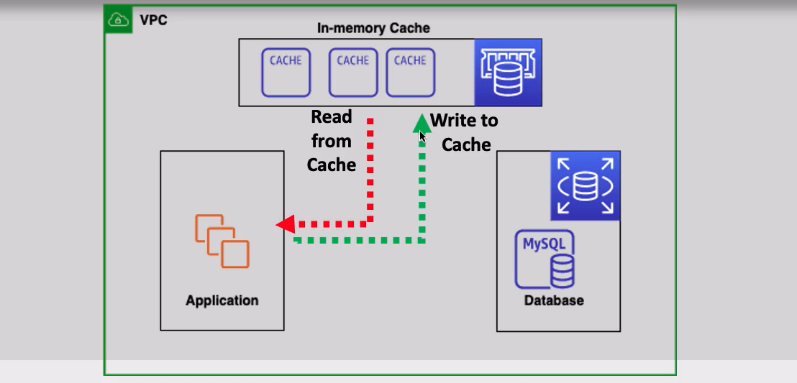
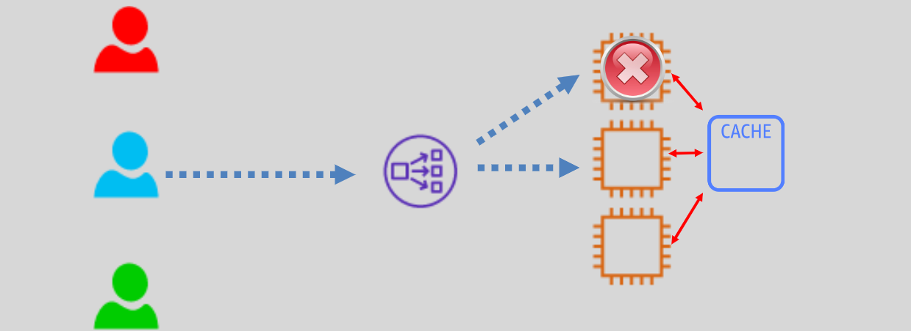

# AWS ElastiCache ⚡

`High-Performance In-Memory Data Store`

AWS ElastiCache is a **fully managed, distributed in-memory key-value store** that accelerates application performance by caching frequently accessed data. It provides **sub-millisecond latency**, making it an ideal choice for applications requiring high-speed data retrieval.

---

  

---

## 🌟 **What is AWS ElastiCache?**

ElastiCache is designed to:

- **Improve Application Performance**: By reducing the load on backend databases through in-memory caching.
- **Handle High-Throughput Workloads**: Offers sub-millisecond latency for real-time data processing.

### Key Features

- Supports popular caching engines:
  - **Redis**: Rich feature set with support for advanced data structures, replication, and persistence.
  - **Memcached**: Simple caching for horizontal scalability.
- Fully managed by AWS, ensuring minimal operational overhead.

---

## 🔑 **Clusters in ElastiCache**

ElastiCache nodes are launched within **clusters**.

  

### Cluster Characteristics

- **Nodes**:
  - Nodes are based on EC2 instances.
  - Multiple nodes form a cluster to enhance performance and reliability.
- **VPC Integration**:
  - Nodes are launched in the customer's VPC and secured using **security groups**.
  - Not accessible from the internet—ensuring enhanced security.
- **Endpoint Access**:
  - Applications connect to ElastiCache clusters using endpoints.
- **Instance Types**:
  - Supports **On-Demand** and **Reserved** EC2 instances (does not support Spot instances).
- **Fault Tolerance**:
  - Automatically replaces failed nodes for seamless operation.
- **Monitoring and Notifications**:
  - Integrates with **CloudWatch** for metrics and **SNS** for alerts.

---

## 🚀 **Use Cases of ElastiCache**

### **1️⃣ Storing Session Data for Stateless Applications**

  

- Stateless applications, by design, do not retain user session data between requests.
- ElastiCache provides a fast and reliable way to store session data, ensuring:
  - Continued user sessions.
  - Reduced database overhead by caching session states.

**Example**:  
E-commerce platforms can use ElastiCache to store shopping cart data for users, maintaining a smooth shopping experience even if they navigate away and return later.

---

## ✅ **Conclusion**

AWS ElastiCache is a powerful tool for improving application performance and scalability. With its support for **in-memory caching**, ElastiCache reduces database load, ensuring **sub-millisecond latency** and high throughput. Its ability to store session data for stateless applications further enhances its utility for real-time, user-centric applications.
