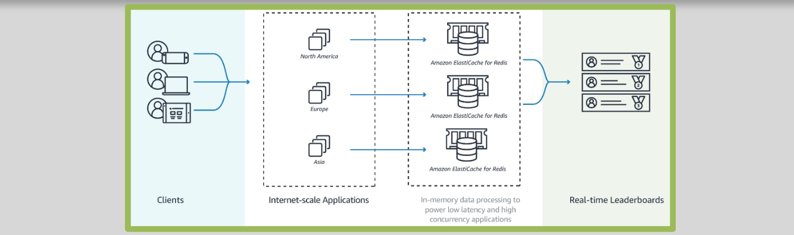

# 🎮 ElastiCache for Redis Sorted Sets and Global Data Stores

## 📊 Sorted Sets

  

ElastiCache for Redis **Sorted Sets** are perfect for handling complex computations, especially useful in gaming leaderboards.

### Key Features

- **Uniqueness & Ordering:** Sorted sets ensure each element is unique and maintain a specific order.
- **Real-Time Re-Ranking:** Every time a new element is added, the set re-ranks in real-time, keeping everything up-to-date.
- **Simplified Computations:** Applications no longer need to perform complex ranking calculations, as Sorted Sets handle it all.

---

## 🌍 Cross AWS Regions Read Replica Clusters

  

ElastiCache for Redis **Global Data Stores** enable the creation of read replicas across AWS regions that are fully managed, fast, and secure.

### Key Features

- **Primary and Secondary Clusters:**
  - **Primary Cluster:** Handles read and write operations.
  - **Secondary Clusters:** Read-only replicas, ensuring data redundancy and availability.
- **Automatic Replication:**
  - Data is asynchronously replicated from the primary to secondary clusters.
- **Low Latency Reads & Disaster Recovery:**
  - Provides low latency access across regions and enhances disaster recovery capabilities.
- **Failover Support:**
  - If the primary cluster fails, the secondary cluster can be promoted to become the new primary.

---

ElastiCache for Redis not only boosts performance with features like Sorted Sets for real-time data processing but also ensures data availability and low latency across multiple regions with Global Data Stores.
