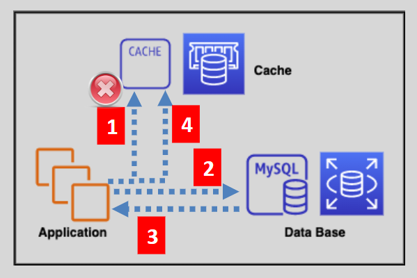
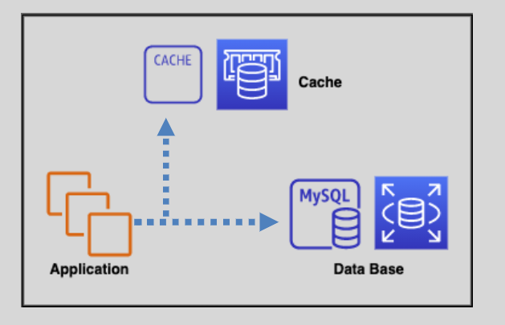
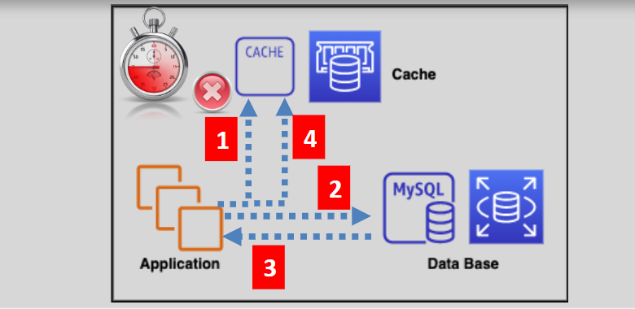

# 🚀 Caching Strategies

Caching is a crucial technique for improving the performance and efficiency of applications. Here are some popular caching strategies and how they work:

## 💤 Lazy Loading

  

**How It Works:**

- The application first tries to read data from the cache.
  - **Cache Hit:** If the data is found, it is read from the cache.
  - **Cache Miss:** If the data is not found or has expired, the application queries the database.
- The application then writes the retrieved data to the cache.

**Pros:**

- Only requested data is cached, minimizing memory usage.

**Cons:**

- Cached data may become stale over time.
- Cache miss penalty: Additional trips to the database can increase latency.

---

## ✍️ Write Through

  

**How It Works:**

- Whenever data is written to the database, it is simultaneously added or updated in the cache.

**Pros:**

- Data in the cache is always up-to-date and never stale.

**Cons:**

- Every write operation involves two trips: one to the database and one to the cache.
- Cache churn: Cached data may never be used, leading to unnecessary writes.
- New cache nodes start empty, leading to potential data misses initially.

---

## ⏳ Adding TTL (Time to Live)

  

**How It Works:**

- Adds a Time to Live value to each write operation in the cache.
- This ensures that data won't remain in the cache indefinitely and become too stale.

**Pros:**

- Data in the cache remains fresh and not stale.
- Prevents the cache from being overloaded with outdated data.

**Cons:**

- TTL must be carefully set to balance between data freshness and cache utilization.

---

## Summary

Each caching strategy has its unique advantages and trade-offs. Depending on your application requirements and workload characteristics, you can choose the most suitable caching strategy to optimize performance and efficiency.

- **Lazy Loading:** Best for scenarios where you want to cache only frequently accessed data and can tolerate occasional cache misses.
- **Write Through:** Ideal when you need consistent and up-to-date data in the cache but can handle the extra write overhead.
- **Adding TTL:** Useful when you want to ensure data freshness and avoid stale data in the cache.
