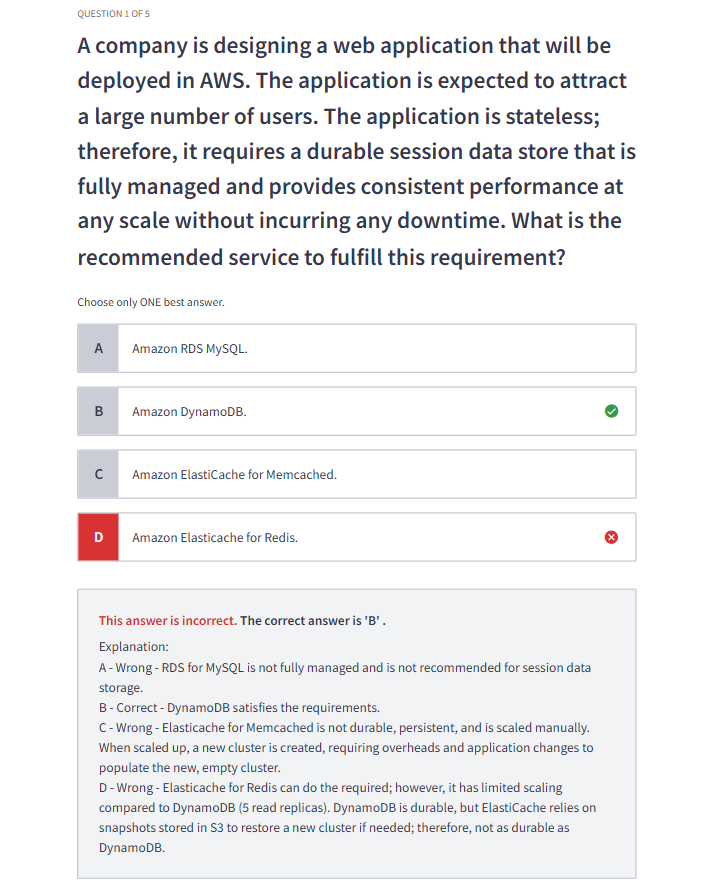

# ⚔️ DynamoDB vs. ElastiCache for Redis: Which to Use for Session Storage?

So you're building a web app and asking yourself:

> “Should I use **DynamoDB** or **Redis (ElastiCache)** to store my session data?”

You’re not alone. Let’s **break down the battle** between the two with clear examples, smart humor, and official AWS wisdom — so you’ll never get tricked on questions like that again. 😉

---

## 🧠 Official Definitions

| 🔸             | **Amazon DynamoDB**                          | **Amazon ElastiCache for Redis**               |
| -------------- | -------------------------------------------- | ---------------------------------------------- |
| 🏛️ Type        | Fully managed NoSQL database                 | In-memory key-value cache                      |
| 🧠 Purpose     | Durable, scalable storage                    | Ultra-fast, temporary storage                  |
| 🔁 Persistence | Yes (built-in)                               | Optional (AOF/RDB snapshots)                   |
| 🌩️ Speed       | Fast (ms)                                    | Blazing fast (sub-ms)                          |
| 🧰 Use Case    | Long-term storage, analytics, event tracking | Caching, session storage, leaderboard, pub/sub |
| 🔒 Durability  | ✅ Very high                                 | ⚠️ Depends on config                           |
| 🧬 Scaling     | Automatic                                    | Manual (Cluster Mode or Replication)           |

---

## ⚖️ Comparison Table: DynamoDB vs Redis for Session Data

| Feature                           | DynamoDB ✅   | Redis (ElastiCache) ⚡      |
| --------------------------------- | ------------- | --------------------------- |
| Sub-millisecond latency           | ❌            | ✅                          |
| Durability                        | ✅ (Built-in) | ⚠️ (With effort)            |
| High Availability                 | ✅            | ✅ (Manual setup)           |
| Auto-scaling                      | ✅            | ❌ (Cluster Mode needed)    |
| Session TTL support               | ✅            | ✅                          |
| Recovery on crash                 | Instant       | ❌ Delay (Snapshot Restore) |
| Cost efficiency at scale          | ✅            | ⚠️ More RAM-intensive       |
| Best for exam questions like this | ✅            | ❌                          |

---

---

## 💡 Redis **Can Be** Durable, But With Work

When you enable:

- **AOF** (Append Only File): every write is logged to disk.
- **RDB** (snapshot): takes periodic backups.
- **Multi-AZ replicas**: failover in case of master loss.
- **Cluster mode**: enables horizontal scaling.

✅ Redis becomes **highly available** and **resilient**.

> 🧠 But: durability depends on **how recently a snapshot was taken**, or how **frequently AOF is flushed**.

**If a crash happens before a snapshot/AOF flush**, some data might be lost.

---

## 🧪 DynamoDB Is Durable By Design

DynamoDB doesn’t need tuning:

- Data is **automatically replicated across 3 AZs**.
- **Strongly consistent writes** are possible.
- You **never lose a write** once it’s confirmed.
- No manual snapshot, no persistence config, no failover setup.

---

---

## ✅ When to Use Redis ElastiCache for Durable Sessions

If you're okay with extra effort and need 🔥 blazing speed:

### ✔️ What You Must Do

- Enable **AOF persistence** (every-second flush recommended).
- Enable **RDB snapshoting** as a safety backup.
- Use **Multi-AZ replication**.
- Use **Cluster mode enabled** to scale and distribute sessions.
- Set proper **failover detection**.

### ✅ Redis Becomes Durable BUT

- Requires **more engineering effort**
- You **may lose a few seconds of data** if a crash happens before AOF flush

---

## ⚙️ Real-World Scenario Breakdown

### 🛍 Use Case 1: **Durable Session Storage for Millions of Users**

> ❓ App is stateless, must persist sessions for all users, survive crashes, scale without downtime.

✅ Use **DynamoDB**

| Why?                                                   |
| ------------------------------------------------------ |
| ✔ Fully durable — data survives restarts and failures. |
| ✔ Autoscaling, no effort needed.                       |
| ✔ No cache warmup or restoration delays.               |
| ✔ Built-in TTL for session expiration.                 |

🚫 Redis: Not ideal unless persistence and failover are perfectly tuned. Redis snapshots and failover add complexity.

---

### 🧠 Use Case 2: **Ultra-Fast Session Access (e.g., Gaming or Trading Platform)**

> ❓ You need **sub-millisecond** latency, and you don’t care if a user has to re-login on rare Redis failovers.

✅ Use **ElastiCache for Redis**

| Why?                                                  |
| ----------------------------------------------------- |
| ⚡ Access is insanely fast.                           |
| 🧠 Sessions are stored in memory.                     |
| 🔁 Works great with sticky sessions and session TTLs. |
| 🔄 Clustering allows sharded storage if needed.       |

🚫 DynamoDB: Still fast, but not ideal when you're handling high-frequency real-time reads/writes.

---

### 🏗 Use Case 3: **Hybrid Architecture (Use Both!)**

Some high-performance apps do:

- 🔄 Store **hot sessions** in Redis for speed.
- 🔁 Backup or store **cold sessions** in DynamoDB for durability.

📌 Example:

```plaintext
User logs in → Write session to Redis + DynamoDB
Session lookup → Try Redis → Fallback to DynamoDB if not found
```

---

## 🧪 AWS Exam Gotcha (From the Image)

<div style="text-align: center;">
    
</div>

> ❌ Why Redis is NOT the correct answer?

Because:

- Redis **requires manual scaling**
- Redis **needs snapshot restoration** on failure (not instant like DynamoDB)
- Redis **is not durable by default** → relies on **AOF/RDB + Multi-AZ setup**

> ✅ Why DynamoDB is the correct answer?

Because:

- It’s **fully managed**
- **Scales automatically**
- **Built-in persistence + High Availability**
- Perfect for **durable session storage across millions of users**

---

## 🧠 Final Takeaway (Human-Smart Summary)

- 🔐 Use **DynamoDB** when you **care about durability and no session loss**.
- ⚡ Use **Redis** when you **need ultra-low latency** and can recover from a lost session.
- 🧬 Or use **both** if you want speed AND safety.
