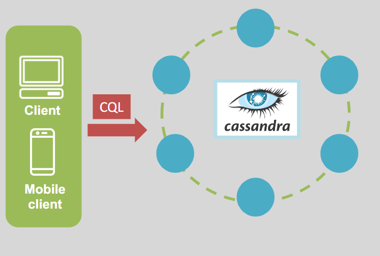

# AWS KeySpaces (For Apache Cassandra) Serverless like `dynamodb`

Amazon KeySpaces is a **fully managed, serverless database service** designed to run **Apache Cassandra–compatible workloads** in AWS. It simplifies the deployment and management of Cassandra-based applications, allowing developers to focus on building scalable, high-performance applications.

---

## 📝 **What is Apache Cassandra?**

Apache Cassandra is an **open-source, distributed NoSQL database** known for its scalability and fault tolerance. It is designed to handle large volumes of data across many servers with no single point of failure.

### Key Characteristics

- **Columnar Database**: Data is stored in columns, making it efficient for analytical queries.
- **Unstructured Data**: Handles flexible, schema-less data models.
- **Distributed Architecture**: Data is replicated across multiple nodes in a cluster.
- **Cassandra Query Language (CQL)**: Used to interact with the database.

---

  

---

## 🌟 **What is Amazon KeySpaces?**

Amazon KeySpaces is a **Cassandra-compatible, fully managed database service** that eliminates the need to manage infrastructure for running Cassandra workloads.

- **Serverless**: Automatically scales up or down based on traffic.
- **Cassandra-Compatible**: Use your existing Cassandra tools and application code without modifications.
- **High Performance**: Offers **single-digit millisecond latency** for fast data access.

---

  

---

## 🔑 **Key Features of Amazon KeySpaces**

1. **Scalability**:

   - Scales automatically to handle thousands of requests per second.
   - Supports virtually **unlimited storage** and throughput.

2. **Throughput Modes**:

   - **On-Demand Mode**: Automatically adjusts capacity based on application traffic.
   - **Provisioned Mode**: Allows you to specify throughput with optional **Autoscaling**.

3. **High Availability and Durability**:

   - Data is replicated three times across multiple Availability Zones (AZs) in a region.
   - Ensures fault tolerance and zero data loss.

4. **Security**:

   - **Encryption at Rest**: Enabled by default for data protection.
   - **Encryption in Transit**: Always required to secure data during transmission.
   - API calls can be routed through **VPC endpoints** for enhanced security.

5. **Seamless Integration**:
   - Works with existing Cassandra application code, drivers, and tools.
   - No need to modify queries or data models.

---

## 🚀 **How Amazon KeySpaces Works**

1. **Cassandra-Compatible**:

   - Use **CQL (Cassandra Query Language)** to interact with tables, just as you would with Apache Cassandra.

2. **Serverless and Autoscaling**:

   - Automatically adjusts capacity and throughput to match workload demands.

3. **Highly Available**:

   - Stores three copies of your data across multiple AZs for durability and reliability.

4. **Secure Access**:
   - Connect securely using AWS IAM roles and VPC endpoints.

---

## 📚 **Use Cases for Amazon KeySpaces**

1. **IoT Applications**:

   - Process and store large volumes of sensor data in real-time.

2. **Gaming**:

   - Track player activity, scores, and leaderboards with low-latency access.

3. **E-commerce**:

   - Manage product catalogs, user profiles, and session data efficiently.

4. **Event Logging**:
   - Store and analyze logs from distributed applications at scale.

---

## ✅ **Conclusion**

Amazon KeySpaces makes it simple to run **Cassandra-compatible workloads** on AWS. Its **serverless architecture**, high availability, and seamless compatibility allow developers to build scalable, high-performance applications without the complexity of managing Cassandra clusters. Whether for IoT, gaming, or e-commerce, Amazon KeySpaces is an excellent choice for applications requiring a robust, distributed database.
